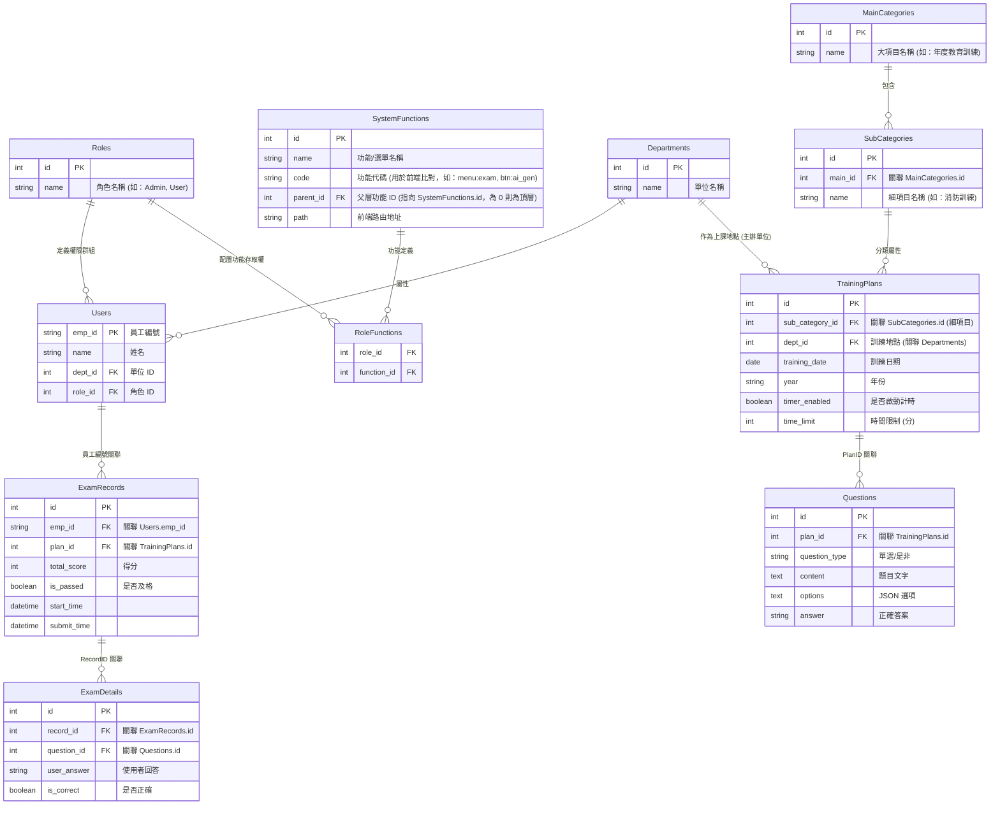

# 教育訓練線上考卷系統 - Phase 2 技術計畫 (PLAN)

**版本 Version**：v1.0.0  
**核准日期 Ratified**：2026-01-02  
**最近修訂 Last Amended**：2026-01-02

---

## 1. 專案結構與技術堆疊

### 1.1 資料夾結構
採用前後端分離的「模組化單體」架構：
- `backend/`: FastAPI 原始碼、SQLite 資料庫、AI 模組。
- `frontend/`: React + Vite + TypeScript 原始碼。
- `data/materials/{year}/{plan_id}/`: 按年份與計畫分開存放的教材。

### 1.2 技術堆疊
- **Frontend**: React 18, Tailwind CSS, Framer Motion (紅字特效), Lucide React。
- **SVG Engine**: 實作動態日曆產生組件 (藍/奶油色配色)。
- **Backend**: FastAPI, SQLAlchemy (ORM), Pydantic。
- **Database**: SQLite (單機開發與部署首選)。
- **PDF Export**: `reportlab` (Python) 根據 PDF 範本動態生成。

---

## 2. 資料庫設計 (SQLite Schema)

### 2.1 實體關聯圖概要

---

## 3. 主要 API 契約 (API Contracts)

### 3.1 認證類
- `POST /api/auth/login`: 輸入 emp_id + captcha -> 回傳 JWT。
- `POST /api/auth/register`: 註冊新員工 (ID, Name, Dept)。
- `GET /api/auth/captcha`: 取得動態圖形驗證碼。

### 3.2 訓練與題目類
- `GET /api/plans`: 取得所有訓練計畫。
- `POST /api/plans/import-txt`: 上傳 TXT 檔案解析題目。
- `POST /api/plans/ai-generate`: 上傳 PDF 並帶入自定義 Prompt，回傳 AI 題目草稿。

### 3.3 考試與成績類
- `POST /api/exams/submit`: 提交考卷。
- `GET /api/exams/record/{id}`: 取得單次考試結果（含紅字視覺所需的 JSON 資料）。
- `GET /api/exams/export-pdf/{id}`: 生成成績單 PDF。

### 3.4 系統管理類 (System Admin)
- `GET /api/users`: 取得員工列表 (分頁/搜尋)。
- `PUT /api/users/{emp_id}`: 修改員工資料 (角色/單位/停用)。
- `GET /api/roles`: 取得角色列表。
- `POST /api/roles`: 新增角色。
- `PUT /api/roles/{id}/permissions`: 設定角色權限 (綁定 Function Code)。

---

## 4. 關鍵功能實現邏輯

### 4.1 紅字手寫成績 UI (CSS/Framer Motion)
為了達成「紅字手寫」批改效果：
1. **字體**: 使用 Google Fonts 的 `Caveat` 或 `Coming Soon` 等手寫感字體。
2. **視覺效果**: 
   - 旋轉角度：呈現稍微傾斜（如 -10deg）的批改感。
   - 動態劃線：使用 Framer Motion 模擬圓圈或兩道底線的動畫。
   - 色彩：鮮紅 #e53e3e。

### 4.2 免密碼登入機制
- 伺服器端維護一個與 Session 綁定的 Captcha 解答。
- 登入時檢查 `emp_id` 是否存在，不存在則轉註冊頁；存在則驗證 Captcha。

### 4.3 AI 輔助出題
- 使用 OpenAI/Gemini SDK。
- **System Prompt**: 內嵌一份「嚴格要求 TXT 格式」的範例指令。
- **User Prompt**: 包含管理員在介面手動調整的內容。

---

## 5. 憲章遵循檢查 (Constitution Check)
- **P1 簡潔**: 使用 SQLite 避免複雜的資料庫維運。
- **P5 語言**: 程式碼註解與文件皆使用正體中文 (zh-TW)。
- **P8 一致性**: 使用統一的 CSS 變數定義紅字與底線樣式。
- **P2 安全**: 使用圖形驗證碼防止暴力破解，且後端 API 皆有 JWT 驗證。

---
> [!IMPORTANT]
> **開發優先順序**
> 1. SQLite 資料庫初始化與 FastAPI 骨架。
> 2. 註冊/登入流 (含驗證碼)。
> 3. TXT 匯入與基礎訓練管理。
> 4. 行動端考卷介面。
