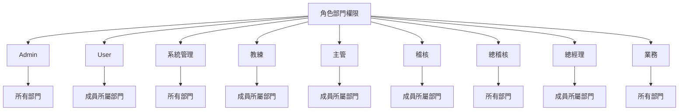
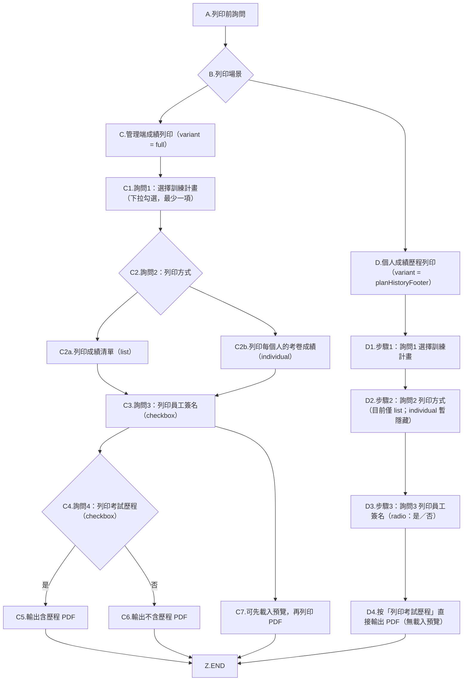
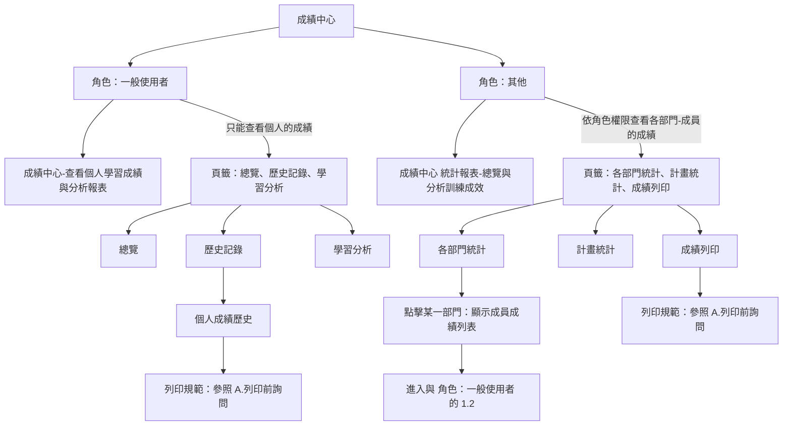

# T13 增修功能實作 PLAN 測試問題及新增加需求：

## 角色部門權限

## [`所有人`] 皆適用此列印流程：

---
## 1.成績中心
1. 沒有做到依`角色`，來區分資料可視範圍（部門內 / 全部）。
   - 成績中心各項功能權限

> 角色部門權限管理設計好後，依上面你自己的描述：
> 規則是「登入者自己所屬部門一定能看」，再加上「角色部門權限頁面你額外選的部門」也能看；
> 所以業務若選 10 個部門，登入業務後在報到/成績中心就能看到除了自己部門之外的那 10（至少包含額外 5）。

問題修改歷程：
--- 
1. 例如，500032是KC倉副理（或其他稽核人員、業務、主管），登入後，進入成績中心，應該只能(**看到及列印**)`他所屬`**KC倉**的各項總覽與分析訓練成效狀況。
2. 其他一般user，則只能查看個人學習成績與分析報表。
3. 不管到那，`**Admin是擁有所有的權限，且不能變更的**`。
4. 

--- 

1. 列印PDF時，輸出的檔名格式：日期_
2. 當詢問2， 選擇 列印成績清單時，disable列印員工簽名。
3. 考試歷程：
a. 未勾選時，僅列印最後一次的成績。
b. 有勾選時，依每個人的考試的先後順序列印。
1. 列印每個人的考卷成績：
a. 沒有隔列Highlight顯示。
b. @0.standards/2.棕地專案/T13 增修功能實作PLAN_測試問題.md:48-53 ，都沒做到。
1. 

--- 
### 接下來繼續修改成績中心的問題，以 KA倉 副理 熊致偉 300009 為例：
1. 進入部門成績，中間 4個頁籤，預設顯示「各部門統計」，
   點開成員成績列表，點擊 黃振麟 - 2026年度新人培訓 的 查看個人成績後，
   頁面沒有反應，應該直接導入至  **歷史記錄 頁籤**，而且此歷史記錄是 `黃振麟 的個人成績歷史` 的記錄，
   **不是** `KA倉 副理 熊致偉 300009` 的個人成績歷史。
2. 續1，手動點 歷史記錄 頁籤，出現 無法載入資料。
   後台出現錯誤：
   INFO:     127.0.0.1:50169 - "GET /api/exam/personal/history?sort_by=time&order=desc&page=1&page_size=20&emp_id=300005 HTTP/1.1" 403 Forbidden
  點其他的頁籤（總覽、學習分析）都一樣的狀況。

### 再來，修改 總覽、歷史記錄、學習分析 這3個頁籤 的使用規範
1. 續前問題，點擊 黃振麟 - 2026年度新人培訓 後，自動導入 **歷史記錄 頁籤**。
   - 我講錯了，改成自動導入至 **總覽 頁籤**。
   - **總覽、歷史記錄、學習分析** 這3個頁籤變成`黃振麟`的 個人學習成績與分析報表。
   - 續，這 3個頁籤的標題，要加上 **KA倉 黃振麟** 個人成績總覽/個人成績歷史/個人學習分析。
   - 續，說明：**KA倉 黃振麟** 這個要隨著點擊誰而不同。
   - 如果沒有從各部門統計點擊的話，**總覽、歷史記錄、學習分析** 這3個頁籤就是`登入的那個人的個人學習成績與分析報表`。
   - 當點擊 **成績中心＋右邊那個勳章** 就回到 `登入的那個人的個人學習成績與分析報表`。
2. 個人成績總覽裡有 6個卡片：
   - 第一個是已完成考試卡片，增加此卡片點擊後導入至個人成績歷史頁籤。
   - 其他5個卡片維持現狀。
3. 

### 再來，成績中心 - 歷史記錄 的問題修改
1. 續前問題，點擊 黃振麟 - 2026年度新人培訓，再點進入 歷史記錄，進入查看 KA 倉 黃振麟 的所有考試記錄後：
   - 成績列印流程，不在此頁面上進行這個流程。
   - 點擊考試歷程 的某一筆記錄，結果出現 無法載入資料。
     後台出現錯誤：
     INFO:     127.0.0.1:60292 - "GET /api/exam/personal/print/plan-options HTTP/1.1" 200 OK
     INFO:     127.0.0.1:61215 - "GET /api/exam/record/45/detail HTTP/1.1" 403 Forbidden
     INFO:     127.0.0.1:61217 - "GET /api/exam/record/45/detail HTTP/1.1" 403 Forbidden

### 繼續 成績中心 - 歷史記錄 的調整修改 #1
1. 在搜尋bar裡輸入關鍵字，不要打一個字，就馬上進行搜尋，然後頁面就重整，然後游標就不知道跑到那裡去了。
   - 游標應該是繼續停在搜尋bar，以便讓人繼續打字。
   - 改善搜尋bar裡打字搜尋的作法。

### 繼續 成績中心 - 歷史記錄 的調整修改 #2

1. 修改了考試次數後，以 KA 倉 謝綺瑩 (300002)為例：
   - 在成績中心-個人成績歷史中，個人的成績趨勢 和 訓練列表的重考次數，2邊的數字對不起來。
   - 考試中心、成績中心的考試次數，顯示不一致。
   - 新的考試次數計數，第一次考試你會自動加1。
   - KA 倉 謝綺瑩 (300002)，2026年度教育訓練-消防演練，報到時間是2026/4/2 下午2:04:18，隨即進行第一次的考試，但在他的考試中心看到此訓練的挑戰次數是2。
   - 續，進到他個人成績歷史，看到的「重考」次數是2，點查看詳情，在考試歷程記錄看到2次一模一樣的記錄。
   - 續，再試一次2026年 資訊安全，報到完馬上進行考試，交卷後回到考試中心，結果也是看到挑戰次數是2。
   - 續，進到個人成績歷史，看到的「重考」次數是2，但這次進到考試歷程記錄，卻只看到一次的考試歷程。
   - 再換另一位HQ 倉儲行政部 孫怡真 (100023)，以2026老人計劃的測試結果，和謝綺瑩 (300002)以2026年 資訊安全測試結果，2個人的結果是一樣。
   - 所以，你在第一次考試的時候，計算方式會自動加1，但在成績中心的成績趨勢，顯示是1次，成績列表是2次，進入考試歷程記錄，只看到一次的考試歷程。
   - 以 KA倉 稽核 林正南 (300008)登入，進入成績中心-部門成績，查看成員成績列表，發現謝綺瑩 (300002)的考試記錄只有2筆，與實際 謝綺瑩 (300002)的成績中心的4筆不相符。
2. 全部重新檢查，考試中心上所顯示的挑戰次數、成績中心的個人成績歷史 的選擇計畫/成績趨勢/訓練計劃列表重考次數/考試歷程記錄及部門成績
3. 續，「重考」次數。。。。第2次以後才叫重考，如果第一次就及格，就不會有重考狀況，所以這個欄位到底要不要叫做「重考次數」，還是叫做「考試次數」？
4. 所有的時間顯示，改為 24'h制。
   
以上問題原因（校正版）：
1. 主因正確：後端把 ExamRecord.attempts 當成「提交次數」在 submit_exam 會 +1，但 start_exam 會先建立一筆 ExamRecord(attempts=0)；舊邏輯用 `(existing_record.attempts or 1) + 1`，所以第一次交卷會從 0 直接變 2（不是 1）。
2. 次因補充：不同畫面取「次數」來源不同，才會放大不一致：
   - 成績趨勢 / 考試歷程：看 ExamHistory 筆數（每次提交新增一筆）
   - 考試中心卡片 / 成績列表：原本看 ExamRecord.attempts（受舊邏輯與舊資料影響）
   => 同一人同一計畫就會出現「趨勢=1、列表=2、卡片=2、歷程=1」。
3. 命名問題：欄位語意其實是「考試次數（提交次數）」，不是「重考次數」。第 1 次不是重考。

解決方法（已實作）：
1. 修正 submit_exam 的累加邏輯，改為首次提交=1：
   - `existing_record.attempts = (existing_record.attempts or 0) + 1`
2. 讓「考試中心卡片」與「成績中心列表」改用 ExamHistory 筆數作為考試次數來源，與趨勢/歷程一致：
   - 以 `count(ExamHistory.id)` 為主。
   - 舊資料若已有 submit_time 但尚無 history，fallback 視為 1 次，避免顯示 0。
3. 前端欄位名稱統一為「考試次數」，避免誤讀為「重考次數」。

結果：
- 同一人同一計畫在「考試中心卡片 / 成績列表 / 成績趨勢 / 考試歷程」的次數可對齊。
- 第一次交卷顯示為 1 次，第二次才是 2 次。

### 2026/04/20
### 繼續 成績中心 - 歷史記錄 的調整修改 #3
1. 個人成績歷史 - 選擇計畫，增加全選/不全選功能。
   - 這個功能有沒有可能可以做成元件，供任何專案使用？不過看起來好像不需要。
2. 在個人歷史記錄裡，最下面是每個訓練的清單列表，點「查看詳情」進入該筆訓練的考試歷程 Modal；再於**考試歷程清單**點某一次的「查看詳情」，開啟**該次**的**成績詳情** Modal（**2026/04/22 定案**）：
   - 右上角「**預覽成績單**」按鈕：預設 **可點（enable）**；**不**採用「未勾簽名則整顆按鈕反灰不可按」。
   - **列印員工簽名**（在按鈕左側，與成績單內容連動）：
     - 以 **單選（radio）＋三態** 於前端狀態管理：`未選`／`否`／`是`（**不用**一般 checkbox 的「預設否＝當成已回答」）。
     - 選 `是`：預覽／列印成績單**須**含「考生簽名」、「日期」區塊。
     - 選 `否`：預覽／列印成績單**不要**含上述區塊。
     - `未選`：依實作與 UI 可搭配提示；原則上須在選定 `是` 或 `否` 後，列印/預覽行為與上兩點一致（不得與「有／無歷程列印」需求混淆）。
   - 此為**單次成績**檢視；**不**在此 Modal 內處理「考試歷程成績列印」（該流程見下方第 3 點）。

3. 「考試歷程記錄」**下方**之 **考試歷程成績列印**（**2026/04/22 定案＋討論補充**）：
   - **區塊標題**：由「成績列印」改為 **「考試歷程成績列印」**。
   - **步驟條（步驟指示）**：以步驟式（1→2→3）**循序精靈**呈現 **詢問1（訓練計畫）**、**詢問2（列印方式）**、**詢問3（列印員工簽名）**；圓圈與箭頭連線、**完成當步再「下一步」** 始進入下一步；讓使用者在畫面上一眼可辨識目前步驟。
   - **詢問1（訓練計畫）**：**預設行為維持現行**（例如 Modal 內之計畫帶入／勾選方式等既有實作）。
   - **詢問2（列印方式）**：
     - 文案：「列印個人`所有考試歷程成績清單`」、「列印個人`所有考試歷程的每一次考卷成績`」。
     - **無預設值**；必須明確選定其一（例如 `未選` → 點選後方視為已作答），才能與詢問3 一併滿足「可列印」條件。
   - **詢問3（列印員工簽名）**：
     - 以 **radio＋三態**（`未選`／`否`／`是`）於 React 管理，**無預設值**（**不**寫死「預設否」當成已選）。
     - 選 `是`：不論詢問2 為成績清單或逐次考卷，**PDF／列印內容皆須**含**與成績單預覽一致**之「考生簽名／日期」**雙欄**區塊（列印體、非單一底線代號）。
     - 選 `否`：列印時**不要**加上簽名與日期。
   - **主按鈕**：「產生 PDF」改為「**列印考試歷程**」；預設 **灰階、不可按**；僅在 **詢問2 與詢問3 皆已明確選定**（皆脫離 `未選`）後，才為 **綠色可按**。

### 成績中心
1. 不管是個人的**個人成績總覽**，或「部門成績」的**成績中心 統計報表**，只顯示現在進行中的訓練，已過期或已封存的不在此。
2. 續1, 加上可篩選的功能（如同訓練計劃管理一樣）

> **結案註記（2026-04-20）**：已實作並驗證—選擇計畫全選／清除、`ScorePrintFlow` 歷程 Modal 變體（個人文案、單一產生 PDF）、成績詳情（歷程入口）簽名 checkbox 與預覽 gate、個人成績總覽／報表 `plan_status`（active／expired／archived）前後端對齊。  
> **驗收補註（2026-04-20）**：第 178–198 行 UI 重構已實作—成績詳情預覽常駐可點、簽名改三態 radio；考試歷程底部改「考試歷程成績列印」標題、步驟條、詢問2／3 無預設、主鈕「列印考試歷程」與 API 參數對齊（含 `include_exam_history` 於歷程列印流程）。  
> **待辦補註（2026/04/22 起）**：**接續 2026/04/22** 小節（下）已於 **2026-04-20 後續實作** 對齊；逐次一試一冊之**答題明細**若需與「查看詳情」完全同級，另行擴充（目前 PDF 為每次一頁摘要＋導向系統查閱之註記）。

### 接續 2026/04/22 的「考試歷程記錄」調整（**實作完成 2026-04-20，可 UAT**）
以下與**單次成績**、**歷程成績列印（PDF／瀏覽器列印）**內容與樣式有關，實作時以前端 `ScoreCardPreview` 列印組裝、歷程 Modal／`POST /exam/personal/print/pdf` 與 `render_score_print_pdf_to_buffer` 一併對齊。

1. **單次成績**（從歷程清單點「查看詳情」→ **成績詳情** → **預覽成績單** → **列印**）  
   1. 不論有無選好「列印員工簽名」，**列印與列印預覽**皆**不得**出現「**考試歷程**」大區塊；此路徑僅代表該訓練下**單一提交／單次**成績，與「整份歷程表」不同。  
   2. **原因說明（工程）**：畫面預覽只渲染**單次**成績內容；若列印流程在 iframe／列印用 HTML 中**另行拼接**了 `detail.history` 的「考試歷程」表，就會導致「畫面沒有、列印卻有」之不一致。實作上應在單次路徑**關閉**該段拼接，或與畫面使用同一套規則。  
   3. **驗收**：成績單預覽畫面與列印預覽內容一致，皆無歷程表（除非產品另定單次也要附歷程，目前**否**）。

2. **考試歷程成績列印**（`PlanHistoryModal` 底部流程；詢問1～3 與**列印考試歷程**鈕）  
   1. **當詢問2 選「列印個人所有考試歷程成績清單」（`list`）**  
      1. **考試歷程**在 PDF／列印內需為**附圖／規格圖**之**表格式**（欄位如：次數、考試時間、分數、狀態等），**不**用主表下再以純文字行條列歷次的方式取代。  
      2. **不要**以邊框／底色／「本次」標籤等 UI **框選、強調某一次**考試歷程列（僅能呈現中性列表；若需標示當前語意，改以產品可接受之**非框選**方式另定）。  
      3. 考試歷程**表身**採**隔列底色（zebra / striping）** 易讀，與全表「不單列強調」並存。  
   2. **當詢問2 選「列印個人所有考試歷程的每一次考卷成績」（`individual`）**  
      1. 同一訓練下**每一次**考試產出之版面，**比照**從歷程點「查看詳情」可見之**成績單內容層級**（總分、通過、答題等）；**每場考試一組／一份**，分頁或分紙遞迴產生（**每試一份／多頁一試** 依既有成總單結構，與產品截圖一致即可）。  
      2. 此模式若後端目前僅**清單式**合併列，需擴充為**多筆成績單各印一冊**或等效實作。  
   3. **文件標題**（歷程成績列印 PDF 抬頭，若有多處抬頭一併改）：`{所選或當下訓練計畫名稱}` ＋ **「教育訓練考試歷程成績列印」**（**不要**固定只用泛用「教育訓練成績列印」當成唯一標題，除非僅能取單一計畫名之技術註記）。  
   4. **筆數**：**不要**印出「筆數：N」一類說明（全拿掉）。  
   5. **當詢問3**  
      1. 選**是**：列印內**簽名＋日期**區塊之**版式、雙欄**與**成績詳情**路徑選「是—列印員工簽名」時之成績單一致（**考生簽名 / Examinee Signature** 與 **日期 / Date** 之下各一橫線，**不要**主表內單一「簽名：____」佔行代替）。  
      2. 選**否**：**不要**印簽名與日期。  

> **實作狀態（2026-04-20）**：`ScoreCardPreview` 單次列印預設不併入 `history` 表；`POST /exam/personal/print/pdf` 支援 `plan_title`、`document_context: personal_exam_history`；`render_score_print_pdf_to_buffer` 在該脈絡下：`list` 為 **{計畫名}＋教育訓練考試歷程成績列印** 抬頭、不印筆數、歷程為表格式＋**隔列**、簽名選「是」時為**雙欄**（考生簽名／日期）；`individual` 為**每筆一頁**摘要 PDF。Admin `report_print_pdf` 未改變 `document_context` 預設。驗收後可補 **UAT 日期** 與截圖路徑。

### 2026/04/23「接續 2026/04/22」兩階段實作 修正：
> 除下列問題尚需修正，其餘兩階段實作的部份都已完成。
「考試歷程記錄」的待修正問題（**已修正**）：
1. **考試歷程成績列印**，當詢問2：
   1. 選「列印個人所有考試歷程成績清單」
      1. 考試歷程成績清單區塊與上面的區塊，和下面的區塊（簽名區塊）之間的間距太小，加大間距。（**已加大間距**）
      2. 上面區塊的：
         1. 時間那個欄位名稱，改成「考試時間」。（**已修改**）
         2. 時間欄位的資料，分不見了，完整的時間應該是 2026-01-21 16:39 吧～ 39分不見了。（**已修改，顯示至分鐘**）
      3. 中間區塊（考試歷程清單區塊）：
         1. 清單列表內的文字，改成垂直置中。（**已調整垂直置中**）
         2. 文字加大一點。（**字體從 7 加大為 8**）
         3. 狀態改為考試結果。（**已修改**）
   2. **選「列印個人所有考試歷程的每一次考卷成績」（`individual`）** ：先隱藏此選項，暫不提供此功能。（**已於 UI 隱藏此選項**）
2. 按「列印考試歷程」輸出PDF檔，檔案規則：教育訓練名稱＋部門名稱＋考試人員（員工編號_姓名）＋教育訓練考試歷程成績_列印時間。（**已修改下載檔名規則**）
3. 在表頭加一個列印時間：直接抓取列印當下的日期。（**已於 PDF 表頭右側加入列印時間**）
--- 

2026/04/28
### 繼續 成績中心 - 部門成績 調整項目：
> 依據角色的部門權限所授權，只有角色為`User`的僅能查看到自己的資料，其餘皆依`不同的角色，授多不同的部門權限`。
> 以下是針對有`部門權限的角色`進行修改
1. 當點繫`「部門成績」`頁籤（預設是 個人成績總覽「總覽」頁籤），進入部門的成績中心 統計報表，在中間區域的`「訓練計畫」`，預設是`進行中`的「各部門統計」的績效表現，此績效表現是用`手風琴 (Accordion)`建構垂直折疊來顯示每個部門的`「成員成績列表」`：
   <!-- 1. 不要使用垂直折疊式功能，改成使用列表表格。 -->
   1. 維持原垂直折疊式功能。
   2. 點擊了某一部門，即進入`該部門`的`「成員成績列表」`。
      > 有跨部門的角色需先選擇部門，如果沒有跨部門的話，就只有自己所屬部門而已。 
      > 跨部門權限者，在進入前，要先選擇部門後才進入，若只有單一部門者，就直接進入。
      1. 比如`點選「KA倉」`，跳出一個 `Modal頁面`，內容顯示該部門（KA倉）的`成員成績列表`。
      2. 然後後續就依原來的做法進行。
2. 續1, 進入部門的`成員成績列表`Modal，此Modal最重要的目的是要進行教育訓練的整批考卷的列印，所以需要下列的幾個步驟才能完成：
   1. **詢問1（訓練計畫）**：
      > 清空已選計畫與名單，在此處不要有預設。 
      1. 先選擇是那個階段的：正在進行中（預設）、已過期、已封存。
      2. 再依所選的階段列出那個階段的所有教育訓練計劃。
      3. 選擇了某一個教育訓練計劃後，列出該部門所有成員（不論有沒有報到，或有沒有通過考試，全部都要列出來。
         1. 成員名單要從 User（部門成員）抓，不可只用 ExamRecord。
         2. 該列表的欄位，除現有的之外，再加上一個欄位：出席狀態，此狀態顯示方式：[未應考＋報到總覽的原因]來呈現。
   2. **詢問2（列印方式）**：最後一次的考試，`不是所有的考試歷程`。 
      > 考卷的成績單，和成績清單不一樣，考卷成績單，就是那個訓練計劃的考卷的考試成績，成績清單是該部門所有成員的訓練計劃的成績list。
      > 最後一次考試，以 submit_time 最大值為準。
      > 未完成考試的，也要在此清單內，在備註欄中註明原因。
      1. 所有成員的考卷成績單。
         1. 和個人的`成績詳情`列印一樣。
      2. 還是所有成員的考試成績清單。
         1. 欄位和個人的考試歷程一樣。
      3. 未完成考試的，在考卷列印中，分數的地方註明未完成考試的原因，在成績清單中一樣註明原因。
   3. **詢問3（印簽名與日期）** 
      > 如同個人的成績，詢問是否簽名
      1. 選**是**：列印內**簽名＋日期**區塊之**版式，一樣用「考生簽名 / 日期」雙欄樣式。 
      2. 選**否**：**不要**印簽名與日期。
3. 當詢問完後，依所選的條件進行列印。
   1. PDF檔名規則：計畫_部門_成績清單或考卷成績單_列印時間.pdf
4. 權限拒絕時 UX：部門無權限 / 無可視部門 / 無資料，各自錯誤訊息文案。
5. `成員成績列表`Modal ：
   1. 名單要分頁。
   2. 批次列印若超過 20 人是否限制或提示（避免超大 PDF）。

--- 
### 繼續 成績中心 - 歷史記錄 的 查看詳情 button
1. 以 KA倉 稽核 林正南 300008 為例，進入成績中心 -> 部門成績 -> 選取 KA倉 黃振麟：
   - 進入黃振麟的 個人成績歷史，共有3個訓練計劃的考試記錄，點擊 2026年度新人培訓，重考3次，點查看詳情，在考試歷程裡，為什麼第2次的考試沒有詳情？
   - 改查看 林正南 300008 自己的個人成績歷史，現在有2026年度新人培訓，查看詳情，總共有6次考試，一樣是第5次的考試沒有詳情。
   - 2026年度教育訓練-消防演練，林正南 300008只有一次的考試，怎麼會有2次？
2. 人員的報到時間？你是抓那裡的？2026年度教育訓練-消防演練，林正南 300008報到完後，立即進行考試，提交時間和報到時間不相同，從報到時間來看，和考試提交時間差8個小時，表示報到時間的程式的時區（後台API？）沒有設成Asia/Taipei 台灣使用的標準時區，位於 UTC+8。
3. 在考試歷程Model中，`disable` **成績列印的詢問1**，不要讓user可以勾選訓練計劃，因為此考試歷程Model是來自上面所選取的計劃來的。

###

--- 
1. 詢問：選擇訓練計劃 - 使用下拉勾選，最少一項。
2. 將上述流程做成元件，這樣在 admin 的ReportDashboard 及 個人的 PersonalScoreHistory 來使用共用元件，程式也可以更精簡。
3. 成績列印的清單表頭，欄名稱：ITEM序號（沒有ITEM 序號欄，要增加）、員工編號、姓名、部門名稱、授課計劃名稱、成績分數。增加排序功能。
4. 個人成績歷史也要增加ITEM序號（沒有ITEM 序號欄，要增加），及增加排序功能。
5. 個人在列印成績單前未詢問：是否列印員工簽名（預設否）及 是否列印考試歷程（預設否）。
6. 和其他的清單列表一樣， admin 的ReportDashboard 及 個人的 PersonalScoreHistory 的成績清單列表：
   1. 可排序。
   2. 可輸入關鍵字來查詢部門、員工編號、姓名。
   3. 隔列Highlight顯示。
   4. 
7. 
8.  在新增的「成績列印」頁籤裡：
   1. 再增加詢問，使用下拉勾選方式：
      1. 詢問1：列印成績清單，還是每個人的考卷成績。
      2. 詢問2：那一個（還是那幾個）的訓練計劃要列印。
      3. 詢問3：是否要列印員工簽名。
      4. 詢問4：是否要列印考試歷程。

--- 
1. 列印PDF：
   1. 點載入預覽後，在列印PDF的button會出現(16)，請問那個14是怎麼算出來的？
   2. 在清單列表：
      1. 增加一個ITEM序號欄。
      2. 和其他的清單列表一樣，每頁顯示XX筆、分頁顯示。
      3. 和其他的清單列表一樣，可排序、可輸入關鍵字來查詢部門、員工編號、姓名。
   3. 報表 Title 名稱改成：XXX 教育訓練 **報到清單**。
   4. Title底下，從左到右：把報到統計Model上方4個卡片的人數放在此。（應到XX人 實到XX人 ....）
   5. 列印前詢問的事項 **簽名欄：否  歷程：否** 不用顯示出來。
   6. 下方授課人員的清單：
      1. 表頭欄名稱，依續：ITEM序號（新增加）、員工編號、姓名、部門、授課計劃、成績。增加排序功能。
      2. 隔列Highlight顯示。
2. 

## 2. 考卷工坊
1. 修改：將右邊的「點擊或拖放上傳考卷 (TXT)」區塊，把(選擇檔案 和 上傳後將... 這段字)移到 (上傳的那個圖 和 點擊或拖放...) 的右邊，變成左右2邊（現在是上下）。
2. 在題庫維護中，有輸入關鍵字方式查詢題目內容，或輸入標籤的關鍵字查詢，在這2個input的右邊加一個小XX，可以方便清除輸入的內容，然後重新輸入。 
3. 從題庫匯入題目：
   1. 增加「全選 / 不全選」功能，以便方便加入訓練計劃的考卷題目中。
   2. 題目編輯，增加可輸入多個標籤功能。

## 3. 報到總覽 
1. 沒有做到依 職務（或角色），來區分資料可視範圍（部門內 / 全部），例如，500032是KC倉副理，登入後，在報到總覽，應該只能看到[2026老人計劃]、[2026年度新人培訓]這2個訓練計劃，而且進到計劃中也只能(**看到及列印**)他所屬**KC倉**的報到狀況。
   1. 比如[`訓練計畫-Docker`]，授課單位是[`IT`]，只有擁有報到總覽的權限的角色才能看到此訓練計畫的報到狀況，其他部門的人不應該看到。
   2. 至於列印則一樣，只有擁有報到總覽的權限的角色，才能查看及列印報到統計。
2. 在報到統計Model中：
   1. 增加一個功能- 就是未報到者，如有請假，要填寫原因，增加一鍵填寫多人請假原因的功能。
   2. 應清楚顯示目前是選到上方的那個卡片，點擊到的那個卡片的邊框加粗和顏色加深，方便可以清楚的目視。
   3. 編輯請假原因後，應**立即重新統計**上方4個卡片的人數變化。
3. 報到總覽和訓練計劃的報到統計Model，上方4個卡片的**人數統計不一樣**？這不是用同一個資料表table的記錄嗎？（報到統計 - 2026老人計劃）
4. **依職務/角色做資料可視範圍權**限進入報到統計，列印目前清單：
   1. 報表 Title 名稱改成：XXX 教育訓練 **報到清單**
   2. Title底下，從左到右：把報到統計Model上方4個卡片的人數放在此。（應到XX人 實到XX人 ....）
   3. 列印前詢問的事項 **簽名欄：否  歷程：否** 不用顯示出來。
   4. 下方授課人員的清單：
      1. 表頭欄名稱，依續：ITEM序號（新增加）、員工編號、姓名、部門、授課計劃、報到時間、未報到原因。
      2. 隔列Highlight顯示。
      3. 列印時，要按「列印目前清單」，這裡的目前清單，看起來預設是只列印實到人數，應該是列所選擇的是那個卡片才對。

## 4. 考試中心
1. 成功登入後，只顯示屬於自己的且是目前正在進行中的訓練計劃，已過期或已封存的皆不要顯示。

## 5. 訓練訓練
1. 編輯訓練計畫，個人受課對象的list，人員的狀態是未啟用的，不要在此個人受課對象list中出現。（**不論在其他的那個地方，應該都要隱藏未啟用的人員。**）