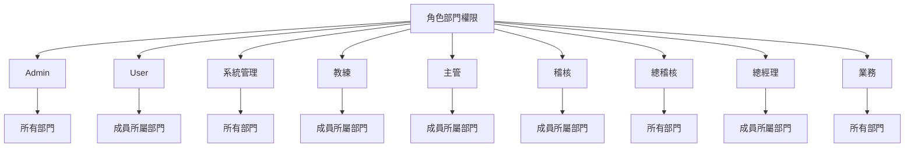
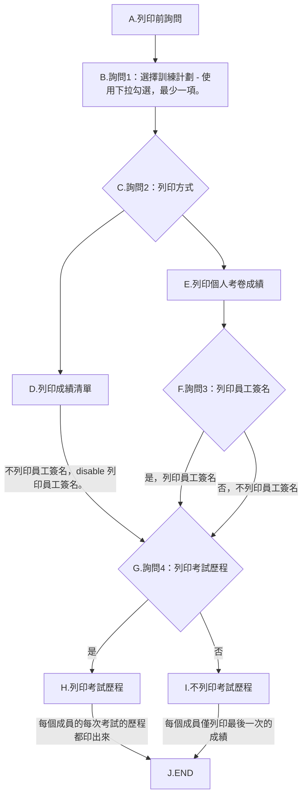
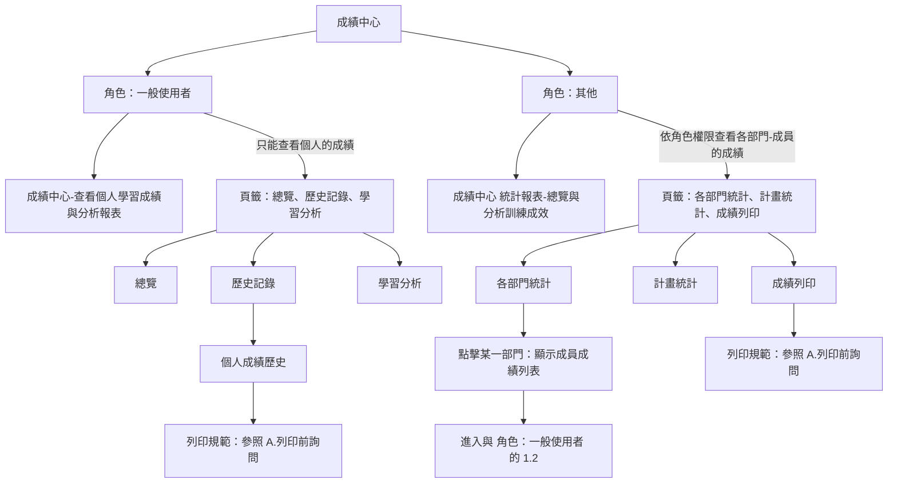

# T13 增修功能實作 PLAN 測試問題及新增加需求：

## 角色部門權限

## [`所有人`] 皆適用此列印流程：

---
## 1.成績中心
1. 沒有做到依`角色`，來區分資料可視範圍（部門內 / 全部）。
   - 成績中心各項功能權限

> 角色部門權限管理設計好後，依上面你自己的描述：
> 規則是「登入者自己所屬部門一定能看」，再加上「角色部門權限頁面你額外選的部門」也能看；
> 所以業務若選 10 個部門，登入業務後在報到/成績中心就能看到除了自己部門之外的那 10（至少包含額外 5）。

問題修改歷程：
--- 
1. 例如，500032是KC倉副理（或其他稽核人員、業務、主管），登入後，進入成績中心，應該只能(**看到及列印**)`他所屬`**KC倉**的各項總覽與分析訓練成效狀況。
2. 其他一般user，則只能查看個人學習成績與分析報表。
3. 不管到那，`**Admin是擁有所有的權限，且不能變更的**`。
4. 

--- 

1. 列印PDF時，輸出的檔名格式：日期_
2. 當詢問2， 選擇 列印成績清單時，disable列印員工簽名。
3. 考試歷程：
a. 未勾選時，僅列印最後一次的成績。
b. 有勾選時，依每個人的考試的先後順序列印。
1. 列印每個人的考卷成績：
a. 沒有隔列Highlight顯示。
b. @0.standards/2.棕地專案/T13 增修功能實作PLAN_測試問題.md:48-53 ，都沒做到。
1. 

--- 
### 接下來繼續修改成績中心的問題，以 KA倉 副理 熊致偉 300009 為例：
1. 進入部門成績，中間 4個頁籤，預設顯示「各部門統計」，
   點開成員成績列表，點擊 黃振麟 - 2026年度新人培訓 的 查看個人成績後，
   頁面沒有反應，應該直接導入至  **歷史記錄 頁籤**，而且此歷史記錄是 `黃振麟 的個人成績歷史` 的記錄，
   **不是** `KA倉 副理 熊致偉 300009` 的個人成績歷史。
2. 續1，手動點 歷史記錄 頁籤，出現 無法載入資料。
   後台出現錯誤：
   INFO:     127.0.0.1:50169 - "GET /api/exam/personal/history?sort_by=time&order=desc&page=1&page_size=20&emp_id=300005 HTTP/1.1" 403 Forbidden
  點其他的頁籤（總覽、學習分析）都一樣的狀況。

### 再來，修改 總覽、歷史記錄、學習分析 這3個頁籤 的使用規範
1. 續前問題，點擊 黃振麟 - 2026年度新人培訓 後，自動導入 **歷史記錄 頁籤**。
   - 我講錯了，改成自動導入至 **總覽 頁籤**。
   - **總覽、歷史記錄、學習分析** 這3個頁籤變成`黃振麟`的 個人學習成績與分析報表。
   - 續，這 3個頁籤的標題，要加上 **KA倉 黃振麟** 個人成績總覽/個人成績歷史/個人學習分析。
   - 續，說明：**KA倉 黃振麟** 這個要隨著點擊誰而不同。
   - 如果沒有從各部門統計點擊的話，**總覽、歷史記錄、學習分析** 這3個頁籤就是`登入的那個人的個人學習成績與分析報表`。
   - 當點擊 **成績中心＋右邊那個勳章** 就回到 `登入的那個人的個人學習成績與分析報表`。
2. 個人成績總覽裡有 6個卡片：
   - 第一個是已完成考試卡片，增加此卡片點擊後導入至個人成績歷史頁籤。
   - 其他5個卡片維持現狀。
3. 

### 再來，成績中心 - 歷史記錄 的問題修改
1. 續前問題，點擊 黃振麟 - 2026年度新人培訓，再點進入 歷史記錄，進入查看 KA 倉 黃振麟 的所有考試記錄後：
   - 成績列印流程，不在此頁面上進行這個流程。
   - 點擊考試歷程 的某一筆記錄，結果出現 無法載入資料。
     後台出現錯誤：
     INFO:     127.0.0.1:60292 - "GET /api/exam/personal/print/plan-options HTTP/1.1" 200 OK
     INFO:     127.0.0.1:61215 - "GET /api/exam/record/45/detail HTTP/1.1" 403 Forbidden
     INFO:     127.0.0.1:61217 - "GET /api/exam/record/45/detail HTTP/1.1" 403 Forbidden

### 繼續 成績中心 - 歷史記錄 的調整修改 #1
1. 在搜尋bar裡輸入關鍵字，不要打一個字，就馬上進行搜尋，然後頁面就重整，然後游標就不知道跑到那裡去了。
   - 游標應該是繼續停在搜尋bar，以便讓人繼續打字。
   - 改善搜尋bar裡打字搜尋的作法。

### 繼續 成績中心 - 歷史記錄 的調整修改 #2

1. 修改了考試次數後，以 KA 倉 謝綺瑩 (300002)為例：
   - 在成績中心-個人成績歷史中，個人的成績趨勢 和 訓練列表的重考次數，2邊的數字對不起來。
   - 考試中心、成績中心的考試次數，顯示不一致。
   - 新的考試次數計數，第一次考試你會自動加1。
   - KA 倉 謝綺瑩 (300002)，2026年度教育訓練-消防演練，報到時間是2026/4/2 下午2:04:18，隨即進行第一次的考試，但在他的考試中心看到此訓練的挑戰次數是2。
   - 續，進到他個人成績歷史，看到的「重考」次數是2，點查看詳情，在考試歷程記錄看到2次一模一樣的記錄。
   - 續，再試一次2026年 資訊安全，報到完馬上進行考試，交卷後回到考試中心，結果也是看到挑戰次數是2。
   - 續，進到個人成績歷史，看到的「重考」次數是2，但這次進到考試歷程記錄，卻只看到一次的考試歷程。
   - 再換另一位HQ 倉儲行政部 孫怡真 (100023)，以2026老人計劃的測試結果，和謝綺瑩 (300002)以2026年 資訊安全測試結果，2個人的結果是一樣。
   - 所以，你在第一次考試的時候，計算方式會自動加1，但在成績中心的成績趨勢，顯示是1次，成績列表是2次，進入考試歷程記錄，只看到一次的考試歷程。
   - 以 KA倉 稽核 林正南 (300008)登入，進入成績中心-部門成績，查看成員成績列表，發現謝綺瑩 (300002)的考試記錄只有2筆，與實際 謝綺瑩 (300002)的成績中心的4筆不相符。
2. 全部重新檢查，考試中心上所顯示的挑戰次數、成績中心的個人成績歷史 的選擇計畫/成績趨勢/訓練計劃列表重考次數/考試歷程記錄及部門成績
3. 續，「重考」次數。。。。第2次以後才叫重考，如果第一次就及格，就不會有重考狀況，所以這個欄位到底要不要叫做「重考次數」，還是叫做「考試次數」？
4. 所有的時間顯示，改為 24'h制。
   
以上問題原因（校正版）：
1. 主因正確：後端把 ExamRecord.attempts 當成「提交次數」在 submit_exam 會 +1，但 start_exam 會先建立一筆 ExamRecord(attempts=0)；舊邏輯用 `(existing_record.attempts or 1) + 1`，所以第一次交卷會從 0 直接變 2（不是 1）。
2. 次因補充：不同畫面取「次數」來源不同，才會放大不一致：
   - 成績趨勢 / 考試歷程：看 ExamHistory 筆數（每次提交新增一筆）
   - 考試中心卡片 / 成績列表：原本看 ExamRecord.attempts（受舊邏輯與舊資料影響）
   => 同一人同一計畫就會出現「趨勢=1、列表=2、卡片=2、歷程=1」。
3. 命名問題：欄位語意其實是「考試次數（提交次數）」，不是「重考次數」。第 1 次不是重考。

解決方法（已實作）：
1. 修正 submit_exam 的累加邏輯，改為首次提交=1：
   - `existing_record.attempts = (existing_record.attempts or 0) + 1`
2. 讓「考試中心卡片」與「成績中心列表」改用 ExamHistory 筆數作為考試次數來源，與趨勢/歷程一致：
   - 以 `count(ExamHistory.id)` 為主。
   - 舊資料若已有 submit_time 但尚無 history，fallback 視為 1 次，避免顯示 0。
3. 前端欄位名稱統一為「考試次數」，避免誤讀為「重考次數」。

結果：
- 同一人同一計畫在「考試中心卡片 / 成績列表 / 成績趨勢 / 考試歷程」的次數可對齊。
- 第一次交卷顯示為 1 次，第二次才是 2 次。

### 2026/04/20
### 繼續 成績中心 - 歷史記錄 的調整修改 #3
1. 個人成績歷史 - 選擇計畫，增加全選/不全選功能。
   - 這個功能有沒有可能可以做成元件，供任何專案使用？不過看起來好像不需要。
2. 在個人歷史記錄裡，最下面是每個訓練的清單列表，點查看詳情，進入所選擇的訓練的考試歷程記錄的Model：
   - 上方的考試歷程清單，點某一次的查看詳情，跳出該次的考試的考卷成績，在此時，才要進入詢問和簽名/歷程列印的詢問。
     - 查看 **個人** 某個訓練的某一次考試的成績，跳出該次的成績詳情Model：
       - 右上藍色的「預覽成績單」的Button，預設 **呈現灰色無法按的狀態**。
       - 續，在Button 的左邊加 **列印員工簽名（預設否）的Checkbox**，詢問是否列印員工簽名（預設否）。
       - 續，`當勾選擇是否列印員工簽名後`，Button才恢復**藍色可按的狀態**。
   - 前述功能要重新調整：（2026/04/21）
     - 在「成績詳情」的Model，恢復右上藍色的「預覽成績單」的Button，預設enable。
       - 當`勾選`列印員工簽名：列印成績單時，`要`加上「考生簽名」、「日期」。
       - 當如果`不勾選`列印員工簽名：列印成績單時，`不要`加上「考生簽名」、「日期」。
     - 查看 **個人** 某個訓練的某一次考試的成績，不會有所謂的歷程列印的需求。
3. 在「考試歷程記錄」下方的成績列印流程：（2026/04/21）
   - `成績列印`改成`考試歷程成績列印`。
   - 詢問2：列印方式
     - 列印個人成績清單改為「列印個人`考試歷程成績清單`」。
     - 列印個人考卷成績改為「列印個人所有`考試歷程考卷成績`」。
   - 增加詢問3：
     - 「列印員工簽名（預設否）」，
   - 「產生PDF」改為「列印」，預設 **呈現灰色無法按的狀態**，須等依詢問2、詢問3都選擇後，才恢復**藍色可按的狀態**。
   - 及「下方的列印簽名/歷程的詢問」2個 **Checkbox**， 和 右邊的「2個button」：載入預覽、列印PDF（已選1人）。

### 成績中心
1. 不管是個人的**個人成績總覽**，或「部門成績」的**成績中心 統計報表**，只顯示現在進行中的訓練，已過期或已封存的不在此。
2. 續1, 加上可篩選的功能（如同訓練計劃管理一樣）

> **結案註記（2026-04-20）**：已實作並驗證—選擇計畫全選／清除、`ScorePrintFlow` 歷程 Modal 變體（個人文案、單一產生 PDF）、成績詳情（歷程入口）簽名 checkbox 與預覽 gate、個人成績總覽／報表 `plan_status`（active／expired／archived）前後端對齊。

續 2026/04/20 的調整

--- 
   
   - 待決定後，才依決定後的選項再進行列印。
     - 不需要載入預覽。
     - 按列印後，跳出列印預覽，再決定是要儲存至PDF檔？還是真正的列印。
   - 在此，隱藏此成績列印的詢問的流程及下方的列印簽名/歷程的詢問和右方的2個button。

### 繼續 成績中心 - 歷史記錄 的 查看詳情 button
1. 以 KA倉 稽核 林正南 300008 為例，進入成績中心 -> 部門成績 -> 選取 KA倉 黃振麟：
   - 進入黃振麟的 個人成績歷史，共有3個訓練計劃的考試記錄，點擊 2026年度新人培訓，重考3次，點查看詳情，在考試歷程裡，為什麼第2次的考試沒有詳情？
   - 改查看 林正南 300008 自己的個人成績歷史，現在有2026年度新人培訓，查看詳情，總共有6次考試，一樣是第5次的考試沒有詳情。
   - 2026年度教育訓練-消防演練，林正南 300008只有一次的考試，怎麼會有2次？
2. 人員的報到時間？你是抓那裡的？2026年度教育訓練-消防演練，林正南 300008報到完後，立即進行考試，提交時間和報到時間不相同，從報到時間來看，和考試提交時間差8個小時，表示報到時間的程式的時區（後台API？）沒有設成Asia/Taipei 台灣使用的標準時區，位於 UTC+8。
3. 在考試歷程Model中，`disable` **成績列印的詢問1**，不要讓user可以勾選訓練計劃，因為此考試歷程Model是來自上面所選取的計劃來的。

###

--- 
1. 詢問：選擇訓練計劃 - 使用下拉勾選，最少一項。
2. 將上述流程做成元件，這樣在 admin 的ReportDashboard 及 個人的 PersonalScoreHistory 來使用共用元件，程式也可以更精簡。
3. 成績列印的清單表頭，欄名稱：ITEM序號（沒有ITEM 序號欄，要增加）、員工編號、姓名、部門名稱、授課計劃名稱、成績分數。增加排序功能。
4. 個人成績歷史也要增加ITEM序號（沒有ITEM 序號欄，要增加），及增加排序功能。
5. 個人在列印成績單前未詢問：是否列印員工簽名（預設否）及 是否列印考試歷程（預設否）。
6. 和其他的清單列表一樣， admin 的ReportDashboard 及 個人的 PersonalScoreHistory 的成績清單列表：
   1. 可排序。
   2. 可輸入關鍵字來查詢部門、員工編號、姓名。
   3. 隔列Highlight顯示。
   4. 
7. 
8.  在新增的「成績列印」頁籤裡：
   1. 再增加詢問，使用下拉勾選方式：
      1. 詢問1：列印成績清單，還是每個人的考卷成績。
      2. 詢問2：那一個（還是那幾個）的訓練計劃要列印。
      3. 詢問3：是否要列印員工簽名。
      4. 詢問4：是否要列印考試歷程。

--- 
1. 列印PDF：
   1. 點載入預覽後，在列印PDF的button會出現(16)，請問那個14是怎麼算出來的？
   2. 在清單列表：
      1. 增加一個ITEM序號欄。
      2. 和其他的清單列表一樣，每頁顯示XX筆、分頁顯示。
      3. 和其他的清單列表一樣，可排序、可輸入關鍵字來查詢部門、員工編號、姓名。
   3. 報表 Title 名稱改成：XXX 教育訓練 **報到清單**。
   4. Title底下，從左到右：把報到統計Model上方4個卡片的人數放在此。（應到XX人 實到XX人 ....）
   5. 列印前詢問的事項 **簽名欄：否  歷程：否** 不用顯示出來。
   6. 下方授課人員的清單：
      1. 表頭欄名稱，依續：ITEM序號（新增加）、員工編號、姓名、部門、授課計劃、成績。增加排序功能。
      2. 隔列Highlight顯示。
2. 

## 2. 考卷工坊
1. 修改：將右邊的「點擊或拖放上傳考卷 (TXT)」區塊，把(選擇檔案 和 上傳後將... 這段字)移到 (上傳的那個圖 和 點擊或拖放...) 的右邊，變成左右2邊（現在是上下）。
2. 在題庫維護中，有輸入關鍵字方式查詢題目內容，或輸入標籤的關鍵字查詢，在這2個input的右邊加一個小XX，可以方便清除輸入的內容，然後重新輸入。 
3. 從題庫匯入題目：
   1. 增加「全選 / 不全選」功能，以便方便加入訓練計劃的考卷題目中。
   2. 題目編輯，增加可輸入多個標籤功能。

## 3. 報到總覽 
1. 沒有做到依 職務（或角色），來區分資料可視範圍（部門內 / 全部），例如，500032是KC倉副理，登入後，在報到總覽，應該只能看到[2026老人計劃]、[2026年度新人培訓]這2個訓練計劃，而且進到計劃中也只能(**看到及列印**)他所屬**KC倉**的報到狀況。
   1. 比如[`訓練計畫-Docker`]，授課單位是[`IT`]，只有擁有報到總覽的權限的角色才能看到此訓練計畫的報到狀況，其他部門的人不應該看到。
   2. 至於列印則一樣，只有擁有報到總覽的權限的角色，才能查看及列印報到統計。
2. 在報到統計Model中：
   1. 增加一個功能- 就是未報到者，如有請假，要填寫原因，增加一鍵填寫多人請假原因的功能。
   2. 應清楚顯示目前是選到上方的那個卡片，點擊到的那個卡片的邊框加粗和顏色加深，方便可以清楚的目視。
   3. 編輯請假原因後，應**立即重新統計**上方4個卡片的人數變化。
3. 報到總覽和訓練計劃的報到統計Model，上方4個卡片的**人數統計不一樣**？這不是用同一個資料表table的記錄嗎？（報到統計 - 2026老人計劃）
4. **依職務/角色做資料可視範圍權**限進入報到統計，列印目前清單：
   1. 報表 Title 名稱改成：XXX 教育訓練 **報到清單**
   2. Title底下，從左到右：把報到統計Model上方4個卡片的人數放在此。（應到XX人 實到XX人 ....）
   3. 列印前詢問的事項 **簽名欄：否  歷程：否** 不用顯示出來。
   4. 下方授課人員的清單：
      1. 表頭欄名稱，依續：ITEM序號（新增加）、員工編號、姓名、部門、授課計劃、報到時間、未報到原因。
      2. 隔列Highlight顯示。
      3. 列印時，要按「列印目前清單」，這裡的目前清單，看起來預設是只列印實到人數，應該是列所選擇的是那個卡片才對。

## 4. 考試中心
1. 成功登入後，只顯示屬於自己的且是目前正在進行中的訓練計劃，已過期或已封存的皆不要顯示。

## 5. 訓練訓練
1. 編輯訓練計畫，個人受課對象的list，人員的狀態是未啟用的，不要在此個人受課對象list中出現。（**不論在其他的那個地方，應該都要隱藏未啟用的人員。**）