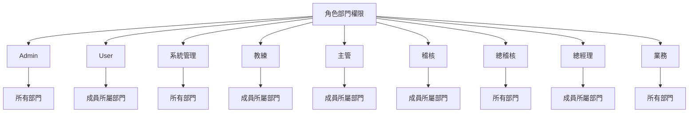
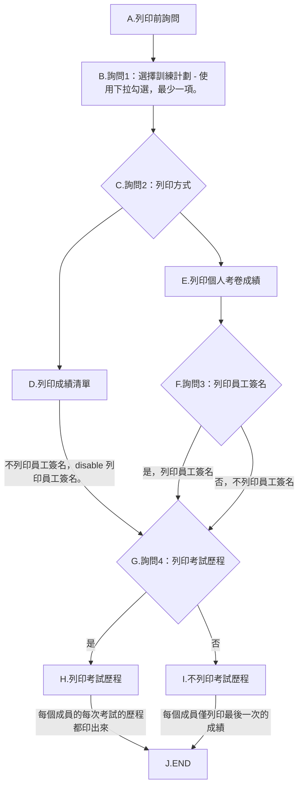
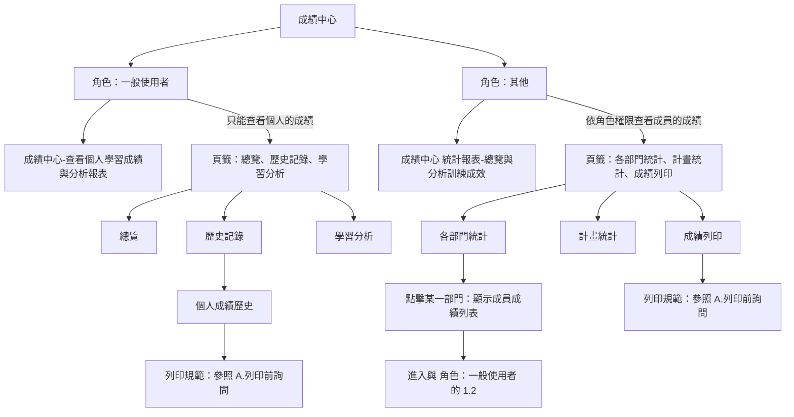

# T13 增修功能實作 PLAN 測試問題及新增加需求：

## 角色部門權限

## [`所有人`] 皆適用此列印流程：

---
## 1.成績中心
1. 沒有做到依`角色`，來區分資料可視範圍（部門內 / 全部）。
   - 成績中心各項功能權限

1. 例如，500032是KC倉副理（或其他稽核人員、業務、主管），登入後，進入成績中心，應該只能(**看到及列印**)`他所屬`**KC倉**的各項總覽與分析訓練成效狀況。
2. 其他一般user，則只能查看個人學習成績與分析報表。
3. 不管到那，`**Admin是擁有所有的權限，且不能變更的**`。
4. 

角色部門權限管理設計好後，依上面你自己的描述：
規則是「登入者自己所屬部門一定能看」，再加上「角色部門權限頁面你額外選的部門」也能看；所以業務若選 10 個部門，登入業務後在報到/成績中心就能看到除了自己部門之外的那 10（至少包含額外 5）。
請依此規則進行相關的修正，修正前，請先提出計刜。

1. 列印PDF時，輸出的檔名格式：日期_
2. 當詢問2， 選擇 列印成績清單時，disable列印員工簽名。
3. 考試歷程：
a. 未勾選時，僅列印最後一次的成績。
b. 有勾選時，依每個人的考試的先後順序列印。
3. 列印每個人的考卷成績：
a. 沒有隔列Highlight顯示。
b. @0.standards/2.棕地專案/T13 增修功能實作PLAN_測試問題.md:48-53 ，都沒做到。
4. 

2. 詢問：選擇訓練計劃 - 使用下拉勾選，最少一項。
3. 將上述流程做成元件，這樣在 admin 的ReportDashboard 及 個人的 PersonalScoreHistory 來使用共用元件，程式也可以更精簡。
4. 成績列印的清單表頭，欄名稱：ITEM序號（沒有ITEM 序號欄，要增加）、員工編號、姓名、部門名稱、授課計劃名稱、成績分數。增加排序功能。
5. 個人成績歷史也要增加ITEM序號（沒有ITEM 序號欄，要增加），及增加排序功能。
6. 個人在列印成績單前未詢問：是否列印員工簽名（預設否）及 是否列印考試歷程（預設否）。
7. 和其他的清單列表一樣， admin 的ReportDashboard 及 個人的 PersonalScoreHistory 的成績清單列表：
   1. 可排序。
   2. 可輸入關鍵字來查詢部門、員工編號、姓名。
   3. 隔列Highlight顯示。
   4. 
8. 
9.  在新增的「成績列印」頁籤裡：
   1. 再增加詢問，使用下拉勾選方式：
      1. 詢問1：列印成績清單，還是每個人的考卷成績。
      2. 詢問2：那一個（還是那幾個）的訓練計劃要列印。
      3. 詢問3：是否要列印員工簽名。
      4. 詢問4：是否要列印考試歷程。

--- 
1. 列印PDF：
   1. 點載入預覽後，在列印PDF的button會出現(16)，請問那個14是怎麼算出來的？
   2. 在清單列表：
      1. 增加一個ITEM序號欄。
      2. 和其他的清單列表一樣，每頁顯示XX筆、分頁顯示。
      3. 和其他的清單列表一樣，可排序、可輸入關鍵字來查詢部門、員工編號、姓名。
   3. 報表 Title 名稱改成：XXX 教育訓練 **報到清單**。
   4. Title底下，從左到右：把報到統計Model上方4個卡片的人數放在此。（應到XX人 實到XX人 ....）
   5. 列印前詢問的事項 **簽名欄：否  歷程：否** 不用顯示出來。
   6. 下方授課人員的清單：
      1. 表頭欄名稱，依續：ITEM序號（新增加）、員工編號、姓名、部門、授課計劃、成績。增加排序功能。
      2. 隔列Highlight顯示。
2. 

## 2. 考卷工坊
1. 修改：將右邊的「點擊或拖放上傳考卷 (TXT)」區塊，把(選擇檔案 和 上傳後將... 這段字)移到 (上傳的那個圖 和 點擊或拖放...) 的右邊，變成左右2邊（現在是上下）。
2. 在題庫維護中，有輸入關鍵字方式查詢題目內容，或輸入標籤的關鍵字查詢，在這2個input的右邊加一個小XX，可以方便清除輸入的內容，然後重新輸入。 
3. 從題庫匯入題目：
   1. 增加「全選 / 不全選」功能，以便方便加入訓練計劃的考卷題目中。
   2. 題目編輯，增加可輸入多個標籤功能。

## 3. 報到總覽 
1. 沒有做到依 職務（或角色），來區分資料可視範圍（部門內 / 全部），例如，500032是KC倉副理，登入後，在報到總覽，應該只能看到[2026老人計劃]、[2026年度新人培訓]這2個訓練計劃，而且進到計劃中也只能(**看到及列印**)他所屬**KC倉**的報到狀況。
   1. 比如[`訓練計畫-Docker`]，授課單位是[`IT`]，只有擁有報到總覽的權限的角色才能看到此訓練計畫的報到狀況，其他部門的人不應該看到。
   2. 至於列印則一樣，只有擁有報到總覽的權限的角色，才能查看及列印報到統計。
2. 在報到統計Model中：
   1. 增加一個功能- 就是未報到者，如有請假，要填寫原因，增加一鍵填寫多人請假原因的功能。
   2. 應清楚顯示目前是選到上方的那個卡片，點擊到的那個卡片的邊框加粗和顏色加深，方便可以清楚的目視。
   3. 編輯請假原因後，應**立即重新統計**上方4個卡片的人數變化。
3. 報到總覽和訓練計劃的報到統計Model，上方4個卡片的**人數統計不一樣**？這不是用同一個資料表table的記錄嗎？（報到統計 - 2026老人計劃）
4. **依職務/角色做資料可視範圍權**限進入報到統計，列印目前清單：
   1. 報表 Title 名稱改成：XXX 教育訓練 **報到清單**
   2. Title底下，從左到右：把報到統計Model上方4個卡片的人數放在此。（應到XX人 實到XX人 ....）
   3. 列印前詢問的事項 **簽名欄：否  歷程：否** 不用顯示出來。
   4. 下方授課人員的清單：
      1. 表頭欄名稱，依續：ITEM序號（新增加）、員工編號、姓名、部門、授課計劃、報到時間、未報到原因。
      2. 隔列Highlight顯示。
      3. 列印時，要按「列印目前清單」，這裡的目前清單，看起來預設是只列印實到人數，應該是列所選擇的是那個卡片才對。

## 4. 考試中心
1. 成功登入後，只顯示屬於自己的且是目前正在進行中的訓練計劃，已過期或已封存的皆不要顯示。

## 5. 訓練訓練
1. 編輯訓練計畫，個人受課對象的list，人員的狀態是未啟用的，不要在此個人受課對象list中出現。（**不論在其他的那個地方，應該都要隱藏未啟用的人員。**）