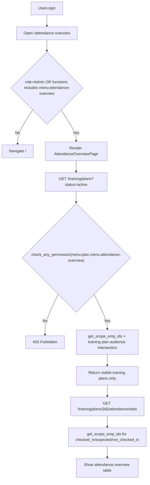
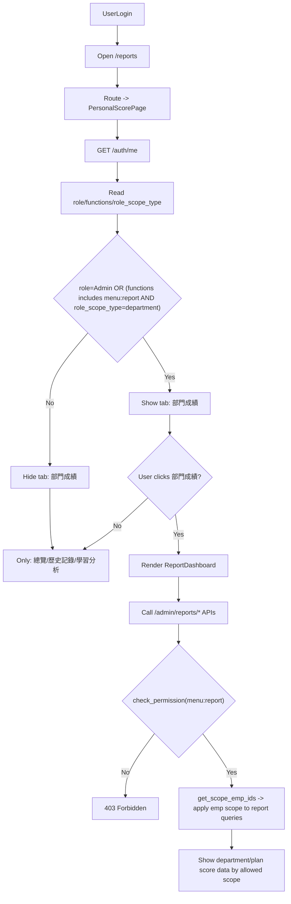

# T13 報到總覽與成績中心進入判斷流程圖

本文件含 **流程圖（mermaid）** 與 **流程步驟說明**；步驟編號與圖中節點順序對應，便於對照。

## 1) 進入「報到總覽」判斷邏輯

### 1.1 流程步驟說明（報到總覽）

1. **使用者已登入**：具備有效 Token，可呼叫需認證的 API。
2. **開啟報到總覽路徑**：瀏覽器進入 `/attendance-overview`。
3. **前端路由守門**：若 `role === Admin` 或 `functions` 含 `menu:attendance-overview`，才渲染 `AttendanceOverviewPage`；否則導向首頁 `/`。
4. **載入計畫清單**：頁面呼叫 `GET /training/plans?status=active`。
5. **後端 API 權限**：`training` 路由以 `check_any_permission(["menu:plan", "menu:attendance-overview"])` 檢查；未通過回 **403**。
6. **計畫清單套用可視範圍**：後端以 `get_scope_emp_ids` 取得目前使用者可見員工，再與各計畫「受訓對象（部門＋個人）」做交集，只回傳與可視範圍有關的計畫。
7. **逐筆載入統計**：對每個可見計畫呼叫 `GET /training/plans/{id}/attendance/stats`。
8. **統計數字再套 scope**：應到／實到／未到名單與人數皆在後端依同一套 `get_scope_emp_ids` 裁切，避免清單與明細口徑不一致。
9. **畫面呈現**：表格顯示各計畫報到統計與「報到統計」操作。

## 2) 進入「成績中心」判斷邏輯

### 2.1 流程步驟說明（成績中心）

1. **使用者已登入**：具備有效 Token。
2. **開啟成績中心路徑**：瀏覽器進入 `/reports`（或 `/reports/personal`，皆導向同一個個人成績頁元件）。
3. **前端路由**：一律渲染 `PersonalScorePage`（不另依角色切到不同頂層頁）。
4. **取得登入者資訊**：呼叫 `GET /auth/me`，讀取 `role`、`functions`、`role_scope_type`（及必要時之 `role_scope_dept_ids`，供後端／其他功能使用）。
5. **是否顯示「部門成績」頁籤**：
   - 若 `role === Admin` → **顯示**「部門成績」。
   - 若 `functions` 含 `menu:report` 且 `role_scope_type === department`（角色部門權限為「成員所屬部門」）→ **顯示**「部門成績」。
   - 其餘 → **不顯示**「部門成績」；僅顯示「總覽／歷史記錄／學習分析」。
6. **使用者停留在個人頁籤**：可檢視個人總覽、歷史、學習分析（實際資料權限仍由對應個人 API 與後端規則決定）。
7. **使用者點選「部門成績」**：在頁籤已顯示的前提下，於頁內掛載 `ReportDashboard`。
8. **報表 API 呼叫**：`ReportDashboard` 向 `/admin/reports/*` 取數。
9. **後端報表權限**：各端點使用 `check_permission("menu:report")`；未通過回 **403**。
10. **報表資料範圍**：通過權限後，查詢一律套用 `get_scope_emp_ids`（與角色部門權限一致：自己部門＋額外可視部門聯集等規則），再回傳可見的部門／計畫／成績資料。

## 3) 核心規則摘要

- 報到總覽：入口權限由前端路由先判斷，資料可視範圍由後端 `get_scope_emp_ids` 決定。
- 成績中心：`/reports` 一律可進入個人頁；`部門成績` 頁籤是否顯示，取決於 `Admin` 或 `menu:report + role_scope_type=department`。
- 真正資料範圍最終都由後端 scope 套用，不以前端顯示為唯一依據。
