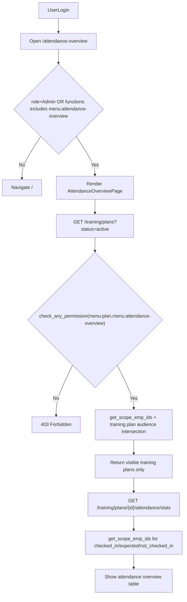
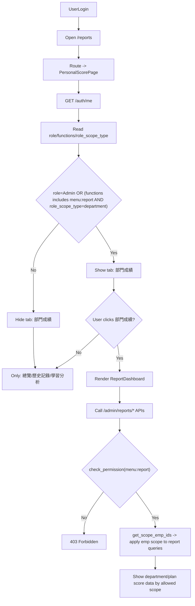

# T13 報到總覽與成績中心進入判斷流程圖

## 1) 進入「報到總覽」判斷邏輯

## 2) 進入「成績中心」判斷邏輯

## 3) 核心規則摘要

- 報到總覽：入口權限由前端路由先判斷，資料可視範圍由後端 `get_scope_emp_ids` 決定。
- 成績中心：`/reports` 一律可進入個人頁；`部門成績` 頁籤是否顯示，取決於 `Admin` 或 `menu:report + role_scope_type=department`。
- 真正資料範圍最終都由後端 scope 套用，不以前端顯示為唯一依據。
