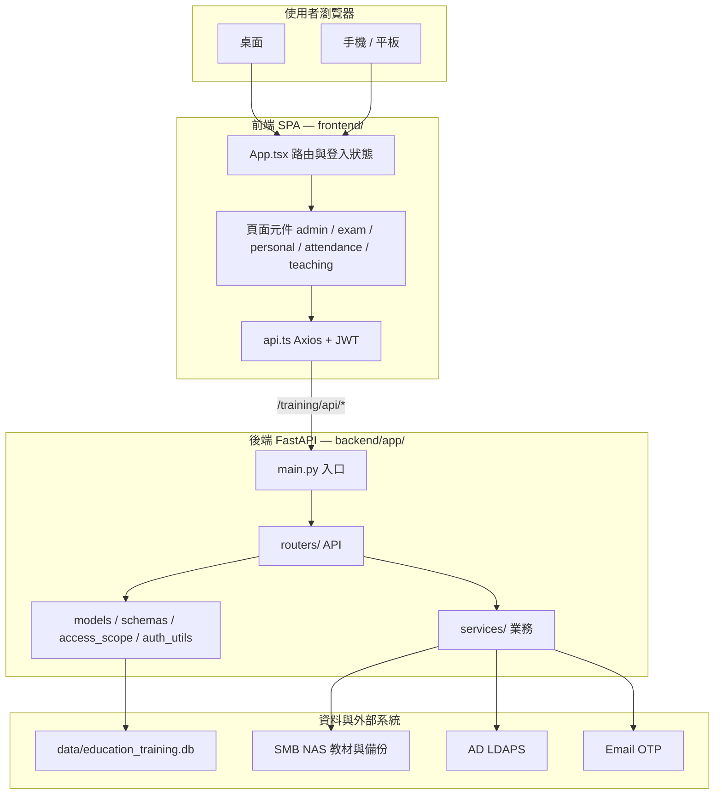
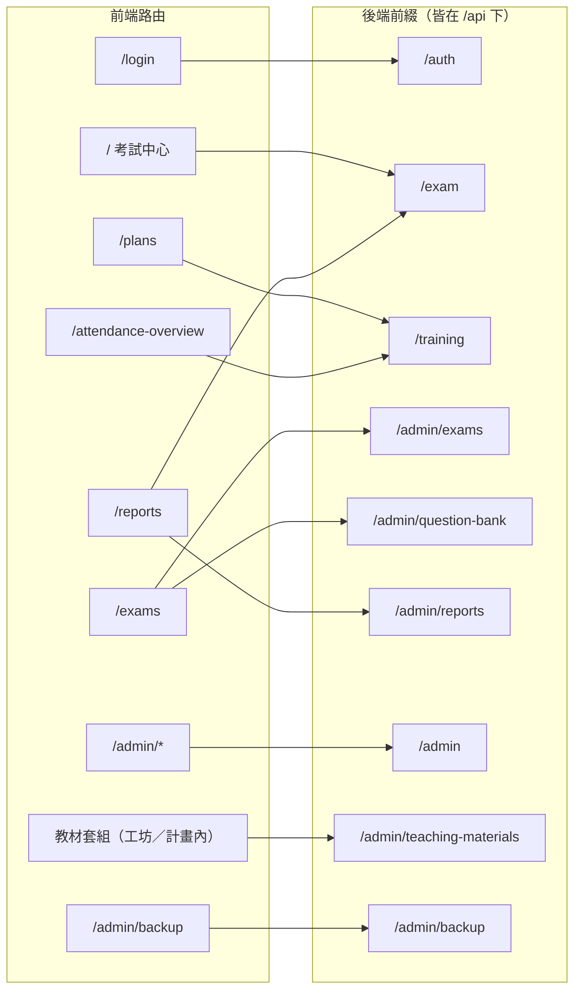

# 專案系統架構分析 (Project System Architecture Analysis)


**徽章使用規範**：本文件遵循 [徽章使用規範](../01-綠地專案/徽章使用規範.md)。

---

## 一、目的與範圍

本文件為本系統**現行架構單一真理來源（SSOT）**，記錄：

1. 系統架構與模組邊界  
2. 認證／訓練／考試／教材／備份流程  
3. 資料庫實體摘要與資料流  
4. **前後端每支程式（檔案）的用途與對應關係**

適用對象：開發人員、維運人員、專案管理者。  
歷史長文 [專案架構分析.md](專案架構分析.md) **勿當現行 SSOT**。資料表欄位以 [education_training_db_結構分析.md](資料庫結構分析/education_training_db_結構分析.md) 為準。

---

## 二、系統架構概觀

### 2.1 整體架構

本系統採**前後端分離**：前端為 SPA（React + Vite），後端為 RESTful API（FastAPI），資料持久層使用 SQLite。  
對外以瀏覽器存取前端（base path `/training/`），前端經由 Axios 呼叫 `/training/api/*`（開發代理至 `localhost:8000/api/*`）；後端依 JWT 與 RBAC 進行認證與授權。共用 UI 元件位於企業根目錄 `0.shared-ui`（別名 `@shared-ui`）。



### 2.2 模組邊界

| 模組 | 職責 | 主要 API 前綴 |
|------|------|----------------|
| 認證 | 驗證碼、員工登入、註冊、JWT、QRcode、AD 管理登入、Email OTP、break-glass | `/auth` |
| 系統管理 | 單位、分類、人員、角色、權限、功能清單、職務、角色部門範圍 | `/admin` |
| 訓練計畫 | 計畫 CRUD、受課單位/個人、封存、報到統計、報到總覽 | `/training` |
| 考卷工坊 | 題目上傳/解析（NAS）、題目 CRUD | `/admin/exams` |
| 題庫 | 題庫查詢、更新、刪除、匯入至計畫 | `/admin/question-bank` |
| 教材庫 | 套組上傳/下載、NAS 登入 session、類型與格式主檔 | `/admin/teaching-materials`（含 `/sets`） |
| 考試中心 | 我的考試、報到、開始考試、提交答案、評分 | `/exam` |
| 成績中心 | 總覽、部門/計畫統計、個人成績、PDF 導出、批次列印 | `/admin/reports`、`/exam` |
| 排程備份 | 備份設定、NAS 連線測試、立即備份、執行紀錄分頁與可選刪 NAS 之批次刪除 | `/admin/backup` |
| QRcode | 登入 QR 產生（方案 A：固定登入頁 URL） | `/admin/qrcode` |

### 2.3 前端頁面與後端 API 對照



列表類 API 幾乎都經 `access_scope.get_scope_emp_ids()` 過濾（`all`／`department`／`self`）。能登入但列表全空，優先查資料範圍或業務表是否為 0，而非前端錯誤。

---

## 三、系統流程

### 3.1 認證與授權流程

```
使用者輸入員工編號
    → GET /auth/captcha 取得驗證碼圖
    → 輸入驗證碼 + POST /auth/login
    → 後端驗證（員工編號 + 驗證碼）
    → 簽發 JWT Token
    → 前端將 Token 存於 localStorage
    → 後續請求於 Header 帶上 Authorization: Bearer <token>
    → 後端依 Token 取得使用者與角色，再依 RBAC 檢查功能權限
```

（若使用 QRcode 登入：掃描 QRcode 進入登入頁，仍依上述流程以員工編號 + 驗證碼登入。）

**IT 管理者（棕地 AD 整合）**：

```
路徑 A — AD 登入：POST /auth/login/admin（IT Admins 群組 + JIT 建檔，is_trainee=false）
路徑 B — break-glass：POST /auth/login/local（本地 admin，不受 AD_ENABLED 影響）
路徑 D — AD 斷線：POST /auth/login/admin/email/request → verify（Email OTP）
管理角色不得使用免密 POST /auth/login
```

### 3.2 訓練計畫與考試主流程

```
系統管理：建立分類（大項目/細項目）
    ↓
訓練計畫管理：建立計畫（細項目、開課單位、受課單位/個人、日期、及格分數、封存等）
    ↓
考卷工坊：上傳 TXT 或從題庫匯入題目 → 題目寫入 questions，並可同步題庫
    ↓
考試中心：使用者選擇計畫 → 報到（若需）→ 開始考試 → 作答 → 提交
    ↓
後端：自動評分、寫入 exam_records / exam_details
    ↓
成績中心：總覽、部門/計畫/個人統計、成績詳情、PDF 成績單
```

### 3.3 題目上傳與匯入流程

```
【TXT 上傳】
上傳 TXT → TXTParser 解析 → 判斷題型（單選/多選/是非）
    → 寫入 questions（綁定 plan_id）
    → 依內容檢查 question_bank，不存在則新增
    → 原始檔備份至 NAS `{year}/{plan_id}/exams/`（service 模式；見 `storage.py`）

【教材上傳】（與考卷分離；現行＝套組 Wave2）
訓練計畫編輯頁或教材庫 → 新增／編輯套組（互斥）→ 勾選綁定計畫（0～N；無綁定＝通用）
    → NAS interactive 登入 → 上傳檔案至 NAS
    → 寫入 teaching_material_sets + teaching_material_files + teaching_material_set_plans
    → 寫入 file_transfer_audit_logs；離開連線必 disconnect
（舊表 teaching_materials 僅供 Wave1 遷移溯源；API 本體見 teaching_material_sets.py）

【題庫匯入】
題庫查詢（關鍵字、題型、標籤篩選）→ 選題 → POST 匯入至指定計畫
    → 複製題目至 questions（同 plan_id）
```

---

## 四、資料庫結構

### 4.1 核心實體關係概觀

- **組織**：`departments` ↔ `users`（多對一）；`roles` ↔ `users`（多對一）；`roles` ↔ `system_functions`（多對多，經 `role_functions`）。
- **訓練**：`main_categories` → `sub_categories` → `training_plans`；`training_plans` ↔ `departments`（受課單位，經 `plan_target_departments`）；`training_plans` ↔ `users`（個人授課對象，經 `plan_target_users`）。
- **題目與題庫**：`training_plans` → `questions`；獨立 `question_bank`，可經匯入寫回 `questions`。
- **考試與報到**：`users` + `training_plans` → `exam_records` → `exam_details`；`attendance_records` 記錄報到。
- **教材（棕地，現行套組）**：`material_types`／`material_file_formats` 主檔 → `teaching_material_sets` → `teaching_material_files`（實體檔於 NAS）；計畫綁定經 `teaching_material_set_plans`（無列＝通用）。Wave1 `teaching_materials` 為遺留表。
- **備份與稽核**：`backup_schedule_config`（單例）、`backup_records`；`file_transfer_audit_logs` 記錄考卷／教材傳輸。

### 4.2 主要資料表摘要

| 表名 | 說明 | 關鍵欄位 |
|------|------|----------|
| **departments** | 部門/單位 | id, name |
| **users** | 使用者 | emp_id(PK), name, dept_id, role_id, status, is_trainee, auth_source, ad_username, email |
| **teaching_material_sets** | 教材套組主檔（現行） | id, title, material_type_id, year, is_active |
| **teaching_material_files** | 套組內檔案（現行） | id, set_id, storage_path, original_filename, file_size_bytes |
| **teaching_material_set_plans** | 套組↔計畫 | set_id, plan_id（UNIQUE） |
| **teaching_materials** | Wave1 目錄卡（遺留） | id, plan_id, title, storage_path；已遷移至套組 |
| **material_types** | 教材類型主檔 | id, name, slug |
| **material_file_formats** | 允許副檔名主檔 | id, ext, label |
| **backup_schedule_config** | 排程備份設定 | id(=1), enabled, frequency, retention_count |
| **file_transfer_audit_logs** | 傳輸稽核 | id, emp_id, action, resource_type, filename |
| **roles** | 角色 | id, name |
| **system_functions** | 功能清單（樹狀） | id, name, code, parent_id, path |
| **role_functions** | 角色－功能多對多 | role_id, function_id |
| **main_categories / sub_categories** | 訓練分類 | id, name, main_id |
| **training_plans** | 訓練計畫 | id, sub_category_id, dept_id, title, training_date, end_date, year, passing_score, is_archived, expected_attendance |
| **plan_target_departments** | 計畫－受課單位 | plan_id, dept_id |
| **plan_target_users** | 計畫－個人授課對象 | plan_id, emp_id |
| **questions** | 考卷題目（綁定計畫） | id, plan_id, content, question_type, options, answer, points |
| **question_bank** | 題庫 | id, content, question_type, options, answer, tags |
| **exam_records** | 考試紀錄 | id, emp_id, plan_id, total_score, is_passed, start_time, submit_time, attempts |
| **exam_details** | 考試詳情（每題） | id, record_id, question_id, user_answer, is_correct |
| **attendance_records** | 報到紀錄 | id, plan_id, emp_id, checkin_time |

資料庫欄位與關聯之完整定義請見後端 `backend/app/models.py` 及 [02-棕地專案/規格與計畫/0.專案架構分析.md](../02-棕地專案/規格與計畫/0.專案架構分析.md)。

---

## 五、資料流程

### 5.1 訓練計畫建立至考試完成

```
分類 → 訓練計畫（含受課單位/個人、日期、及格分數）
    → 題目（上傳或題庫匯入）寫入 questions
    → 使用者於考試中心選擇計畫
    → 開始考試（取得題目，不傳答案）
    → 作答結果於前端暫存 / 本地儲存
    → 提交 → 後端評分 → 寫入 exam_records、exam_details
    → 成績中心自 exam_records 彙總統計
```

### 5.2 題目與題庫雙向關係

```
questions（依 plan_id）
    ↑ 寫入/更新
    │  考卷工坊上傳、題庫匯入
    │
question_bank（獨立）
    ← 上傳時若題庫無相同內容則新增
```

### 5.3 封存對查詢之影響

- 訓練計畫 `is_archived = True` 時，於「正在進行中」「已過期」之列表與篩選中不顯示。
- 考卷工坊、考試中心、成績中心相關 API 僅查詢或暴露 `is_archived = False` 之計畫（依各 API 實作為準）。
- 已存在之 `exam_records`、`questions` 不因計畫封存而刪除，僅自「可操作」列表中排除。

---

## 六、專案技術堆疊

### 6.1 後端

| 技術 | 用途 |
|------|------|
| **FastAPI** | REST API、路由、依賴注入、非同步支援 |
| **SQLAlchemy** | ORM、模型定義、連線與 Session 管理 |
| **SQLite** | 單機資料庫（`data/education_training.db`） |
| **Pydantic** | 請求/回應結構與驗證 |
| **python-jose** | JWT 簽發與驗證 |
| **Pillow** | 圖形驗證碼生成 |
| **ReportLab** | PDF 成績單生成 |
| **python-multipart** | 檔案上傳 |
| **qrcode** | 登入/報到 QRcode 產生 |

### 6.2 前端

| 技術 | 用途 |
|------|------|
| **React** | UI 組件、狀態、生命週期 |
| **TypeScript** | 型別定義與靜態檢查 |
| **Vite** | 開發伺服器、建置、HMR |
| **Tailwind CSS** | 樣式、響應式、 utility-first |
| **React Router** | 前端路由與導覽 |
| **Axios** | HTTP 呼叫、interceptor（JWT） |
| **Lucide React** | 圖標 |
| **Framer Motion** | 動畫與過場 |
| **Recharts** | 成績中心圖表 |
| **date-fns** | 日期處理與顯示 |

### 6.3 開發與維運

- **版控**：Git  
- **套件**：後端 `requirements.txt`；前端 `package.json`  
- **資料庫變更**：遷移腳本置於 `backend/migrations/`，說明見 [MIGRATION_GUIDE](資料庫遷移/MIGRATION_GUIDE.md)

---

## 七、後端程式用途（`backend/app/`）

實際讀取的 SQLite 路徑由 `database.py` 固定為**專案根** `data/education_training.db`（與 `backend/` 並列）。`backend/data/` 內空檔勿當正式庫。

### 7.1 核心層

| 檔案 | 用途與目的 |
|------|------------|
| `main.py` | FastAPI 入口：CORS、啟動建表、JWT／SMTP 安全警告、啟動／停止備份排程、註冊全部 router |
| `database.py` | SQLAlchemy engine／Session；解析 DB 路徑 |
| `config.py` | `pydantic-settings` 讀 `backend/.env`（JWT、AD、SMB、SMTP、備份） |
| `models.py` | 全部 SQLAlchemy 表與關聯 |
| `schemas.py` | 全部 Pydantic 請求／回應 |
| `auth_utils.py` | JWT 簽發／驗證、bcrypt 雜湊 |
| `access_scope.py` | 資料可見範圍：`all`／`department`／`self`；`get_scope_emp_ids()` |
| `init_db.py` | 首次建表與基礎角色／選單／break-glass 種子 |
| `constants/auth.py` | 超管角色名稱、AD 帳號正規化、管理角色判定 |

### 7.2 路由層（`routers/`）

掛載於 `/api`。前端 Axios `baseURL` 為 `/training/api`。

| 檔案 | API 前綴 | 用途與目的 |
|------|----------|------------|
| `auth.py` | `/auth` | 四條登入（員工驗證碼／AD／break-glass／Email OTP）、驗證碼、`/me`、改密碼 |
| `admin.py` | `/admin` | 單位、分類、人員、角色、權限、職務、功能清單、角色部門範圍 |
| `training.py` | `/training` | 計畫 CRUD、受課單位／個人、免考、封存、報到統計與報到總覽 |
| `exam.py` | `/admin/exams` | 考卷工坊：TXT 解析、計畫題 CRUD |
| `question_bank.py` | `/admin/question-bank` | 全域題庫查詢／維護、匯入至計畫 |
| `exam_center.py` | `/exam` | 我的考試、報到、開始考試、提交評分、重考授權 |
| `report.py` | `/admin/reports` | 總覽／部門／計畫統計、詳情分頁、PDF 與批次列印 |
| `teaching_material_sets.py` | `/admin/teaching-materials` | **現行**教材套組（多檔、綁 0～N 計畫）；須先於 Wave1 註冊 |
| `teaching_materials.py` | 同上 | Wave1 遺留；教材類型／格式主檔、NAS session 仍由此提供 |
| `backup.py` | `/admin/backup` | 排程設定、NAS 連線測試、立即備份、紀錄分頁／批次刪除 |
| `qrcode.py` | `/admin/qrcode` | 登入／報到 QR；舊含 UUID 的 QR 掃碼一律導向 `/login` |

### 7.3 服務層（`services/`）

| 檔案 | 用途與目的 |
|------|------------|
| `ad_auth.py` | LDAP/LDAPS bind，回傳 `AdAuthResult` |
| `jit_provision.py` | AD 首次登入自動建立本地管理員（`is_trainee=False`） |
| `email_otp.py` | AD 斷線備援：OTP 請求／驗證／速率限制 |
| `smtp_mailer.py` | SMTP 寄信；`SMTP_PASSWORD` 支援 `enc:` 解密 |
| `crypto.py` | Fernet 加解密 |
| `password_policy.py` | break-glass 密碼複雜度與有效期 |
| `parser.py` | 考卷 TXT 解析（單選／多選／是非） |
| `storage.py` | SMB NAS 抽象（interactive／service／backup 三模式） |
| `nas_session.py` | 教材傳輸短時 session token（TTL 10 分鐘） |
| `backup_service.py` | SQLite 一致性備份、ZIP、上傳 NAS、依保留份數清舊檔 |
| `scheduler.py` | APScheduler 單例，依設定動態增刪備份 job |
| `audit_log.py` | 檔案傳輸等稽核寫入 |
| `attendance_checkin.py` | 報到／合併批次：受課對象與計畫啟用判定 |
| `attendance_absence.py` | 未到原因與報到歷程事件 |
| `exam_exemption.py` | 免考角色／單位／個人規則 |

### 7.4 維運腳本（非正式執行路徑）

| 位置 | 用途 |
|------|------|
| `backend/migrations/*.py` | 結構遷移（手動執行；見 [MIGRATION_GUIDE](資料庫遷移/MIGRATION_GUIDE.md)） |
| `backend/restore_training_data.py` | 資料恢復 |
| `backend/scripts/encrypt_env_secret.py` | 將 SMTP／備份密碼編成 `enc:` 密文 |
| `seed_*`、`check_*`、`fix_*`、`remove_bad_user.py` 等 | 一次性種子／除錯；勿當日常啟動步驟 |

---

## 八、前端程式用途（`frontend/src/`）

路由基礎路徑 `/training/`（`vite.config.ts`）。共用元件 `@shared-ui` 指向企業根 `0.shared-ui`。

### 8.1 骨架與通訊

| 檔案 | 用途與目的 |
|------|------------|
| `main.tsx` | React 掛載入口 |
| `App.tsx` | 登入使用者狀態、React Router、響應式導覽列、功能碼路由守衛 |
| `api.ts` | Axios 實例、`baseURL=/training/api`、注入 JWT、401 踢登入 |
| `types.ts` | `User`、訓練計畫等共用型別 |
| `api/teachingMaterials.ts` | 教材套組 API 包裝 |
| `types/materials.ts` | 教材套組／檔案型別 |

### 8.2 路由對應頁面（`App.tsx` 現行掛載）

| 路徑 | 元件 | 用途與目的 |
|------|------|------------|
| `/login` | `LoginPage.tsx` | 員工驗證碼、AD、break-glass、Email OTP 登入 |
| `/login/change-password` | `ChangePasswordPage.tsx` | 強制／自願改密 |
| `/` | `exam/ExamDashboard.tsx` | 考試中心：應考清單 |
| `/exam/run/:planId` | `exam/ExamRunner.tsx` | 作答畫面 |
| `/checkin` | `exam/CheckInPage.tsx` | 掃碼／手動報到 |
| `/plans` | `admin/TrainingPlanManager.tsx` | 訓練計畫管理 |
| `/attendance-overview` | `attendance/AttendanceOverviewPage.tsx` | 報到總覽、合併報到 QR、未到原因 |
| `/exams` | `admin/ExamStudio.tsx` | 考卷工坊（內嵌題庫） |
| `/teaching-materials` | （導向 `/exams`） | 舊教材庫路徑相容 |
| `/reports`、`/reports/personal` | `personal/PersonalScorePage.tsx` | 成績中心：個人＋管理報表＋批次列印 |
| `/admin/departments` | `admin/DepartmentManager.tsx` | 單位 |
| `/admin/categories` | `admin/CategoryManager.tsx` | 訓練分類 |
| `/admin/material-masters` | `admin/MaterialMastersManager.tsx` | 教材類型／允許副檔名 |
| `/admin/users` | `admin/UserManager.tsx` | 人員 |
| `/admin/job-titles` | `admin/JobTitleManager.tsx` | 職務 |
| `/admin/roles` | `admin/RoleManager.tsx` | 角色 |
| `/admin/permissions` | `admin/PermissionManager.tsx` | 角色功能權限 |
| `/admin/role-scopes` | `admin/RoleDepartmentScopeManager.tsx` | 角色資料範圍 |
| `/admin/qrcode` | `admin/QRCodeManager.tsx` | QR 產生 |
| `/admin/backup` | `admin/BackupScheduleManager.tsx` | 排程備份 |
| `/admin/reports` | `admin/ReportDashboard.tsx` | 管理端統計（亦可由個人成績頁嵌入） |

### 8.3 元件分組

**共用**

| 檔案 | 用途 |
|------|------|
| `ConfirmModal.tsx` | 確認對話框 |
| `common/Pagination.tsx` | 通用分頁（可標「共 N 筆考生／計畫／部門」） |
| `common/ScorePrintFlow.tsx` | 成績列印精靈 UI |

**考試 `exam/`**

| 檔案 | 用途 |
|------|------|
| `ExamTimer.tsx` | 考試倒數 |
| `ScoreCard.tsx` | 交卷成績卡 |
| `CheckInButton.tsx` | 報到按鈕 |
| `AuthorizeRetakeModal.tsx` | 授權重考 |
| `PassFailStamp.tsx` | 及格／不及格印章 |

**成績 `personal/`**

| 檔案 | 用途 |
|------|------|
| `PersonalScoreOverview.tsx` | 個人總覽 KPI |
| `PersonalScoreHistory.tsx` | 考試歷程 |
| `PersonalLearningAnalysis.tsx` | 學習分析 |
| `ScoreDetailModal.tsx` | 單次考試詳情 |
| `ScoreCardPreview.tsx`、`scoreCardPrintHtml.ts` | 考卷成績單 HTML 列印（與批次 individual 同源） |
| `PlanHistoryModal.tsx` | 單一計畫歷程 |
| `printTriState.ts` | 列印勾選三態 |
| `types.ts` | 個人成績頁專用型別 |

**管理 `admin/`（非獨立路由者）**

| 檔案 | 用途 |
|------|------|
| `QuestionBankManager.tsx` | 題庫維護（嵌在 ExamStudio） |
| `QuestionEditorModal.tsx` | 編輯單題 |
| `BankImportModal.tsx` | 從題庫匯入計畫 |
| `DeptMemberScoreModal.tsx` | 部門成員成績彈窗 |
| `BatchPrintPage.tsx` | 跨計畫批次列印（嵌在 PersonalScorePage） |

**報到 `attendance/`**

| 檔案 | 用途 |
|------|------|
| `BulkAbsenceReasonModal.tsx` | 批次登記未到原因 |

**教材 `teaching/`**

| 檔案 | 用途 |
|------|------|
| `TeachingMaterialLibrary.tsx` | 教材套組庫 |
| `MaterialSetUploadPanel.tsx` | 新增套組 |
| `MaterialSetEditPanel.tsx` | 編輯套組 |
| `NasLoginModal.tsx` | NAS 互動登入 |
| `FileTransferModal.tsx` | 上傳／下載進度 |
| `PlanBindingChecklist.tsx`、`planBindingUtils.ts` | 套組綁定計畫 |
| `PlanMaterialsSection.tsx` | 訓練計畫編輯頁教材區塊 |
| `SelectedFilesList.tsx` | 已選檔案清單 |
| `transfer.ts` | 傳輸輔助函式 |

**Hooks／utils**

| 檔案 | 用途 |
|------|------|
| `hooks/useExamProgress.ts` | 作答進度本機保存 |
| `hooks/useBatchPrint.ts` | 批次列印共用（BatchPrintPage 與 ReportDashboard） |
| `hooks/useNasTransfer.ts` | NAS 傳輸狀態 |
| `hooks/useMaterialFileFormats.ts` | 允許副檔名 |
| `utils/authGuards.ts` | 管理選單可見判定 |
| `utils/sessionUser.ts` | 登入使用者快取 |
| `utils/date.ts` | 後端時間字串解析 |
| `utils/planSearch.ts` | 計畫關鍵字搜尋 |
| `utils/attendanceCheckinEventLabel.ts` | 報到歷程事件顯示文字 |

### 8.4 現存但未掛路由

以下檔案仍在 repo，**`App.tsx` 未 import**，勿當成現行入口：

| 檔案 | 說明 |
|------|------|
| `LandingPage.tsx` | 早期落地頁 |
| `QRCodeLoginPage.tsx` | 舊 QR token 登入頁；現行掃碼導向 `/login` |
| `admin/SystemFunctionManager.tsx` | 功能清單維護 UI；現行由權限／種子資料管理 |

---

## 九、與其他文件之關係

- **功能與需求**：[01-綠地專案/教育訓練線上考卷系統 - 需求分析.md](../01-綠地專案/教育訓練線上考卷系統%20-%20需求分析.md)  
- **棕地一頁總覽**：[02-棕地專案/棕地功能總覽.md](../02-棕地專案/棕地功能總覽.md)  
- **資料表欄位**：[資料庫結構分析/education_training_db_結構分析.md](資料庫結構分析/education_training_db_結構分析.md)  
- **目錄樹摘要**：[專案系統架構-還輯分析-目錄tree.md](專案系統架構-還輯分析-目錄tree.md)  
- **快速啟動與目錄**：[../README.md](../README.md)、[專案說明.md](專案說明.md)  
- **操作步驟與情境**：[專案使用說明.md](專案使用說明.md)  
- **角色與 RBAC**：[角色與權限管理架構說明.md](角色與權限管理架構說明.md)  
- **歷史架構長文（勿當現行 SSOT）**：[專案架構分析.md](專案架構分析.md)

---

**文件版本**：v1.2.0  
**最後修訂**：2026-08-19（補完整程式架構圖與前後端每支檔案用途）  
**維護**：架構、路由或檔案職責變更時請同步更新本文件第七～八章；細部欄位以資料庫結構分析為準。
