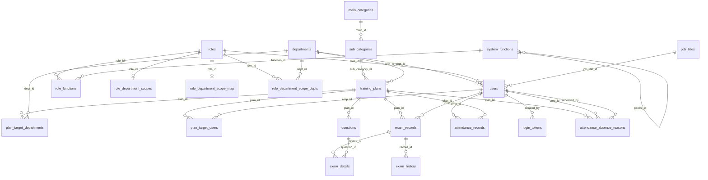

# education_training.db 資料庫結構分析

## 1. 目的

記錄專案根目錄 `data/education_training.db`（SQLite）之資料表、欄位定義、索引與表間關聯，供開發、遷移與權限設計對照使用。

## 2. 範圍

- **涵蓋**：`sqlite_master` 中所有 `type='table'` 之使用者資料表（不含 `sqlite_%` 內建表）。
- **不含**：執行時期資料內容、應用程式層商業規則（僅就 schema 與宣告式外鍵描述）。
- **分析基準檔**：`data/education_training.db`（分析產出時點以本文件「參考」一節為準）。

## 3. 權責

- **維護**：架構或遷移變更時應更新本文件與實際 DB 一致。
- **單一真相**：以實際 `.db` 檔與 `backend/app/models.py` 對照為準；若二者不一致，以執行環境 DB 為準並應追蹤差異原因。

## 4. 名詞解釋

| 名詞 | 說明 |
|------|------|
| **PK** | Primary Key，主鍵。 |
| **FK** | Foreign Key，SQLite 宣告式外鍵（需連線啟用 foreign_keys 時強制）。 |
| **M:N** | 多對多，通常以關聯表兩欄分別指向兩實體。 |
| **scope_type** | 角色可查視之部門範圍類型；應用程式慣用值見 `RoleDepartmentScope` 註解：`all` \| `department` \| `self`（預設 `self`）。 |
| **長度** | 字元型：schema 有 `VARCHAR(n)` 者表列 `n`（字元數，SQLite 仍以 TEXT 儲存）；未宣告者標「未宣告」。`TEXT` 為「未固定上限」（SQLite 單欄約 1GB 上限）。整數、日期時間、布林標「—」。 |

## 5. 作業內容

### 5.1 資料表一覽（依名稱排序）

共 **22** 張表（英文表名＋中文名稱）：

| 資料表（英文） | 中文名稱 |
|----------------|----------|
| `attendance_absence_reasons` | 缺席／未到原因登記 |
| `attendance_records` | 簽到紀錄 |
| `departments` | 部門 |
| `exam_details` | 考卷作答明細 |
| `exam_history` | 考試成績／提交歷程快照 |
| `exam_records` | 考試主紀錄 |
| `job_titles` | 職務 |
| `login_tokens` | 登入 Token（一次性／限時） |
| `main_categories` | 訓練主分類 |
| `plan_target_departments` | 訓練計畫對象部門（多對多） |
| `plan_target_users` | 訓練計畫對象人員（多對多） |
| `question_bank` | 共用題庫 |
| `questions` | 訓練計畫考題 |
| `role_department_scope_depts` | 角色可查視部門範圍—部門明細 |
| `role_department_scope_map` | 角色可查視部門範圍—範圍類型（ORM 使用） |
| `role_department_scopes` | 角色可查視部門範圍—範圍類型（遺留表，與 scope_map 同構） |
| `role_functions` | 角色與系統功能關聯（多對多） |
| `roles` | 角色 |
| `sub_categories` | 訓練子分類 |
| `system_functions` | 系統功能（選單／按鈕權限樹） |
| `training_plans` | 訓練／考試計畫 |
| `users` | 使用者（帳號） |

### 5.2 實體關係圖（ERD）

以下以 Mermaid `erDiagram` 表達主要 FK 關聯（與 SQLite 宣告一致）。



> **說明**：`question_bank` 在 schema 上為獨立題庫，**未**宣告 FK 至 `users`；`created_by` 語意上常對應 `users.emp_id`，但 DB 層未強制。

### 5.3 各資料表欄位結構

欄位表欄位：`欄位`、`中文說明`、`類型`、`長度`、`NOT NULL`、`PK`、`預設`、`FK / 備註`。

---

#### `attendance_absence_reasons` — 訓練計畫缺席／未到原因登記

| 欄位 | 中文說明 | 類型 | 長度 | NOT NULL | PK | 預設 | FK / 備註 |
|------|----------|------|------|----------|----|------|-----------|
| id | 流水號 | INTEGER | — | 是 | 是 | — | — |
| plan_id | 訓練計畫 ID | INTEGER | — | 是 | — | — | → `training_plans.id` |
| emp_id | 未到／缺席員工工號 | VARCHAR | 未宣告 | 是 | — | — | → `users.emp_id` |
| reason_code | 原因代碼 | VARCHAR | 50 | 是 | — | — | — |
| reason_text | 原因補充說明 | VARCHAR | 500 | 否 | — | — | — |
| recorded_by | 登錄人員工號 | VARCHAR | 未宣告 | 是 | — | — | → `users.emp_id` |
| recorded_at | 登錄時間 | DATETIME | — | 否 | — | — | — |

**索引**：`ix_attendance_absence_reasons_id`（`id`）。

---

#### `attendance_records` — 簽到紀錄

| 欄位 | 中文說明 | 類型 | 長度 | NOT NULL | PK | 預設 | FK / 備註 |
|------|----------|------|------|----------|----|------|-----------|
| id | 流水號 | INTEGER | — | 是 | 是 | — | — |
| emp_id | 簽到員工工號 | VARCHAR | 未宣告 | 否 | — | — | → `users.emp_id` |
| plan_id | 訓練計畫 ID | INTEGER | — | 否 | — | — | → `training_plans.id` |
| checkin_time | 簽到時間 | DATETIME | — | 否 | — | — | — |
| ip_address | 簽到來源 IP | VARCHAR | 未宣告 | 否 | — | — | — |

**索引**：`ix_attendance_records_id`（`id`）。

---

#### `departments` — 部門

| 欄位 | 中文說明 | 類型 | 長度 | NOT NULL | PK | 預設 | FK / 備註 |
|------|----------|------|------|----------|----|------|-----------|
| id | 部門 ID | INTEGER | — | 是 | 是 | — | — |
| name | 部門名稱 | VARCHAR | 未宣告 | 否 | — | — | UNIQUE（見索引） |

**索引**：`ix_departments_id`（`id`）、`ix_departments_name`（UNIQUE，`name`）。

---

#### `exam_details` — 單次考卷作答明細

| 欄位 | 中文說明 | 類型 | 長度 | NOT NULL | PK | 預設 | FK / 備註 |
|------|----------|------|------|----------|----|------|-----------|
| id | 流水號 | INTEGER | — | 是 | 是 | — | — |
| record_id | 考試主紀錄 ID | INTEGER | — | 否 | — | — | → `exam_records.id` |
| question_id | 考題 ID | INTEGER | — | 否 | — | — | → `questions.id` |
| user_answer | 使用者作答內容 | VARCHAR | 未宣告 | 否 | — | — | — |
| is_correct | 是否答對 | BOOLEAN | — | 否 | — | — | — |

**索引**：`ix_exam_details_id`（`id`）。

---

#### `exam_history` — 成績／提交歷程快照（關聯單一 `exam_records`）

| 欄位 | 中文說明 | 類型 | 長度 | NOT NULL | PK | 預設 | FK / 備註 |
|------|----------|------|------|----------|----|------|-----------|
| id | 流水號 | INTEGER | — | 是 | 是 | — | — |
| record_id | 考試主紀錄 ID | INTEGER | — | 否 | — | — | → `exam_records.id` |
| submit_time | 提交時間 | DATETIME | — | 否 | — | — | — |
| total_score | 總分 | INTEGER | — | 否 | — | — | — |
| is_passed | 是否及格 | BOOLEAN | — | 否 | — | — | — |
| details | 明細快照（JSON 或文字） | TEXT | 未固定上限 | 否 | — | — | 可能為彙總 JSON 或文字 |

**索引**：`ix_exam_history_id`（`id`）。

---

#### `exam_records` — 考試主紀錄（使用者 × 計畫）

| 欄位 | 中文說明 | 類型 | 長度 | NOT NULL | PK | 預設 | FK / 備註 |
|------|----------|------|------|----------|----|------|-----------|
| id | 流水號 | INTEGER | — | 是 | 是 | — | — |
| emp_id | 應考員工工號 | VARCHAR | 未宣告 | 否 | — | — | → `users.emp_id` |
| plan_id | 訓練計畫 ID | INTEGER | — | 否 | — | — | → `training_plans.id` |
| total_score | 總分 | INTEGER | — | 否 | — | — | — |
| is_passed | 是否及格 | BOOLEAN | — | 否 | — | — | — |
| start_time | 開始作答時間 | DATETIME | — | 否 | — | — | — |
| submit_time | 提交時間 | DATETIME | — | 否 | — | — | — |
| attempts | 作答次數／重考次數 | INTEGER | — | 否 | — | — | — |

**索引**：`ix_exam_records_id`（`id`）。

---

#### `job_titles` — 職務名稱

| 欄位 | 中文說明 | 類型 | 長度 | NOT NULL | PK | 預設 | FK / 備註 |
|------|----------|------|------|----------|----|------|-----------|
| id | 職務 ID | INTEGER | — | 是 | 是 | — | — |
| name | 職務名稱 | VARCHAR | 未宣告 | 否 | — | — | UNIQUE |
| sort_order | 排序權重 | INTEGER | — | 否 | — | — | — |

**索引**：`ix_job_titles_id`、`ix_job_titles_name`（UNIQUE）。

---

#### `login_tokens` — 登入用一次性／限時 Token

| 欄位 | 中文說明 | 類型 | 長度 | NOT NULL | PK | 預設 | FK / 備註 |
|------|----------|------|------|----------|----|------|-----------|
| id | 流水號 | INTEGER | — | 是 | 是 | — | — |
| token | Token 字串 | VARCHAR | 未宣告 | 否 | — | — | UNIQUE |
| created_by | 建立者工號 | VARCHAR | 未宣告 | 否 | — | — | → `users.emp_id` |
| created_at | 建立時間 | DATETIME | — | 否 | — | — | — |
| expires_at | 過期時間 | DATETIME | — | 否 | — | — | — |
| used_at | 首次使用時間 | DATETIME | — | 否 | — | — | — |
| is_used | 是否已使用 | BOOLEAN | — | 否 | — | — | — |

**索引**：`ix_login_tokens_id`、`ix_login_tokens_token`（UNIQUE）。

---

#### `main_categories` — 訓練主分類

| 欄位 | 中文說明 | 類型 | 長度 | NOT NULL | PK | 預設 | FK / 備註 |
|------|----------|------|------|----------|----|------|-----------|
| id | 主分類 ID | INTEGER | — | 是 | 是 | — | — |
| name | 主分類名稱 | VARCHAR | 未宣告 | 否 | — | — | UNIQUE 約束（表層級） |

**索引**：`ix_main_categories_id`（`id`）。

---

#### `plan_target_departments` — 計畫對象部門（M:N）

| 欄位 | 中文說明 | 類型 | 長度 | NOT NULL | PK | 預設 | FK / 備註 |
|------|----------|------|------|----------|----|------|-----------|
| plan_id | 訓練計畫 ID | INTEGER | — | 否 | — | — | → `training_plans.id` |
| dept_id | 部門 ID | INTEGER | — | 否 | — | — | → `departments.id` |

無複合主鍵宣告；實務上應避免重複 `(plan_id, dept_id)`。

---

#### `plan_target_users` — 計畫對象人員（M:N）

| 欄位 | 中文說明 | 類型 | 長度 | NOT NULL | PK | 預設 | FK / 備註 |
|------|----------|------|------|----------|----|------|-----------|
| plan_id | 訓練計畫 ID | INTEGER | — | 否 | — | — | → `training_plans.id` |
| emp_id | 受課對象工號 | VARCHAR | 未宣告 | 否 | — | — | → `users.emp_id` |

無複合主鍵宣告；實務上應避免重複 `(plan_id, emp_id)`。

---

#### `question_bank` — 共用題庫

| 欄位 | 中文說明 | 類型 | 長度 | NOT NULL | PK | 預設 | FK / 備註 |
|------|----------|------|------|----------|----|------|-----------|
| id | 題目 ID | INTEGER | — | 是 | 是 | — | — |
| content | 題幹 | TEXT | 未固定上限 | 是 | — | — | — |
| question_type | 題型 | VARCHAR | 未宣告 | 是 | — | — | — |
| options | 選項（序列化） | TEXT | 未固定上限 | 否 | — | — | — |
| answer | 正解 | VARCHAR | 未宣告 | 是 | — | — | — |
| tags | 標籤 | TEXT | 未固定上限 | 否 | — | — | — |
| hint | 提示 | TEXT | 未固定上限 | 否 | — | — | — |
| created_by | 建立者工號 | VARCHAR | 未宣告 | 否 | — | — | **無 FK**（語意可為工號） |
| created_at | 建立時間 | DATETIME | — | 否 | — | — | — |
| level | 難度等級 | VARCHAR | 20 | 否 | — | — | — |

**索引**：`ix_question_bank_id`（`id`）。

---

#### `questions` — 某訓練計畫底下的考題

| 欄位 | 中文說明 | 類型 | 長度 | NOT NULL | PK | 預設 | FK / 備註 |
|------|----------|------|------|----------|----|------|-----------|
| id | 考題 ID | INTEGER | — | 是 | 是 | — | — |
| plan_id | 訓練計畫 ID | INTEGER | — | 否 | — | — | → `training_plans.id` |
| content | 題幹 | TEXT | 未固定上限 | 否 | — | — | — |
| question_type | 題型 | VARCHAR | 未宣告 | 否 | — | — | — |
| options | 選項（序列化） | TEXT | 未固定上限 | 否 | — | — | — |
| answer | 正解 | VARCHAR | 未宣告 | 否 | — | — | — |
| points | 配分 | INTEGER | — | 否 | — | — | — |
| hint | 提示 | TEXT | 未固定上限 | 否 | — | — | — |
| level | 難度等級 | VARCHAR | 20 | 否 | — | — | — |

**索引**：`ix_questions_id`（`id`）。

---

#### `role_department_scope_depts` — 角色部門範圍：指定多部門時之明細

| 欄位 | 中文說明 | 類型 | 長度 | NOT NULL | PK | 預設 | FK / 備註 |
|------|----------|------|------|----------|----|------|-----------|
| role_id | 角色 ID | INTEGER | — | 是 | 是（複合） | — | → `roles.id` |
| dept_id | 可查視部門 ID | INTEGER | — | 是 | 是（複合） | — | → `departments.id` |

**索引**：無額外命名索引（PK 即複合主鍵）。

---

#### `role_department_scope_map` — 角色部門範圍類型（ORM：`RoleDepartmentScope`）

| 欄位 | 中文說明 | 類型 | 長度 | NOT NULL | PK | 預設 | FK / 備註 |
|------|----------|------|------|----------|----|------|-----------|
| role_id | 角色 ID | INTEGER | — | 是 | 是 | — | → `roles.id` |
| scope_type | 範圍類型 | VARCHAR | 未宣告 | 是 | — | — | 如 `all`／`department`／`self` |

**索引**：無額外命名索引。

---

#### `role_department_scopes` — 與 `role_department_scope_map` 結構相同之表

| 欄位 | 中文說明 | 類型 | 長度 | NOT NULL | PK | 預設 | FK / 備註 |
|------|----------|------|------|----------|----|------|-----------|
| role_id | 角色 ID | INTEGER | — | 是 | 是 | — | → `roles.id` |
| scope_type | 範圍類型 | VARCHAR | 未宣告 | 是 | — | — | 同上 |

**注意**：`backend/app/models.py` 中 **僅** 對應 `role_department_scope_map`（類別 `RoleDepartmentScope`）。本表可能是歷史遷移遺留；應用程式若未讀寫此表，與 `scope_map` 並存時需釐清單一資料來源。

---

#### `role_functions` — 角色與系統功能 M:N

| 欄位 | 中文說明 | 類型 | 長度 | NOT NULL | PK | 預設 | FK / 備註 |
|------|----------|------|------|----------|----|------|-----------|
| role_id | 角色 ID | INTEGER | — | 否 | — | — | → `roles.id` |
| function_id | 系統功能 ID | INTEGER | — | 否 | — | — | → `system_functions.id` |

無複合主鍵宣告。

---

#### `roles` — 角色

| 欄位 | 中文說明 | 類型 | 長度 | NOT NULL | PK | 預設 | FK / 備註 |
|------|----------|------|------|----------|----|------|-----------|
| id | 角色 ID | INTEGER | — | 是 | 是 | — | — |
| name | 角色名稱 | VARCHAR | 未宣告 | 否 | — | — | UNIQUE |

**索引**：`ix_roles_id`、`ix_roles_name`（UNIQUE）。

---

#### `sub_categories` — 訓練子分類

| 欄位 | 中文說明 | 類型 | 長度 | NOT NULL | PK | 預設 | FK / 備註 |
|------|----------|------|------|----------|----|------|-----------|
| id | 子分類 ID | INTEGER | — | 是 | 是 | — | — |
| main_id | 所屬主分類 ID | INTEGER | — | 否 | — | — | → `main_categories.id` |
| name | 子分類名稱 | VARCHAR | 未宣告 | 否 | — | — | — |

**索引**：`ix_sub_categories_id`（`id`）。

---

#### `system_functions` — 系統功能樹（選單／按鈕權限）

| 欄位 | 中文說明 | 類型 | 長度 | NOT NULL | PK | 預設 | FK / 備註 |
|------|----------|------|------|----------|----|------|-----------|
| id | 功能 ID | INTEGER | — | 是 | 是 | — | — |
| name | 顯示名稱 | VARCHAR | 未宣告 | 否 | — | — | — |
| code | 功能代碼 | VARCHAR | 未宣告 | 否 | — | — | UNIQUE，如 `menu:exam` |
| parent_id | 父功能 ID | INTEGER | — | 否 | — | — | → `system_functions.id`（自關聯） |
| path | 路由／路徑 | VARCHAR | 未宣告 | 否 | — | — | — |

**索引**：`ix_system_functions_id`、`ix_system_functions_code`（UNIQUE）。

---

#### `training_plans` — 訓練／考試計畫

| 欄位 | 中文說明 | 類型 | 長度 | NOT NULL | PK | 預設 | FK / 備註 |
|------|----------|------|------|----------|----|------|-----------|
| id | 計畫 ID | INTEGER | — | 是 | 是 | — | — |
| sub_category_id | 子分類 ID | INTEGER | — | 否 | — | — | → `sub_categories.id` |
| dept_id | 所屬／開課單位 ID | INTEGER | — | 否 | — | — | → `departments.id` |
| title | 計畫標題 | VARCHAR | 未宣告 | 否 | — | — | — |
| training_date | 訓練／考試開始日 | DATE | — | 否 | — | — | — |
| end_date | 結束日 | DATE | — | 否 | — | — | — |
| year | 年度（字串） | VARCHAR | 未宣告 | 否 | — | — | — |
| timer_enabled | 是否啟用計時 | BOOLEAN | — | 否 | — | — | — |
| time_limit | 作答時間上限（分鐘等，依應用） | INTEGER | — | 否 | — | — | — |
| passing_score | 及格分數 | INTEGER | — | 否 | — | — | — |
| expected_attendance | 預期應到人數 | INTEGER | — | 否 | — | — | — |
| is_archived | 是否已封存 | INTEGER | — | 否 | `0` | 0／1 旗標 |

**索引**：`ix_training_plans_id`（`id`）。

---

#### `users` — 使用者（主鍵為工號）

| 欄位 | 中文說明 | 類型 | 長度 | NOT NULL | PK | 預設 | FK / 備註 |
|------|----------|------|------|----------|----|------|-----------|
| emp_id | 員工編號（帳號） | VARCHAR | 未宣告 | 是 | 是 | — | 主鍵 |
| name | 姓名 | VARCHAR | 未宣告 | 否 | — | — | — |
| dept_id | 部門 ID | INTEGER | — | 否 | — | — | → `departments.id` |
| role_id | 角色 ID | INTEGER | — | 否 | — | — | → `roles.id` |
| status | 帳號狀態 | VARCHAR | 未宣告 | 否 | — | — | 應用預設常為 `active` |
| job_title_id | 職務 ID | INTEGER | — | 否 | — | — | → `job_titles.id` |

**索引**：`ix_users_emp_id`（`emp_id`）。

---

### 5.4 關聯總表（FK 匯總）

| 子表 | 欄位 | 父表 | 父欄位 |
|------|------|------|--------|
| attendance_absence_reasons | plan_id | training_plans | id |
| attendance_absence_reasons | emp_id | users | emp_id |
| attendance_absence_reasons | recorded_by | users | emp_id |
| attendance_records | emp_id | users | emp_id |
| attendance_records | plan_id | training_plans | id |
| exam_details | record_id | exam_records | id |
| exam_details | question_id | questions | id |
| exam_history | record_id | exam_records | id |
| exam_records | emp_id | users | emp_id |
| exam_records | plan_id | training_plans | id |
| login_tokens | created_by | users | emp_id |
| plan_target_departments | plan_id | training_plans | id |
| plan_target_departments | dept_id | departments | id |
| plan_target_users | plan_id | training_plans | id |
| plan_target_users | emp_id | users | emp_id |
| questions | plan_id | training_plans | id |
| role_department_scope_depts | role_id | roles | id |
| role_department_scope_depts | dept_id | departments | id |
| role_department_scope_map | role_id | roles | id |
| role_department_scopes | role_id | roles | id |
| role_functions | role_id | roles | id |
| role_functions | function_id | system_functions | id |
| sub_categories | main_id | main_categories | id |
| system_functions | parent_id | system_functions | id |
| training_plans | sub_category_id | sub_categories | id |
| training_plans | dept_id | departments | id |
| users | dept_id | departments | id |
| users | role_id | roles | id |
| users | job_title_id | job_titles | id |

### 5.5 索引一覽

| 索引名稱 | 定義 |
|----------|------|
| ix_attendance_absence_reasons_id | `attendance_absence_reasons(id)` |
| ix_attendance_records_id | `attendance_records(id)` |
| ix_departments_id | `departments(id)` |
| ix_departments_name | UNIQUE `departments(name)` |
| ix_exam_details_id | `exam_details(id)` |
| ix_exam_history_id | `exam_history(id)` |
| ix_exam_records_id | `exam_records(id)` |
| ix_job_titles_id | `job_titles(id)` |
| ix_job_titles_name | UNIQUE `job_titles(name)` |
| ix_login_tokens_id | `login_tokens(id)` |
| ix_login_tokens_token | UNIQUE `login_tokens(token)` |
| ix_main_categories_id | `main_categories(id)` |
| ix_question_bank_id | `question_bank(id)` |
| ix_questions_id | `questions(id)` |
| ix_roles_id | `roles(id)` |
| ix_roles_name | UNIQUE `roles(name)` |
| ix_sub_categories_id | `sub_categories(id)` |
| ix_system_functions_id | `system_functions(id)` |
| ix_system_functions_code | UNIQUE `system_functions(code)` |
| ix_training_plans_id | `training_plans(id)` |
| ix_users_emp_id | `users(emp_id)` |

---

## 6. 參考文件

| 文件 / 路徑 | 說明 |
|-------------|------|
| `README.md` | 專案說明與 DB 路徑 |
| `backend/app/models.py` | SQLAlchemy 模型與表名對應 |
| `backend/app/database.py` | SQLite 連線路徑解析 |
| `1.docs/專案架構分析.md` | 架構與資料庫檔案位置 |

---

## 7. 使用表單（欄位說明）

本節為「文件結構要求」之對應：本分析文件不綁定紙本表單；若需匯出為盤點表，建議以 **5.3 各表**（含欄位中文說明、長度）為列、複製至試算表即可。

---

## 附錄：產出方式（可重現）

於專案根目錄執行：

```bash
sqlite3 data/education_training.db ".schema"
sqlite3 data/education_training.db "SELECT name, sql FROM sqlite_master WHERE type='table' ORDER BY name;"
# 各表：
sqlite3 data/education_training.db "PRAGMA table_info('表名');"
sqlite3 data/education_training.db "PRAGMA foreign_key_list('表名');"
```

---

**文件版本**：依 `data/education_training.db` 靜態掃描產出；2026-04-02 補齊表中文名、欄位中文說明與長度欄。
