# AD 整合：系統管理者登入 — 技術詳細設計

**文件類型**：技術詳細設計（TDD）
**建立日期**：2026-06-25
**狀態**：草案（依 PLAN 方案乙修訂；待核可後進入實作）
**規格準據**：[20260612_AD整合_系統管理者登入_PLAN.md](./20260612_AD整合_系統管理者登入_PLAN.md)

> 本文件將 PLAN 轉為分 Wave 可執行之程式落點、API 契約、資料結構與驗收對照。
>
> **方案乙（已採）**：AD 斷線時，曾成功 AD 登入且本地存有 Email 之 IT 管理帳號，可改走 **Email OTP 備援登入（路徑 D）**；**break-glass（路徑 B）** 仍保留為最後手段。

---

## 1. 目的

1. 將 PLAN §5 之設計轉為可實作之模組、端點、遷移與前端落點。
2. 明確定義 **四條登入路徑**（A AD／B break-glass／C 員工免密／D Email OTP 備援）之程式行為與錯誤碼。
3. 定義 **AD 帳號輸入白名單**、LDAP filter 跳脫、OTP 頻率限制，作為 Security Review 檢查基準。

---

## 2. 架構總覽

```mermaid
flowchart TD
  subgraph pathA [路徑A_AD日常]
    A1[AdminLoginTab] --> A2["POST /auth/login/admin"]
    A2 --> A3[ad_auth LDAPS bind]
    A3 --> A4[IT_Admin群組檢查]
    A4 --> A5[jit_provision upsert含email]
    A5 --> A6["JWT auth_src=ad"]
  end

  subgraph pathD [路徑D_EmailOTP備援_AD斷線]
    D1[AD登入503] --> D2["POST /auth/login/admin/email/request"]
    D2 --> D3[查本地JIT帳號與email]
    D3 --> D4[寄送OTP]
    D4 --> D5["POST /auth/login/admin/email/verify"]
    D5 --> D6["JWT auth_src=email_fallback"]
  end

  subgraph pathB [路徑B_break_glass_僅本地admin]
    B1[LocalEmergencyTab] --> B2["POST /auth/login/local"]
    B2 --> B3[bcrypt驗證]
    B3 --> B4{90天過期?}
    B4 -->|是| B5[change_token強制改密]
    B4 -->|否| B6["JWT auth_src=local"]
  end

  subgraph pathC [路徑C_員工免密]
    C1[LoginPage] --> C2["POST /auth/login"]
  end
```



**路徑 B 註解**：90 天密碼到期政策**僅適用** `is_protected=true` 之 break-glass 本地帳號；**AD 帳號密碼政策由 DC 負責**，不走路徑 B。

**路徑 D 觸發條件**：僅當 **AD 連線失敗**（503）或 `AD_FALLBACK_EMAIL_ENABLED=true` 且偵測 DC 不可達時啟用；**AD 正常時不得**以 Email OTP 取代 AD 登入。

---

## 3. 實作 Wave 分工

| Wave | 範圍 | 主要檔案 | 依賴 |
|------|------|----------|------|
| W1 | 設定、常數、遷移、模型、schemas | `config.py`, `constants/auth.py`, `migrations/add_ad_auth_user_fields.py`, `models.py`, `schemas.py`, `init_db.py` | — |
| W2 | 服務層 | `services/ad_auth.py`, `password_policy.py`, `jit_provision.py`, `email_otp.py`, `smtp_mailer.py` | W1 |
| W3 | 認證端點 + 安全債 | `auth_utils.py`, `routers/auth.py` | W2 |
| W4 | `is_trainee` 隔離 | `access_scope.py`, `exam_center.py`, `training.py`, `admin.py` | W1 |
| W5 | 前端 | `LoginPage.tsx`, `ChangePasswordPage.tsx`, `App.tsx`, `types.ts`, `utils/authGuards.ts` | W3 |
| W6 | 驗收 + Security Review | `reviews/202606xx_AD整合_security-review.md` | W3–W5 |

---

## 4. W1：設定與資料庫

### 4.1 擴充 [`backend/app/config.py`](backend/app/config.py)

在既有 NAS 設定上追加（不影響 SMB）：

| 環境變數 | 型別 | 預設 | 說明 |
|----------|------|------|------|
| `JWT_SECRET_KEY` | str | 開發 fallback + warning | 生產必填 |
| `JWT_EXPIRE_MINUTES` | int | 480 | |
| `AD_ENABLED` | bool | false | |
| `AD_SERVER_URI` | str | "" | |
| `AD_BASE_DN` | str | "" | |
| `AD_DOMAIN` | str | "" | UPN 網域 |
| `AD_ADMIN_GROUP` | str | IT_Admin | |
| `AD_ADMIN_ROLE_NAME` | str | 系統管理 | JIT 掛載角色 |
| `AD_DEFAULT_DEPT_NAME` | str | IT部 | JIT 預設部門 |
| `AD_USE_NESTED_GROUPS` | bool | false | |
| `AD_FALLBACK_EMAIL_ENABLED` | bool | true | Email OTP 備援總開關 |
| `AD_EMAIL_FALLBACK_MAX_DAYS` | int | 30 | 距上次 AD 登入可接受天數 |
| `AD_EMAIL_OTP_LENGTH` | int | 6 | |
| `AD_EMAIL_OTP_TTL_MINUTES` | int | 10 | |
| `AD_EMAIL_OTP_MAX_REQUESTS` | int | 3 | 每 15 分鐘每帳號上限 |
| `AD_EMAIL_ALLOWED_DOMAIN` | str | "" | 可選；如 `yourco.com` |
| `SMTP_HOST` | str | "" | |
| `SMTP_PORT` | int | 587 | |
| `SMTP_USER` | str | "" | |
| `SMTP_PASSWORD` | str | "" | 機敏，不入版控 |
| `SMTP_FROM` | str | "" | 寄件者 |
| `SMTP_USE_TLS` | bool | true | |
| `LOGIN_BYPASS_ENABLED` | bool | false | |
| `PASSWORD_MIN_LENGTH` | int | 12 | 僅 break-glass |
| `PASSWORD_MAX_AGE_DAYS` | int | 90 | 僅 break-glass |
| `LOGIN_MAX_FAILED` | int | 6 | 僅 break-glass |
| `LOGIN_LOCKOUT_MINUTES` | int | 15 | 僅 break-glass |
| `BREAK_GLASS_EMP_ID` | str | admin | |
| `INITIAL_ADMIN_PASSWORD` | str | "" | 遷移注入 |

`@property smtp_configured`、`ad_configured`、`ad_fallback_email_configured`。

### 4.2 新增 [`backend/app/constants/auth.py`](backend/app/constants/auth.py)

```python
SUPER_ADMIN_ROLE_NAMES = frozenset({"Admin", "System Admin", "系統管理", "系統管理者"})
AD_USERNAME_PATTERN = re.compile(r"^[a-zA-Z0-9][a-zA-Z0-9._-]{0,19}$")

def normalize_ad_username(raw: str) -> str: ...
def is_super_admin_role(role_name: str) -> bool: ...
def is_management_role(user: models.User) -> bool: ...
```

### 4.3 遷移 [`backend/migrations/add_ad_auth_user_fields.py`](backend/migrations/add_ad_auth_user_fields.py)

**`users` 新增欄位**

| 欄位 | 型別 | 預設／回填 |
|------|------|------------|
| `auth_source` | TEXT | `'local'` |
| `ad_username` | TEXT UNIQUE NULL | NULL |
| `email` | TEXT NULL | NULL；JIT 從 AD `mail` 同步 |
| `email_verified_at` | DATETIME NULL | AD 登入成功時更新 |
| `is_trainee` | INTEGER | 1（既有列回填 true） |
| `last_login_at` | DATETIME NULL | |
| `password_hash` | TEXT NULL | |
| `password_changed_at` | DATETIME NULL | |
| `must_change_password` | INTEGER | 0 |
| `failed_login_count` | INTEGER | 0 |
| `locked_until` | DATETIME NULL | |
| `is_protected` | INTEGER | 0；`admin` → 1 |

**新增表 `admin_login_otps`**

| 欄位 | 型別 | 說明 |
|------|------|------|
| `id` | INTEGER PK | |
| `emp_id` | TEXT | 對應 JIT 管理帳號 |
| `otp_hash` | TEXT | bcrypt 或 HMAC 雜湊，**不存明文 OTP** |
| `expires_at` | DATETIME | |
| `attempt_count` | INTEGER | 驗證失敗次數 |
| `created_at` | DATETIME | |
| `used_at` | DATETIME NULL | 使用後標記 |

索引：`emp_id`, `expires_at`。過期列可排程清理。

**補丁**：確保 `系統管理` 角色存在；`admin` → `is_protected=1`。

---

## 5. W2：服務層

### 5.1 [`backend/app/services/ad_auth.py`](backend/app/services/ad_auth.py)

- 依賴：`ldap3`（加入 `requirements.txt`）
- `authenticate_ad(username, password) -> AdAuthResult | None`
- **LDAP injection 防護**：`username` 須先通過 `AD_USERNAME_PATTERN`；filter 值使用 `ldap3.utils.conv.escape_filter_chars`
- 連線失敗拋 `AdConnectionError`（router 轉 503）；bind 失敗回 `None`（401）

```python
@dataclass
class AdAuthResult:
    ad_username: str
    display_name: str
    groups: list[str]
    mail: str | None
```

### 5.2 [`backend/app/services/jit_provision.py`](backend/app/services/jit_provision.py)

`upsert_admin_user(db, ad_result, settings) -> User`：

- `emp_id = ad_result.ad_username`（小寫）
- 撞號：`is_trainee=true` 之既有 emp_id → `EmpIdCollisionError`（409）
- 寫入／更新：`name`, `ad_username`, `email`（來自 `mail`）, `email_verified_at=now`（有 email 時）, `auth_source=ad`, `is_trainee=false`, `last_login_at=now`
- 掛 `AD_ADMIN_ROLE_NAME`、預設部門

### 5.3 [`backend/app/services/password_policy.py`](backend/app/services/password_policy.py)

僅供 **路徑 B** break-glass 使用。

### 5.4 [`backend/app/services/email_otp.py`](backend/app/services/email_otp.py)

```python
def is_ad_unreachable() -> bool:
    """輕量 TCP/LDAPS 探測或最近一次 AD 登入失敗快取；用於決定是否允許路徑 D。"""

def can_use_email_fallback(user: User, settings) -> tuple[bool, str]:
    """
    條件（全滿足）：
    1. AD_FALLBACK_EMAIL_ENABLED
    2. AD 目前不可達（is_ad_unreachable）
    3. user.is_trainee == false 且具管理角色
    4. user.email 非空且通過網域白名單（若有設定）
    5. user.status == active
    6. last_login_at 距今 <= AD_EMAIL_FALLBACK_MAX_DAYS 且 auth_source 曾為 ad
    回傳 (False, reason) 供前端顯示
    """

def request_otp(db, username: str, client_ip: str) -> dict:
    """產生 OTP、雜湊入 admin_login_otps、寄信；回傳 { masked_email, expires_in_seconds }"""

def verify_otp(db, username: str, otp_code: str, client_ip: str) -> User:
    """驗證成功 → 更新 last_login_at、標記 used_at、回傳 User"""
```

**OTP 規則**：`secrets` 產生數字碼；單次有效；同帳號 15 分鐘內最多 `AD_EMAIL_OTP_MAX_REQUESTS` 次；連續驗證失敗 6 次作廢該 OTP 列。

### 5.5 [`backend/app/services/smtp_mailer.py`](backend/app/services/smtp_mailer.py)

- `send_otp_email(to: str, otp: str, username: str) -> None`
- 使用 `smtplib` + TLS；失敗拋 `SmtpDeliveryError`（503）

---

## 6. W3：API 契約

### 6.1 `POST /api/auth/login/admin`

| 項目 | 內容 |
|------|------|
| Body | `{ username, password }` |
| username 驗證 | `AD_USERNAME_PATTERN`；Pydantic `max_length=20` |
| password | `max_length=128`；不記 log |
| 成功 | 200 + `AuthLoginResponse`，`auth_src=ad` |
| AD 連線失敗 | **503** + `{ detail, fallback: "email" }` 提示可改 Email OTP |
| 帳密錯 | 401 |
| 非 IT_Admin | 403 |
| AD_ENABLED=false | 503 |

### 6.2 `POST /api/auth/login/admin/email/request`

| 項目 | 內容 |
|------|------|
| Body | `{ username }` |
| 前置 | `AD_FALLBACK_EMAIL_ENABLED` 且 `is_ad_unreachable()`；否則 **400**「請使用 AD 登入」 |
| 成功 | 200 + `{ masked_email: "w***@yourco.com", expires_in_seconds: 600 }` |
| 無資格 | 403 + reason（無 JIT／無 email／超過天數／從未 AD 登入） |
| 頻率限制 | 429 |
| SMTP 失敗 | 503 |

### 6.3 `POST /api/auth/login/admin/email/verify`

| 項目 | 內容 |
|------|------|
| Body | `{ username, otp_code }` |
| otp_code | 6 位數字；`max_length=6` |
| 成功 | 200 + `AuthLoginResponse`，`auth_src=email_fallback` |
| 失敗 | 401；寫稽核 log |

### 6.4 `POST /api/auth/login/local`（路徑 B，不變）

僅 `is_protected=true`；90 天／鎖定僅此路徑。

### 6.5 `POST /api/auth/password/change`

break-glass 強制改密用。

### 6.6 `POST /api/auth/login`（路徑 C）

`is_management_role(user)` → 403。

### 6.7 稽核 log（structlog 或 logging）

每次成功／失敗記錄：`emp_id`, `auth_src`, `client_ip`, `event`（不含密碼／OTP 明文）。

---

## 7. W4：`is_trainee` 隔離

於 [`backend/app/access_scope.py`](backend/app/access_scope.py) 新增：

```python
def apply_trainee_filter(query):
    return query.filter(models.User.is_trainee == True)
```

| 落點 | 變更 |
|------|------|
| `exam_center.py` `get_my_exams` | `is_trainee=false` → 回 `[]`；移除 admin 看全部應考計畫捷徑 |
| `training.py` `get_training_form_users` | `apply_trainee_filter` |
| `training.py` 報到／應到計算 | 部門成員查詢加 trainee |
| `admin.py` `get_users` | `trainees_only=true` 預設 |
| `admin.py` `get_department_users` | trainee 過濾 |
| `exam_center.py` 成績範圍 | `get_scope_emp_ids(..., trainees_only=True)` |

`admin.py`：`is_protected` 禁止 delete／inactive（取代硬編碼 `admin`）。

---

## 8. W5：前端

### 8.1 登入頁 [`LoginPage.tsx`](frontend/src/components/LoginPage.tsx)

三區塊（同一 `/login`）：

1. **員工登入**（預設）：員編 + 圖形驗證碼
2. **AD 管理登入**：`username` + `password`
   - 前端 regex 與後端 `AD_USERNAME_PATTERN` 一致
   - `maxLength={20}`；`autoComplete="username"`
3. **本地緊急登入**（摺疊）：`emp_id` + `password`

**AD 503 分流**：顯示「AD 暫時無法連線」→ 展開 **Email 驗證登入**（輸入同一 `username` → 請求 OTP → 輸入 6 碼）。

### 8.2 [`ChangePasswordPage.tsx`](frontend/src/components/ChangePasswordPage.tsx)

路徑 B `must_change_password` 流程。

### 8.3 [`App.tsx`](frontend/src/App.tsx)

- `/admin/*` 守衛改 `hasAdminMenu(user)`（`functions` 含 `menu:admin` 或子碼）
- 新增 `/login/change-password`

### 8.4 型別 [`types.ts`](frontend/src/types.ts)

- `User.role: string`
- `auth_src?: 'ad' | 'local' | 'email_fallback'`
- `EmailOtpRequestResponse`, `MustChangePasswordResponse`

---

## 9. 輸入安全（Security Review 必查）

| 威脅 | 對策 |
|------|------|
| SQL Injection | SQLAlchemy 參數化；禁止拼接 SQL |
| LDAP Injection | username 白名單 + `escape_filter_chars` |
| OTP 暴力破解 | 6 位、TTL、單次使用、失敗上限 |
| Email 濫發 | 每帳號／IP 頻率限制 |
| AD 斷線期間群組失效 | 僅允許 N 天內曾 AD 登入者；AD 恢復後須再走 AD；文件化殘留風險 |
| JWT 硬編碼 | 環境變數化 |
| 驗證碼 0000 | `LOGIN_BYPASS_ENABLED` 預設 false |

---

## 10. 驗收對照（PLAN §5.7）

原 17 項保留；方案乙新增：

| # | 案例 | 期望 |
|---|------|------|
| 18 | AD 斷線，曾 AD 登入之 IT 帳號有 email，請求 OTP | 200；收到信件（測試環境可 mock SMTP） |
| 19 | 正確 OTP | 200；`auth_src=email_fallback` |
| 20 | 錯誤／過期 OTP | 401 |
| 21 | AD 正常時呼叫 email/request | 400「請使用 AD 登入」 |
| 22 | 從未 AD 登入過／無 email／超過 30 天 | 403 |
| 23 | OTP 請求超過頻率 | 429 |
| 24 | JIT upsert 同步 AD `mail` 至 `users.email` | AD 登入後 DB 有 email |

---

## 11. W6：Security Review

**時機**：W1–W5 完成、§5.7 驗收通過後。

**產出**：`1.docs/02-棕地專案/reviews/202606xx_AD整合_security-review.md`

**格式準據**：[`20260618_建議事項_security-review.md`](../reviews/20260618_建議事項_security-review.md)

**必查範圍**：

1. LDAPS／密碼不落地／JWT 環境變數
2. AD username 白名單與 LDAP escape
3. Email OTP 儲存（雜湊）、頻率限制、SMTP 憑證
4. 路徑 D 殘留權限風險與 `AD_EMAIL_FALLBACK_MAX_DAYS` 是否足夠
5. break-glass `is_protected` API
6. 路徑 C 阻擋管理角色
7. `is_trainee` 各模組隔離
8. 無硬編碼金鑰；後門預設關閉

**上線準則**：無未修復 **High** 漏洞。

---

## 12. 文件同步

| 文件 | 動作 |
|------|------|
| [`1.docs/README.md`](../../README.md) | 索引本技術設計；更新 AD PLAN 摘要 |
| [`20260612_AD整合_系統管理者登入_PLAN.md`](./20260612_AD整合_系統管理者登入_PLAN.md) | 狀態、路徑 D、驗收 |
| [`角色與權限管理架構說明.md`](../../00-專案總覽/角色與權限管理架構說明.md) | 實作後補四條登入路徑 |
| 根 [`README.md`](../../../README.md) | 環境變數（JWT、AD、SMTP） |

---

**最後更新**：2026-06-25（採方案乙：AD 斷線 Email OTP 備援 + 本地 email 同步）
