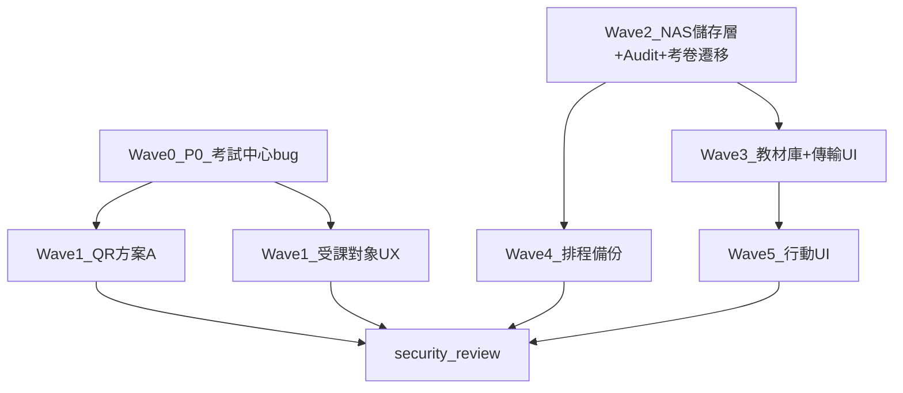

# 教育訓練建議事項 — 實作計劃 (IMPLEMENTATION PLAN)

**文件類型**：實作計劃（Wave 分工與程式落點）
**建立日期**：2026-06-18
**狀態**：待核可後依 Wave 執行
**規格準據**：[`20260618_教育訓練_建議事項_PLAN.md`](./20260618_教育訓練_建議事項_PLAN.md)

> 本文件將定案規格拆解為 **Wave 0～6** 之可執行步驟、程式落點、驗收與排程。
>
> **關聯 PLAN**：
> - 規格定案 → [`20260618_教育訓練_建議事項_PLAN.md`](./20260618_教育訓練_建議事項_PLAN.md)
> - NAS 儲存層 → [`20260612_系統備援_NAS儲存與排程備份_PLAN.md`](./20260612_系統備援_NAS儲存與排程備份_PLAN.md)
> - 教材業務 → [`20260617_教材上傳列管與教材庫_PLAN.md`](./20260617_教材上傳列管與教材庫_PLAN.md)

---

## 1. 目的

1. 將 7 大項建議定案轉為**分 Wave 實作路線圖**，明確依賴與程式落點。
2. 優先交付 **P0 考試中心 bug**，再處理獨立項（QR、受課對象），接著 NAS 基礎設施與教材庫。
3. 各 Wave 結束更新規格 PLAN 狀態並執行驗收；全波完成後 **security-review**。

---

## 2. 範圍

### 2.1 涵蓋 Wave

| Wave | 對應建議項 | 摘要 |
|------|-----------|------|
| 0 | #6 | 考試中心返回後按鈕失效（P0） |
| 1A | #3 | QR 方案 A |
| 1B | #5 | 訓練計畫受課對象 UX |
| 2 | #1A、#2、#2A 基礎 | NAS 儲存層、Audit、考卷遷移 |
| 3 | #1 | 教材庫 + 傳輸 UI |
| 4 | #2A | 排程備份 |
| 5 | #4 | 行動 UI |
| 6 | #7 | security-review |

### 2.2 不涵蓋

- AD 整合登入（另依 [`20260612_AD整合_系統管理者登入_PLAN.md`](./20260612_AD整合_系統管理者登入_PLAN.md) 排程）。

### 2.3 環境前提

- **NAS SMB 已可連線** → Wave 2 直接採 `smbprotocol`（單元測試可 mock）。

---

## 3. 現況與差距

| 領域 | 現況 | 目標 |
|------|------|------|
| 檔案儲存 | `backend/app/routers/exam.py` 寫入本地 `Path("data/materials")` | SMB 三模式 + `exams/`／`teaching/` |
| 教材庫 | 無 `teaching_materials` 表、無 API | 完整教材 PLAN |
| Audit | 無 | `file_transfer_audit_logs` |
| QR | UUID 長碼 + token 流程 | 方案 A：`/training/login` |
| 考試中心 | `ExamDashboard.tsx` 僅 mount 時 fetch | 返回 `/` 時 refetch |
| 受課對象 | `TrainingPlanManager.tsx` 全員列表 + 自動同步 | 單位篩選 + 新增個人對象 |

---

## 4. 依賴關係

---

## 5. Wave 實作內容

### Wave 0 — P0：考試中心按鈕失效（#6）

**目標**：離開考試中心再返回，按鈕無需 F5 即可操作。

**後端**：無變更。

**前端**（`frontend/src/components/exam/ExamDashboard.tsx`、`CheckInButton.tsx`）：

1. `useLocation()`：當 `pathname === '/'` 時呼叫 `fetchExams()`。
2. 離開頁面（`useEffect` cleanup）reset `showNotCheckedInModal`、`pendingStartExamId`、`quickCheckInLoading`。
3. `CheckInButton`：父層返回時 refetch，或以 `key={location.key}` remount（優先 refetch）。

**驗收**：建議事項 PLAN §5.10 #9；考試中心 → 成績中心 → 返回 → 按鈕可點。

**工時**：約 0.5～1 天。可獨立 PR。

**檢查清單**：

- [x] `useLocation` refetch 於返回 `/`（`ExamDashboard.tsx` 依 `location` 重新 `fetchExams()`；`CheckInButton` 透過 `refreshKey={location.key}` 重新抓取報到狀態）
- [x] modal 狀態 cleanup（離開 `/` 時 reset `showNotCheckedInModal`、`pendingStartExamId`、`quickCheckInLoading`）
- [ ] 手動驗證無需 F5（待於執行中環境登入學員帳號實測：考試中心 → 成績中心 → 返回 → 按鈕可點）

> **實作摘要（2026-06-22）**：前端 `frontend/src/components/exam/ExamDashboard.tsx`、`CheckInButton.tsx`；後端無變更。已通過 `npm run lint`（0 問題）與 `npm run build`（tsc + vite 成功）。手動驗證項待確認。

---

### Wave 1 — QR 方案 A（#3）與受課對象 UX（#5）

#### Wave 1A — QR 方案 A

**後端**（`backend/app/routers/qrcode.py`）：

- `POST /admin/qrcode/login/generate` 改為產生登入頁 URL 之 QR（`{FRONTEND_URL}/login`）。
- 不再寫入 `login_tokens`（或改為可選靜態 QR）。
- `/auth/login/qrcode/{token}` 標記 deprecated 或 redirect `/login`。

**前端**（`QRCodeManager.tsx`、`QRCodeLoginPage.tsx`）：

- 移除有效時間 UI；簡化 token 列表。
- QR 內容無 UUID。

**驗收**：掃碼進入 `/training/login`；前端不顯示過期時間。

**檢查清單**：

- [ ] 後端 generate 改為固定登入頁 URL
- [ ] 管理頁移除 expires_at 顯示
- [ ] Safari 短 URL 實機掃碼

#### Wave 1B — 訓練計畫受課對象 UX

**前端**（`TrainingPlanManager.tsx`）：

1. 個人清單預設空；僅顯示已勾選單位人員。
2. 「新增個人對象」按鈕 + 跨單位搜尋 modal。
3. badge 區分單位衍生 vs 額外新增。
4. 移除勾選單位自動寫入全部 `target_user_ids`。

**後端**（`training.py`、`exam_center.py`）：

- 儲存 explicit `target_user_ids`；檢查應考／報到名單解析是否需同步調整。

**驗收**：建議事項 PLAN §5.7 四點。

**工時**：約 2～3 天（可與 Wave 0 並行）。

**檢查清單**：

- [ ] UI 單位／個人關聯行為
- [ ] 儲存後名單與 UI 一致
- [ ] 考試中心應考名單正確

---

### Wave 2 — NAS 儲存層 + Audit + 考卷遷移

**目標**：建立後續檔案功能基礎設施。**阻塞 Wave 3**。

#### 2.1 設定與依賴

- 新增或擴充 `backend/app/config.py`：`SMB_SERVER`、`SMB_SHARE`、`MATERIALS_ROOT`、`BACKUP_ROOT`、`EXAM_SMB_*`。
- `requirements.txt` 新增 `smbprotocol`（備份密碼加密視需要加 `cryptography`）。
- `.env.example` 補齊變數（密碼不入版控）。

#### 2.2 儲存抽象層

新增 `backend/app/services/storage.py`：

- 介面：`connect(mode, credentials) → save/open/list/delete → disconnect()`。
- 模式：`interactive`（教材）、`service`（考卷）、`backup`（排程）。
- 路徑：`{year}/{plan_id}/exams/`、`teaching/`（見 NAS PLAN §5.1）。

#### 2.3 Audit Log

- 遷移：`file_transfer_audit_logs`（建議事項 PLAN §7.1）。
- 新增 `backend/app/services/audit_log.py`。
- 考卷 upload／list／delete 寫入 audit（`nas_username='service'`）。

#### 2.4 考卷工坊遷移

改寫 `backend/app/routers/exam.py`：

- 移除本地 `Path("data/materials")`。
- 全面改用 storage **service** 模式。
- NAS 不可達 → 503 + 明確訊息。

**驗收**：NAS PLAN §5.9 #1、#3、#12～#14。

**工時**：約 3～5 天。

**檢查清單**：

- [ ] storage.py 三模式 + disconnect
- [ ] file_transfer_audit_logs 遷移
- [ ] exam.py 改寫並連 NAS
- [ ] 考卷上傳不彈 NAS 登入；Audit 有 emp_id

---

### Wave 3 — 教材庫 + 傳輸 UI（#1）

**準據**：[`20260617_教材上傳列管與教材庫_PLAN.md`](./20260617_教材上傳列管與教材庫_PLAN.md)。

#### 3.1 資料層

- 遷移：`material_types`、`teaching_materials`。
- `models.py`、`schemas.py`；`init_db` 預設類型。

#### 3.2 後端 API

新增 `backend/app/routers/teaching_materials.py`，註冊於 `main.py`：

| 端點 | 要點 |
|------|------|
| `POST /nas-session/verify` | 驗證 NAS 帳密 → 短時 `nas_session_token`（約 10 分鐘；密碼不存 DB） |
| `POST /upload` | interactive storage；衝突處理 |
| `GET /{id}/download`、`POST /batch-download` | ZIP 串流 |
| 其餘 | conflict-check、列表、軟刪、material-types CRUD |

#### 3.3 前端

- `NasLoginModal.tsx`、`FileTransferModal.tsx`（進度 %、取消、beforeunload、僅 X／取消可關）。
- 訓練計畫編輯頁教材區、`TeachingMaterialLibrary.tsx`。

**驗收**：教材 PLAN §5.11 #1～28。

**工時**：約 5～8 天。

**檢查清單**：

- [ ] 資料表與 API
- [ ] NAS 登入 + 傳輸 UI
- [ ] 單檔／批次下載 Audit + Session 關閉

---

### Wave 4 — 排程備份（#2A）

**準據**：NAS PLAN §5.5～5.6。

- 資料表：`backup_schedule_config`（含 `backup_nas_*` 加密）、`backup_records`。
- `backend/app/services/backup_service.py`：SQLite backup + materials 快照 + ZIP + rotation。
- `APScheduler` 於 `main.py` lifespan。
- 前端：排程設定頁 + 備份紀錄。

**驗收**：NAS PLAN §5.9 #4～#8、#13。

**工時**：約 3～4 天（可與 Wave 3 尾段並行）。

---

### Wave 5 — 行動 UI（#4）

- `ExamDashboard.tsx`、成績中心頁：responsive、safe-area、觸控目標。
- 完成後撰寫 Cursor skill（`mobile-responsive-training-ui`）。

**驗收**：iOS／Android 實機；建議事項 PLAN §5.6。

**工時**：約 2～3 天。

---

### Wave 6 — security-review（#7）

全波完成後執行 `/security-review`，產出：

`1.docs/02-棕地專案/reviews/20260618_建議事項_security-review.md`

重點：NAS 密碼傳遞、audit 完整性、QR 殘留 token 端點、受課對象權限。

---

## 6. 建議排程（單人全職）

| 週次 | 內容 | 累計 |
|------|------|------|
| W1 | Wave 0 + Wave 1 | ~4 天 |
| W2 | Wave 2 | ~5 天 |
| W3～W4 | Wave 3 | ~8 天 |
| W5 | Wave 4 + Wave 5 開工 | ~5 天 |
| W6 | Wave 5 收尾 + security-review | ~3 天 |

**合計**：約 4～6 週。

---

## 7. 文件同步（每 Wave 結束）

| 文件 | 動作 |
|------|------|
| [`20260618_教育訓練_建議事項_PLAN.md`](./20260618_教育訓練_建議事項_PLAN.md) | 狀態、Wave 勾選 |
| NAS／教材 PLAN | 驗收案例打勾 |
| [`1.docs/README.md`](../../README.md) | 實作進度 |
| `reviews/` | 驗收 + security-review |

---

## 8. 風險與緩解

| 風險 | 緩解 |
|------|------|
| NAS AD 帳號格式 | 與 IT 確認 `DOMAIN\user` vs UPN |
| 大檔 50MB 逾時 | 調整 proxy／uvicorn timeout、前端 progress |
| 受課對象影響應考名單 | Wave 1B 同步檢查 `exam_center` |
| Wave 3 範圍大 | MVP：單檔上傳／下載先行，批次 ZIP 第二迭代 |

---

## 9. 建議第一個實作動作

1. 建立分支 `feature/20260618-suggestions`。
2. **立即執行 Wave 0**（考試中心 bug）。
3. 並行：IT 確認 SMB 路徑與三組帳號權限。

---

**最後更新**：2026-06-18
