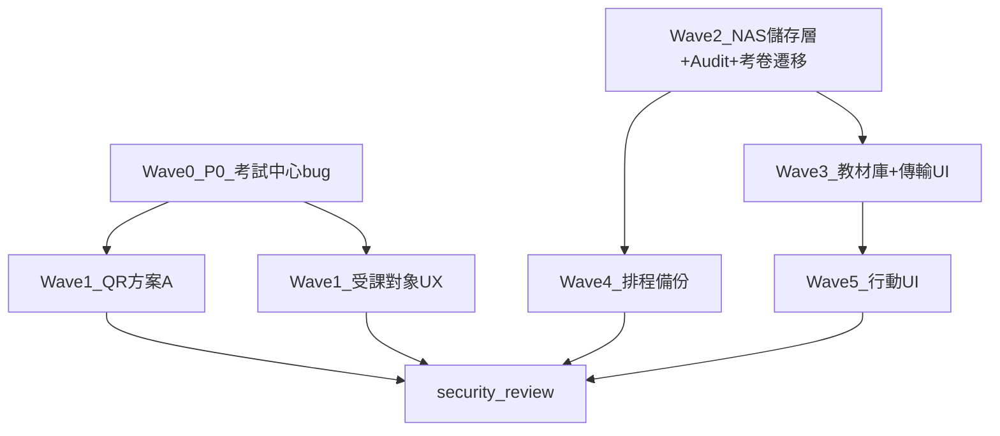

# 教育訓練建議事項 — 實作計劃 (IMPLEMENTATION PLAN)

**文件類型**：實作計劃（Wave 分工與程式落點）
**建立日期**：2026-06-18
**狀態**：待核可後依 Wave 執行
**規格準據**：[`20260618_教育訓練_建議事項_PLAN.md`](./20260618_教育訓練_建議事項_PLAN.md)

> 本文件將定案規格拆解為 **Wave 0～6** 之可執行步驟、程式落點、驗收與排程。
>
> **關聯 PLAN**：
> - 規格定案 → [`20260618_教育訓練_建議事項_PLAN.md`](./20260618_教育訓練_建議事項_PLAN.md)
> - NAS 儲存層 → [`20260612_系統備援_NAS儲存與排程備份_PLAN.md`](./20260612_系統備援_NAS儲存與排程備份_PLAN.md)
> - 教材業務 → [`20260617_教材上傳列管與教材庫_PLAN.md`](./20260617_教材上傳列管與教材庫_PLAN.md)

---

## 1. 目的

1. 將 7 大項建議定案轉為**分 Wave 實作路線圖**，明確依賴與程式落點。
2. 優先交付 **P0 考試中心 bug**，再處理獨立項（QR、受課對象），接著 NAS 基礎設施與教材庫。
3. 各 Wave 結束更新規格 PLAN 狀態並執行驗收；全波完成後 **security-review**。

---

## 2. 範圍

### 2.1 涵蓋 Wave

| Wave | 對應建議項 | 摘要 |
|------|-----------|------|
| 0 | #6 | 考試中心返回後按鈕失效（P0） |
| 1A | #3 | QR 方案 A |
| 1B | #5 | 訓練計畫受課對象 UX |
| 2 | #1A、#2、#2A 基礎 | NAS 儲存層、Audit、考卷遷移 |
| 3 | #1 | 教材庫 + 傳輸 UI |
| 4 | #2A | 排程備份 |
| 5 | #4 | 行動 UI |
| 6 | #7 | security-review |

### 2.2 不涵蓋

- AD 整合登入（另依 [`20260612_AD整合_系統管理者登入_PLAN.md`](./20260612_AD整合_系統管理者登入_PLAN.md) 排程）。

### 2.3 環境前提

- **NAS SMB 已可連線** → Wave 2 直接採 `smbprotocol`（單元測試可 mock）。

---

## 3. 現況與差距

| 領域 | 現況 | 目標 |
|------|------|------|
| 檔案儲存 | `backend/app/routers/exam.py` 寫入本地 `Path("data/materials")` | SMB 三模式 + `exams/`／`teaching/` |
| 教材庫 | 無 `teaching_materials` 表、無 API | 完整教材 PLAN |
| Audit | 無 | `file_transfer_audit_logs` |
| QR | UUID 長碼 + token 流程 | 方案 A：`/training/login` |
| 考試中心 | `ExamDashboard.tsx` 僅 mount 時 fetch | 返回 `/` 時 refetch |
| 受課對象 | `TrainingPlanManager.tsx` 全員列表 + 自動同步 | 單位篩選 + 新增個人對象 |

---

## 4. 依賴關係

---

## 5. Wave 實作內容

### Wave 0 — P0：考試中心按鈕失效（#6）

**目標**：離開考試中心再返回，按鈕無需 F5 即可操作。

**後端**：無變更。

**前端**（`frontend/src/components/exam/ExamDashboard.tsx`、`CheckInButton.tsx`）：

1. `useLocation()`：當 `pathname === '/'` 時呼叫 `fetchExams()`。
2. 離開頁面（`useEffect` cleanup）reset `showNotCheckedInModal`、`pendingStartExamId`、`quickCheckInLoading`。
3. `CheckInButton`：父層返回時 refetch，或以 `key={location.key}` remount（優先 refetch）。

**驗收**：建議事項 PLAN §5.10 #9；考試中心 → 成績中心 → 返回 → 按鈕可點。

**工時**：約 0.5～1 天。可獨立 PR。

**檢查清單**：

- [x] `useLocation` refetch 於返回 `/`（`ExamDashboard.tsx` 依 `location` 重新 `fetchExams()`；`CheckInButton` 透過 `refreshKey={location.key}` 重新抓取報到狀態）
- [x] modal 狀態 cleanup（離開 `/` 時 reset `showNotCheckedInModal`、`pendingStartExamId`、`quickCheckInLoading`）
- [ ] 手動驗證無需 F5（待於執行中環境登入學員帳號實測：考試中心 → 成績中心 → 返回 → 按鈕可點）

> **實作摘要（2026-06-22）**：前端 `frontend/src/components/exam/ExamDashboard.tsx`、`CheckInButton.tsx`；後端無變更。已通過 `npm run lint`（0 問題）與 `npm run build`（tsc + vite 成功）。手動驗證項待確認。

---

### Wave 1 — QR 方案 A（#3）與受課對象 UX（#5）

#### Wave 1A — QR 方案 A

**後端**（`backend/app/routers/qrcode.py`）：

- `POST /admin/qrcode/login/generate` 改為產生登入頁 URL 之 QR（`{FRONTEND_URL}/login`）。
- 不再寫入 `login_tokens`（或改為可選靜態 QR）。
- `/auth/login/qrcode/{token}` 標記 deprecated 或 redirect `/login`。

**前端**（`QRCodeManager.tsx`、`QRCodeLoginPage.tsx`）：

- 移除有效時間 UI；簡化 token 列表。
- QR 內容無 UUID。

**驗收**：掃碼進入 `/training/login`；前端不顯示過期時間。

**檢查清單**：

- [x] 後端 generate 改為固定登入頁 URL（`qrcode.py`：QR 編碼 `{前端基礎URL}/login`，不再寫入 `login_tokens`；回傳 `qrcode_url` + `login_url`）
- [x] 管理頁移除 expires_at 顯示（`QRCodeManager.tsx`：移除有效時間與 token 歷史清單，僅保留產生 / 顯示 / 複製連結）
- [x] Safari 短 URL 實機掃碼（2026-06-22 實測：QR 為短碼且**無 UUID**、Chrome 正常、Safari 關閉「不安全連線警告」可進 `/training/login`）
  - ⚠️ **待 IT 配合（提供 HTTPS）**：Safari 開啟「不安全連線警告／HTTPS-only」時會把 `http://` 強制升級為 `https://`，站台僅 HTTP 故導覽失敗。屬全站 HTTP→HTTPS 之 infra 議題，非 QR 內容問題。部署 TLS 後將後端 `FRONTEND_URL` 設為 `https://{server}/training`，QR 即編碼為 https。

> **實作摘要（2026-06-22）**：
> - 後端 `backend/app/routers/qrcode.py` 改寫為方案 A（QR = 登入頁固定 URL）；移除僅服務舊 UUID-token 流程的 `GET/DELETE /admin/qrcode/login/tokens` 與 `regenerate-qrcode` 三端點。
> - `backend/app/schemas.py` `QRCodeGenerateResponse` 改為 `{qrcode_url, login_url}`。
> - `backend/app/routers/auth.py` 將 `GET/POST /auth/login/qrcode/{token}` 標記 `deprecated=True`（保留相容舊 token）。
> - 前端 `App.tsx` 將 `/auth/login/qrcode/:token` 路由改為 `<Navigate to="/login" replace />`；刪除已廢止的 `QRCodeLoginPage.tsx`。
> - **未動資料庫**：`login_tokens` 表保留不變、無遷移。
> - 驗證：`npm run lint`（0 問題）、`npm run build`（成功）、後端 `py_compile` 與 import smoke 通過。

#### Wave 1B — 訓練計畫受課對象 UX

**前端**（`TrainingPlanManager.tsx`）：

1. 個人清單預設空；僅顯示已勾選單位人員。
2. 「新增個人對象」按鈕 + 跨單位搜尋 modal。
3. badge 區分單位衍生 vs 額外新增。
4. 移除勾選單位自動寫入全部 `target_user_ids`。

**後端**（`training.py`、`exam_center.py`）：

- 儲存 explicit `target_user_ids`；檢查應考／報到名單解析是否需同步調整。

**驗收**：建議事項 PLAN §5.7 四點。

**工時**：約 2～3 天（可與 Wave 0 並行）。

**檢查清單**：

- [x] UI 單位／個人關聯行為（個人清單預設空；勾選單位→列出該單位人員「來自單位」唯讀 badge；「新增個人對象」跨單位 modal；「額外新增」可移除；移除勾選單位自動寫入全部 `target_user_ids`）
- [x] 儲存後名單與 UI 一致（儲存僅送「額外新增」explicit，排除單位衍生；編輯舊計畫再儲存可自動清理被固化的單位成員）
- [x] 考試中心應考名單後端對齊（修正 `exam_center.py` 報到守門，改為「受課單位 ∪ 個人」；`my_exams`/報到統計/預估出席原本已 union）
- [ ] 手動驗證（待實機：建立/編輯計畫 UX 四點、儲存重開一致、跨單位個人於考試中心可見並可報到應考）

> **實作摘要（2026-06-22）**：
> - 前端 `frontend/src/components/admin/TrainingPlanManager.tsx`：受課單位 checkbox 僅切換 `target_dept_ids`（移除自動把單位成員寫入 `target_user_ids`）；個人受課對象卡片改為顯示「來自單位（唯讀）」＋「額外新增（可移除）」並以 badge 區分；新增「新增個人對象」跨單位搜尋 modal；儲存時 `target_user_ids` 僅送非單位衍生者。
> - 後端 `backend/app/routers/exam_center.py`：報到 eligibility 由「僅檢查 `target_departments`」改為「受課單位全員 ∪ 個人受課對象」，與 `my_exams` 一致，修正跨單位個人被 403 誤擋。
> - 後端 `training.py` **未改**：原本即以 explicit 方式儲存 `target_dept_ids` / `target_user_ids`（先前的單位→全員展開發生在前端）。
> - **未動資料庫**：`plan_target_departments` / `plan_target_users` 結構不變、無遷移。
> - 驗證：`npm run lint`（0 問題）、`npm run build`（成功）、後端 `py_compile` + import smoke 通過。
>
> **`target_departments` 與 `target_user_ids` 儲存策略**：
> - `target_departments`（受課單位）＝ **implicit 全員**：勾選的單位代表「該單位所有在職人員」皆為受課對象，**不**逐一展開寫入個人表。
> - `target_user_ids`（個人受課對象）＝ **explicit 額外個人**：僅存「額外新增」且**不屬於**任何已勾選單位者（可跨單位）。儲存前以 `deptDerivedUserIds` 過濾，確保單位成員不被固化為個人，避免名單雙重來源不一致。
> - 應考/報到名單解析一律取 **union(受課單位全員, 個人受課對象)**；兩者皆空＝全公司。
> - 後端 default：**僅**在「無受課單位且無個人受課對象」時才預設 `target_departments=[開課單位]`；若有個人受課對象則允許「僅個人、無單位」（見下方回饋修正 Point 3）。
>
> **回饋修正（2026-06-22，使用者實測後）**：
> - **Point 2（停用帳號顯示）**：舊計畫 `plan_target_users` 殘留 `inactive` 帳號（如 plan#8 共 116 筆，含 `100060`、`900001~19`、`E100001`），因表單僅載入 active 帳號而顯示為裸 ID。前端對查無/停用者改以琥珀色標「（查無此帳號／可能已停用，建議移除）」並可移除；重存舊計畫時後端濾 active、前端濾單位衍生者可自動清理。
> - **Point 3（後端規則 + bug 修正）**：`training.py` 建立/更新受課單位規則統一為「有單位→用之；無單位但有個人→僅個人；皆無→開課單位」，並修正**更新時取消所有受課單位卻未清除**的舊 bug；前端警示僅在「完全無受課對象」時顯示。
> - **Point 4（Approach A：移除即實體化）**：「來自單位」每列新增移除鈕；移除某成員時取消該單位勾選、其餘在職成員轉為明確個人、排除被移除者（純前端，無資料庫變更）。

---

### Wave 2 — NAS 儲存層 + Audit + 考卷遷移

**目標**：建立後續檔案功能基礎設施。**阻塞 Wave 3**。

#### 2.1 設定與依賴

- 新增或擴充 `backend/app/config.py`：`SMB_SERVER`、`SMB_SHARE`、`MATERIALS_ROOT`、`BACKUP_ROOT`、`EXAM_SMB_*`。
- `requirements.txt` 新增 `smbprotocol`（備份密碼加密視需要加 `cryptography`）。
- `.env.example` 補齊變數（密碼不入版控）。

#### 2.2 儲存抽象層

新增 `backend/app/services/storage.py`：

- 介面：`connect(mode, credentials) → save/open/list/delete → disconnect()`。
- 模式：`interactive`（教材）、`service`（考卷）、`backup`（排程）。
- 路徑：`{year}/{plan_id}/exams/`、`teaching/`（見 NAS PLAN §5.1）。

#### 2.3 Audit Log

- 遷移：`file_transfer_audit_logs`（建議事項 PLAN §7.1）。
- 新增 `backend/app/services/audit_log.py`。
- 考卷 upload／list／delete 寫入 audit（`nas_username='service'`）。

#### 2.4 考卷工坊遷移

改寫 `backend/app/routers/exam.py`：

- 移除本地 `Path("data/materials")`。
- 全面改用 storage **service** 模式。
- NAS 不可達 → 503 + 明確訊息。

**驗收**：NAS PLAN §5.9 #1、#3、#12～#14。

**工時**：約 3～5 天。

**檢查清單**：

- [x] storage.py 三模式 + disconnect（`SmbCredentials` 支援 interactive／service／backup 三來源；`connection()` context manager 進出短連線、離開必 disconnect；本波僅 service 模式接線，interactive/backup 留 Wave 3/4）
- [x] file_transfer_audit_logs 遷移（`models.FileTransferAuditLog` + `migrations/add_file_transfer_audit_logs.py`；啟動 `create_all` 亦會建立）
- [x] exam.py 改寫並連 NAS（`/upload` 將 TXT 寫入 `{year}/{plan_id}/exams/`；list／preview／delete 改讀 NAS；移除本地 `Path("data/materials")`；NAS 不可達→503）
- [x] 考卷上傳不彈 NAS 登入；Audit 有 emp_id（service 模式、無使用者登入；audit 記 `emp_id`+`client_ip`+`nas_username='service'`）
- [ ] 整合驗證（需 `backend/.env` 設定 SMB 並 `pip install smbprotocol`：實測上傳落 NAS `exams/`、audit 有紀錄、斷線回 503）

> **實作摘要（2026-06-22）**：
> - 新增 `backend/app/config.py`（pydantic-settings：`SMB_SERVER`/`SMB_SHARE`/`MATERIALS_ROOT`/`BACKUP_ROOT`/`EXAM_SMB_USERNAME`/`EXAM_SMB_PASSWORD`）。
> - 新增 `backend/app/services/storage.py`（SMB 抽象層；`smbclient` 延遲匯入、可 mock；`save/open/list/delete`；`StorageUnavailable`→503）與 `backend/app/services/audit_log.py`（獨立 Session 寫稽核，失敗不影響主流程）。
> - 新增 `models.FileTransferAuditLog` + 遷移腳本；`requirements.txt` 加 `smbprotocol`；新增 `backend/.env.example`（密碼留空，`.env` 已被 gitignore）。
> - 改寫 `backend/app/routers/exam.py`：`/upload` 先寫 NAS 再進 DB（有題必有檔）、檔名防穿越；list/preview/delete 走 NAS service 模式並寫 audit（upload/download/delete）。
> - 驗證：`py_compile`、全 app import、storage mock 單元測試（`tests/test_storage_unit.py`）、migration 於 **DB 副本**測試（含 idempotent）皆通過。
> - **⚠️ 重要落差（待你決定）**：現行 ExamStudio UI 的考卷匯入走「`/upload/preview` → `/import-from-preview`」（傳解析後 JSON 題目，**無原始檔**），不會產生 NAS 檔；會**歸檔 TXT 的是 `/upload` 端點**。故 NAS `exams/` 列表在現行 UI 流程下仍為空。若要讓 UI 流程也歸檔 TXT，需小幅前端調整（將原始檔帶到匯入步驟，或改走 `/upload`）——屬前端，未含於本後端波次。
> - **部署前置**：`pip install -r requirements.txt`（取得 smbprotocol）、填 `backend/.env`、跑 `python migrations/add_file_transfer_audit_logs.py`（執行前先備份 DB）。

---

### Wave 3 — 教材庫 + 傳輸 UI（#1）

**準據**：[`20260617_教材上傳列管與教材庫_PLAN.md`](./20260617_教材上傳列管與教材庫_PLAN.md)。

#### 3.1 資料層

- 遷移：`material_types`、`teaching_materials`。
- `models.py`、`schemas.py`；`init_db` 預設類型。

#### 3.2 後端 API

新增 `backend/app/routers/teaching_materials.py`，註冊於 `main.py`：

| 端點 | 要點 |
|------|------|
| `POST /nas-session/verify` | 驗證 NAS 帳密 → 短時 `nas_session_token`（約 10 分鐘；密碼不存 DB） |
| `POST /upload` | interactive storage；衝突處理 |
| `GET /{id}/download`、`POST /batch-download` | ZIP 串流 |
| 其餘 | conflict-check、列表、軟刪、material-types CRUD |

#### 3.3 前端

- `NasLoginModal.tsx`、`FileTransferModal.tsx`（進度 %、取消、beforeunload、僅 X／取消可關）。
- 訓練計畫編輯頁教材區、`TeachingMaterialLibrary.tsx`。

**驗收**：教材 PLAN §5.11 #1～28。

**工時**：約 5～8 天。

**檢查清單**：

- [x] 資料表與 API（後端完成）：`material_types`/`teaching_materials` 模型+遷移+`init_db` 預設 7 類型；`teaching_materials.py` 全端點（nas-session/verify、conflict-check、upload 多檔部分成功+衝突二選一+白名單+分級上限、by-plan、列表分頁、單檔下載、批次 ZIP、PUT、軟刪、material-types CRUD），註冊於 `main.py`
- [x] 單檔／批次下載 Audit + Session 關閉（後端）：`connection()` context manager 進出短連線、離開必 disconnect；upload/download/batch 寫 `file_transfer_audit_logs`（resource_type=teaching_material、含 nas_username/emp_id/IP）
- [~] NAS 登入 + 傳輸 UI：**後端就緒**（nas-session/verify 短時 token、interactive 傳輸、密碼不入 DB）；**前端 UI 待下一回合**
- [ ] **前端（下一回合）**：`NasLoginModal.tsx`、`FileTransferModal.tsx`（進度 %/取消/beforeunload/僅 X 可關）、訓練計畫編輯頁教材區、`TeachingMaterialLibrary.tsx`、教材類型維護
- [ ] 整合驗證（需 `backend/.env` SMB + `pip install smbprotocol`；/docs 抽測上傳/下載/衝突）

> **實作摘要（2026-06-22，Wave 3 後端）**：
> - 新增 `backend/app/routers/teaching_materials.py`（前綴 `/admin/teaching-materials`，權限 menu:exam；類型異動 menu:admin）。
> - 模型：`MaterialType`、`TeachingMaterial`（教材 PLAN §5.2 全欄位）；`schemas.py` 新增對應 schema；`migrations/add_teaching_materials.py`（建表+冪等植入 7 類型）；`init_db` 同步植入。
> - 服務：`storage.py` 補 `interactive_credentials()`/`verify_credentials()`；新增 `services/nas_session.py`（記憶體短時 token，TTL 由 `NAS_SESSION_TTL_SECONDS`，預設 10 分；密碼不入 DB）。
> - `config.py` 補教材限額（單檔/批次上傳下載/考卷 TXT）與 `nas_session_ttl_seconds`；`.env.example` 補變數（註解預設）。
> - 規則落實：格式白名單（副檔名+雙副檔名防護）、分類型單檔上限（取類型與 50MB 硬上限較小值）、單次≤5 檔/100MB、批次下載≤10 檔/200MB、同名衝突 deactivate_and_new/replace_in_place、多檔部分成功、停用＋新版 NAS 檔不刪、下載檔名 RFC 5987（中文）、軟刪保留實體檔。
> - 驗證：`py_compile`、`import app.main`（12 條教材路由註冊）、helper 單元驗證（白名單/標籤/Content-Disposition）、migration 於 **DB 副本**測試（6+20 欄、7 類型、idempotent）皆通過。
> - **未套用** per-department `resolve_data_scope` 於教材庫（menu:exam 視為管理權限，全可見）——列為 Wave 6 security-review 確認點。
> - **限制**：上傳「取消」(#25) 的 `cancelled` audit 需前端傳輸視窗在中止時回報（後端無法可靠偵測 client abort）→ 留前端回合。
> - **部署前置**：`pip install -r requirements.txt`、填 `backend/.env`、`python migrations/add_teaching_materials.py`（先備份 DB）。

---

### Wave 4 — 排程備份（#2A）

**準據**：NAS PLAN §5.5～5.6。

- 資料表：`backup_schedule_config`（含 `backup_nas_*` 加密）、`backup_records`。
- `backend/app/services/backup_service.py`：SQLite backup + materials 快照 + ZIP + rotation。
- `APScheduler` 於 `main.py` lifespan。
- 前端：排程設定頁 + 備份紀錄。

**驗收**：NAS PLAN §5.9 #4～#8、#13。

**工時**：約 3～4 天（可與 Wave 3 尾段並行）。

---

### Wave 5 — 行動 UI（#4）

- `ExamDashboard.tsx`、成績中心頁：responsive、safe-area、觸控目標。
- 完成後撰寫 Cursor skill（`mobile-responsive-training-ui`）。

**驗收**：iOS／Android 實機；建議事項 PLAN §5.6。

**工時**：約 2～3 天。

---

### Wave 6 — security-review（#7）

全波完成後執行 `/security-review`，產出：

`1.docs/02-棕地專案/reviews/20260618_建議事項_security-review.md`

重點：NAS 密碼傳遞、audit 完整性、QR 殘留 token 端點、受課對象權限。

---

## 6. 建議排程（單人全職）

| 週次 | 內容 | 累計 |
|------|------|------|
| W1 | Wave 0 + Wave 1 | ~4 天 |
| W2 | Wave 2 | ~5 天 |
| W3～W4 | Wave 3 | ~8 天 |
| W5 | Wave 4 + Wave 5 開工 | ~5 天 |
| W6 | Wave 5 收尾 + security-review | ~3 天 |

**合計**：約 4～6 週。

---

## 7. 文件同步（每 Wave 結束）

| 文件 | 動作 |
|------|------|
| [`20260618_教育訓練_建議事項_PLAN.md`](./20260618_教育訓練_建議事項_PLAN.md) | 狀態、Wave 勾選 |
| NAS／教材 PLAN | 驗收案例打勾 |
| [`1.docs/README.md`](../../README.md) | 實作進度 |
| `reviews/` | 驗收 + security-review |

---

## 8. 風險與緩解

| 風險 | 緩解 |
|------|------|
| NAS AD 帳號格式 | 與 IT 確認 `DOMAIN\user` vs UPN |
| 大檔 50MB 逾時 | 調整 proxy／uvicorn timeout、前端 progress |
| 受課對象影響應考名單 | Wave 1B 同步檢查 `exam_center` |
| Wave 3 範圍大 | MVP：單檔上傳／下載先行，批次 ZIP 第二迭代 |

---

## 9. 建議第一個實作動作

1. 建立分支 `feature/20260618-suggestions`。
2. **立即執行 Wave 0**（考試中心 bug）。
3. 並行：IT 確認 SMB 路徑與三組帳號權限。

---

**最後更新**：2026-06-18
