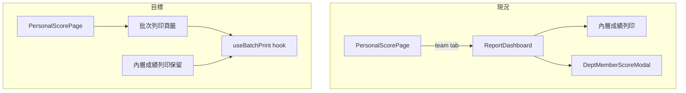
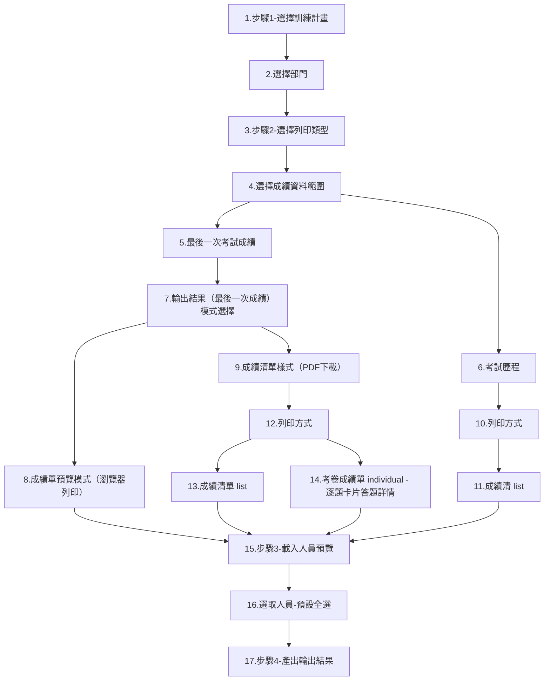

# 成績中心批次列印 — 實作計畫

**文件落點**（核可後建立）：[`1.docs/02-棕地專案/plans/20260624_成績中心批次列印_PLAN.md`](1.docs/02-棕地專案/plans/20260624_成績中心批次列印_PLAN.md)

**規格準據**：使用者需求（多計畫／跨部門／多員工；最後一次成績或考試歷程；PDF 為主）

**已定案決策**：
- `individual`（考卷成績單）：Phase 1 沿用 [`scoreCardPrintHtml.ts`](frontend/src/components/personal/scoreCardPrintHtml.ts) + 瀏覽器列印，與個人預覽同源
- `list`（成績清單）：後端 ReportLab PDF（[`report.py`](backend/app/routers/report.py) `render_score_print_pdf_to_buffer`）
- **兩個入口並存**：頂層新頁籤 + [`ReportDashboard`](frontend/src/components/admin/ReportDashboard.tsx) 內層「成績列印」均保留
- **跨部門或跨計畫 PDF 命名**：依「部門-計畫名稱_yyyyMMdd」拆分多檔，打包為 `批次列印_yyyyMMdd.zip` 下載

---

## 1. 目的

提供管理端在成績中心直接進行**跨訓練計畫、跨部門、多員工**的批次列印，無需先進入部門績效再開 Modal；輸出以 PDF（清單）為主，考卷成績單維持已驗證的 HTML 列印路徑。

## 2. 範圍

### 2.1 涵蓋

| 項目 | 說明 |
|------|------|
| 頂層頁籤 | [`PersonalScorePage.tsx`](frontend/src/components/personal/PersonalScorePage.tsx)「部門成績」右側新增「批次列印」 |
| 四步精靈 UI | 篩選 → 列印類型 → 人員勾選 → 選項與產出 |
| 後端語意 | `score_data_mode`: `last_attempt` / `exam_history`；最後一次去重 |
| 跨部門 | `dept_ids` 多選（依 RBAC 範圍過濾） |
| individual 跨部門 | 泛化 `dept-plan/individual-print-data` 為批次 API |
| 共用邏輯 | 抽出 hook，頂層頁與 ReportDashboard 內層共用 |
| PDF 檔名規則 | 跨部門或跨計畫時，依 `(部門, 計畫)` 分組命名並 ZIP 交付 |
| 計畫清單 | `GET /batch-print/plan-options?plan_status=` 與訓練計畫管理狀態一致 |
| 輸出樣式 | `output_style`: `score_card`（成績單預覽）／`summary_list`（表格 PDF） |

### 2.2 不涵蓋（Phase 2 以後）

- individual 改為後端合併單一 PDF 下載
- 非同步大量列印 job（>200 人）
- 考試歷程的 `individual` 模式（對齊個人端 T13：暫只開放 list）

---

## 3. 現況與差距



| 能力 | 現況 | 差距 |
|------|------|------|
| 頂層入口 | 無 | 新增 `batch-print` tab |
| 多計畫 | `plan_ids` 已支援 | 頂層 UI 暴露 |
| 跨部門 | API 有 `dept_ids`，前端未用 | 部門多選 UI + 權限過濾 |
| 最後一次 | `report_print_preview` 回傳全部 ExamRecord | 需 `(emp_id, plan_id)` 去重 |
| 考試歷程 | `include_exam_history` checkbox 疊加 | 改為 `score_data_mode` 二選一 |
| individual 跨部門 | 僅 `dept-plan/individual-print-data`（單部門） | 泛化批次 API |
| PDF 檔名 | 固定 `score-print-yyyyMMdd.pdf` | 需依部門／計畫分組命名 |

**既有可複用端點**（[`report.py`](backend/app/routers/report.py)）：
- `GET /admin/reports/print/plan-options`
- `GET /admin/reports/department`（部門清單來源）
- `POST /admin/reports/print/preview`、`/print/pdf`
- `POST /admin/reports/dept-plan/individual-print-data`

---

## 4. 資料與 API 設計

### 4.1 請求參數（preview / pdf 共用）

```typescript
interface BatchPrintRequest {
  plan_ids: number[];
  dept_ids: number[];           // 空陣列 = 權限範圍內全部部門
  emp_ids: string[];            // pdf 時為勾選結果；preview 可空
  plan_status: 'active' | 'expired' | 'archived';
  score_data_mode: 'last_attempt' | 'exam_history';
  print_mode: 'list' | 'individual';
  include_employee_signature: boolean;
}
```

### 4.2 語意對照

| `score_data_mode` | 資料查詢 | PDF 行為 |
|-------------------|----------|----------|
| `last_attempt` | 每人每計畫取 `max(submit_time)` | `document_context=default`；list 含主表 |
| `exam_history` | 同計畫全部已提交紀錄 | `document_context=personal_exam_history`；歷程表格式（參考 [`render_score_print_pdf_to_buffer`](backend/app/routers/report.py) L2146） |

| `print_mode` | 輸出 |
|--------------|------|
| `list` | `POST .../batch-print/pdf` → 單檔 PDF 或 ZIP（見 §4.5） |
| `individual` | 僅 `last_attempt`；`POST .../batch-print/individual-data` → `buildBatchPrintHtml` + `printHtmlInIframe`（檔名規則不適用，仍為瀏覽器列印） |
| `output_style=score_card`（最後一次成績） | 同上 individual-data 路徑；**僅輸出有考試作答資料者**（`has_exam=true`），不含未應考／僅報到未完成之空白成績單頁 |

### 4.5 PDF 檔名與交付規則（新增）

**適用範圍**：`print_mode=list` 的 PDF 下載（頂層「批次列印」與 ReportDashboard 內層「成績列印」共用）。

**分組鍵**：勾選結果依 `(dept_name, plan_title)` 分組（以 preview items 實際出現的部門／計畫為準）。

**檔名格式**：

```
{部門名稱}-{計畫名稱}_{yyyyMMdd}.pdf
```

- 日期：列印當日，時區 `Asia/Taipei`
- 檔名消毒：移除或替換 `\ / : * ? " < > |` 等非法字元為 `_`；過長截斷（建議單段 ≤ 40 字）
- 同名衝突：同 ZIP 內若檔名重複，尾綴 `_2`、`_3`…

**交付方式**：

| 情境 | 下載內容 | 外層檔名 |
|------|----------|----------|
| 僅 1 個 `(部門, 計畫)` 組合 | 單一 PDF | `{部門}-{計畫}_{yyyyMMdd}.pdf` |
| 2 個以上 `(部門, 計畫)` 組合（跨部門或跨計畫） | ZIP 內含多個 PDF | `批次列印_{yyyyMMdd}.zip` |

**後端實作要點**：

1. `_group_batch_print_items(items) -> Dict[(dept_name, plan_title), List[dict]]`
2. 每組呼叫 `render_score_print_pdf_to_buffer` 產生獨立 PDF buffer
3. 多組時以 `zipfile` 打包，`Content-Type: application/zip`；`Content-Disposition` 帶 UTF-8 檔名（`filename*=UTF-8''…`）
4. 單組時維持 `application/pdf`，`Content-Disposition` 為 `{部門}-{計畫}_{yyyyMMdd}.pdf`

**前端實作要點**：

- `useBatchPrint.exportPdf` 依回應 `Content-Type` 決定副檔名（`.pdf` / `.zip`）
- 優先從 `Content-Disposition` 解析檔名；無則 fallback 上述規則

### 4.3 後端新增／調整

**方案：在 [`report.py`](backend/app/routers/report.py) 擴充，不另開 router。**

1. **抽取共用查詢** `_batch_print_rows(db, allowed_emp_ids, plan_ids, dept_ids, plan_status, score_data_mode) -> List[dict]`
   - `last_attempt`：subquery `group_by(emp_id, plan_id)` + `max(submit_time)` join 回 ExamRecord
   - `exam_history`：現有 query 全筆 + `order_by(submit_time)`
   - `plan_status`：複用 `_training_plan_status_filter_expr`

2. **新增端點**（`menu:report` + `_get_report_scope_emp_ids`）：
   - `GET /admin/reports/batch-print/dept-options` — 回傳可選部門（依 scope 過濾）
   - `POST /admin/reports/batch-print/preview` — 回傳 `{ total, items }`（items 含 `emp_id, name, dept_name, plan_id, plan_title, total_score, is_passed, submit_time`）
   - `POST /admin/reports/batch-print/pdf` — 依 `(dept_name, plan_title)` 分組產 PDF；單組回傳 PDF、多組回傳 ZIP（§4.5）；`exam_history` 時傳 `document_context=personal_exam_history`
   - `POST /admin/reports/batch-print/individual-data` — 泛化 [`dept_individual_print_data`](backend/app/routers/report.py) L2494：接受 `plan_ids` + `emp_ids`，回傳 `MemberPrintItem[]` 格式；**僅含已提交考試之 `(plan_id, emp_id)` 組合**，不回傳 `has_exam=false` 空白頁

3. **向後相容**：既有 `POST /admin/reports/print/preview` 內部改呼叫 `_batch_print_rows`（`score_data_mode=last_attempt` 預設），ReportDashboard 內層行為不變。

4. **護欄**：
   - `plan_ids` 上限 20、`emp_ids` 上限 200（常數於 `report.py` 或 `config.py`）
   - 超過 20 人 individual：前端 `confirm`（沿用 [`DeptMemberScoreModal`](frontend/src/components/admin/DeptMemberScoreModal.tsx) `PRINT_WARN_THRESHOLD`）

### 4.4 schemas

於 [`schemas.py`](backend/app/schemas.py) 新增 `BatchPrintPreviewRequest`、`BatchPrintPdfRequest`、`BatchPrintIndividualRequest`（Pydantic），避免 Body 參數散落。

---

## 5. 前端設計

### 5.1 頁籤與路由

[`PersonalScorePage.tsx`](frontend/src/components/personal/PersonalScorePage.tsx)：
- `TabType` 擴充 `'batch-print'`
- `URL_TAB_VALUES` 加入 `'batch-print'`；`navigateTab` 寫入 `?tab=batch-print`
- 權限：同 `hasReportPermission`（Admin 或 `menu:report` + department/all scope）
- 渲染新元件 `<BatchPrintPage />`

### 5.2 新元件 `BatchPrintPage.tsx`

路徑：`frontend/src/components/admin/BatchPrintPage.tsx`

四步精靈（可參考 [`DeptMemberScoreModal`](frontend/src/components/admin/DeptMemberScoreModal.tsx) 步驟圓圈 UI）：

| 步驟 | UI |
|------|-----|
| 1 篩選 | 計畫狀態 tabs；訓練計畫多選（複用 [`ScorePrintFlow`](frontend/src/components/common/ScorePrintFlow.tsx) 下拉勾選）；部門多選（新區塊） |
| 2 列印類型 | Radio：`最後一次考試成績` / `考試歷程`；Radio：`成績清單(list)` / `考卷成績單(individual)`；選歷程時禁用 individual |
| 3 人員 | 「載入預覽」→ 表格勾選（搜尋、排序、分頁，邏輯自 ReportDashboard print 區塊抽出） |
| 4 產出 | 員工簽名 checkbox；主鈕「產生 PDF」或「列印考卷成績單」 |

### 5.3 共用 Hook `useBatchPrint.ts`

路徑：`frontend/src/hooks/useBatchPrint.ts`

封裝：
- `fetchDeptOptions`、`fetchPlanOptions`
- `loadPreview`、`exportPdf`（自動處理 PDF／ZIP 檔名）、`exportIndividualHtml`
- state：`selectedPlanIds`、`selectedDeptIds`、`scoreDataMode`、`printMode`、預覽表與勾選

[`ReportDashboard.tsx`](frontend/src/components/admin/ReportDashboard.tsx) 內層 `activeTab === 'print'` 改呼叫同一 hook + 精簡 wrapper（**不移除頁籤**）。

### 5.4 ScorePrintFlow 擴充（可選）

新增 `variant='batchPrint'`：
- 步驟 2 使用 `score_data_mode` radio 取代 `include_exam_history` checkbox
- 或由 `BatchPrintPage` 自行實作步驟 2，僅步驟 1 計畫選擇複用 `ScorePrintFlow`

---

## 6. 實作 Wave 分工

### Wave 1 — 後端語意與 API（優先）

**檔案**：[`backend/app/routers/report.py`](backend/app/routers/report.py)、[`backend/app/schemas.py`](backend/app/schemas.py)

- 實作 `_batch_print_rows`（去重／歷程）
- 新增 4 個 batch-print 端點
- 實作 `_group_batch_print_items`、檔名消毒、單 PDF／ZIP 分支（§4.5）
- 重構既有 `print/preview` 共用查詢
- 手動驗證：`/docs` 抽測 preview 筆數；單組 PDF 檔名、多組 ZIP 內檔名

### Wave 2 — 頂層頁籤與 BatchPrintPage

**檔案**：[`PersonalScorePage.tsx`](frontend/src/components/personal/PersonalScorePage.tsx)、新建 `BatchPrintPage.tsx`、`useBatchPrint.ts`

- 頂層「批次列印」頁籤
- 四步精靈 + 預覽表 + list PDF／ZIP 下載（依 §4.5 解析檔名）
- `npm run lint`、`npm run build`

### Wave 3 — individual 跨部門 + 內層共用

**檔案**：[`report.py`](backend/app/routers/report.py)、[`ReportDashboard.tsx`](frontend/src/components/admin/ReportDashboard.tsx)、[`scoreCardPrintHtml.ts`](frontend/src/components/personal/scoreCardPrintHtml.ts)（僅型別匯入，不改版型）

- `batch-print/individual-data` 串接 `buildBatchPrintHtml`
- ReportDashboard 內層改用 `useBatchPrint`（行為對齊，入口保留）

### Wave 4 — 文件與驗收

**檔案**：
- [`README.md`](README.md) — 成績中心功能表
- [`1.docs/00-專案總覽/專案使用說明.md`](1.docs/00-專案總覽/專案使用說明.md) — 操作步驟
- 本 PLAN 檔案勾選驗收清單

---

## 7. 驗收清單

- [x] 具 `menu:report` 部門主管：頂層可見「批次列印」，僅能選權限內部門（`dept-options` 端點以 `_get_report_scope_emp_ids` 過濾範圍外部門；頁籤顯示條件與既有「部門成績」相同）
- [x] Admin：可跨部門、多計畫勾選（Wave 2 手動驗證以 Admin 身分跨部門/跨計畫操作四步精靈）
- [x] **最後一次**：同一人同計畫考多次，preview / PDF 僅 1 筆（最新）（Wave 1 pytest + curl 實測確認去重）
- [x] **考試歷程**：同情境 PDF 含全部次數；抬頭為「教育訓練考試歷程成績列印」（程式碼確認：`report.py` `_draw_personal_exam_history_list_header` 固定輸出此標題，`batch_print_pdf` 於 `score_data_mode=exam_history` 時正確傳入 `document_context=personal_exam_history`）
- [ ] list 模式：下載 PDF，Docker 容器內中文正常 — **尚未驗證**：本機測試正常，但容器內 CJK 字型套件需另行於部署環境驗證（沿用既有 `register_chinese_fonts()` 路徑，未變更字型載入邏輯，風險與既有 PDF 列印功能相同）
- [x] **單部門單計畫**：下載檔名為 `{部門}-{計畫}_{yyyyMMdd}.pdf`（Wave 1 curl 實測）
- [x] **跨部門或跨計畫**：下載 `批次列印_{yyyyMMdd}.zip`，內含各 `{部門}-{計畫}_{yyyyMMdd}.pdf`（Wave 1 curl 實測）
- [x] 檔名含特殊字元時已消毒，ZIP 內無覆蓋同名檔（Wave 1 pytest 覆蓋消毒/截斷/重名尾綴邏輯）
- [x] individual 模式：HTML 列印與個人「預覽成績單」版型一致（兩入口皆呼叫同一 `buildBatchPrintHtml`，Wave 2/3 手動驗證列印視窗內容）
- [x] 成績單預覽樣式／individual：僅輸出有考試作答資料者，不含未應考空白頁（修正 `individual-data` 笛卡兒展開；前端匯出時依預覽列限制 `plan_ids`）
- [x] 超過 20 人 individual 有確認對話（`BATCH_PRINT_INDIVIDUAL_WARN_THRESHOLD` 邏輯經審查確認正確；因測試資料不足 20 人未能於瀏覽器即時觸發，已以程式碼審查方式確認）
- [x] ReportDashboard 內層「成績列印」仍可用且行為一致（Wave 3 改用 `useBatchPrint` 共用 hook，individual 模式改為與頂層一致之瀏覽器列印——此為計畫既定之行為對齊，非缺陷）
- [x] `npm run lint`、`npm run build` 通過（每一波結束皆重新執行並確認通過）

---

## 8. 風險與緩解

| 風險 | 緩解 |
|------|------|
| 大量 individual HTML 列印卡頓 | 20 人警告 + 上限 200 |
| 兩入口邏輯分叉 | Wave 3 強制共用 `useBatchPrint` |
| `exam_history` + 多計畫 PDF 過長 | 分頁邏輯已在 `render_score_print_pdf_to_buffer`；驗收時測 3 計畫 × 5 人 |
| 多組 PDF ZIP 產生耗時 | 分組上限受 `plan_ids`／`emp_ids` 護欄；前端顯示「產生中…」 |
| 部門／計畫名稱重複導致檔名衝突 | ZIP 內自動加 `_2`、`_3` 尾綴 |
| `individual-data` 以 plan_ids×emp_ids 笛卡兒展開產生空白頁 | 後端僅回傳有 ExamRecord 之組合；前端匯出時依預覽列收窄 plan_ids |

---

## 9. 參考文件

- [`1.docs/02-棕地專案/規格與計畫/1.成績中心功能計劃.md`](1.docs/02-棕地專案/規格與計畫/1.成績中心功能計劃.md)
- [`1.docs/02-棕地專案/交付實作文件/20260430_成績中心-部門成員-考卷列印_修正項目-2.md`](1.docs/02-棕地專案/交付實作文件/20260430_成績中心-部門成員-考卷列印_修正項目-2.md)（individual 同源規格）
- [`1.docs/00-專案總覽/個人成績總覽與學習分析說明.md`](1.docs/00-專案總覽/個人成績總覽與學習分析說明.md)（考試歷程 PDF 抬頭）
- [`CLAUDE.md`](CLAUDE.md)（啟動、權限、PDF 字型）

---

## 10. 批次列印流程



