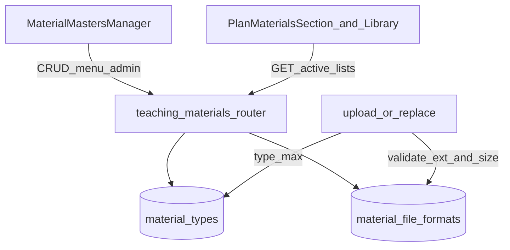

# 教材主檔與允許格式集中維護 — 實作計劃 (PLAN)

**文件類型**：棕地實作計劃（PLAN，僅設計，不含程式碼）  
**建立日期**：2026-07-04  
**狀態**：✅ 已完成（2026-07-04）  
**對應需求**：教材類型與允許檔案格式改由系統管理集中維護；支援影片上傳；前後端不再雙份硬編碼。

> 本文件依使用者全域規範採 7 大結構：目的／範圍／權責／名詞解釋／作業內容／參考文件／使用表單。  
> 核可後依 §5.7 實作順序執行；完成後於 §8 檢查清單勾選並補實作摘要。  
>
> **與母規格分工**：教材業務主規格見 [`20260617_教材上傳列管與教材庫_PLAN.md`](./20260617_教材上傳列管與教材庫_PLAN.md)。本文件為其**棕地增強**：主檔維運 UI、允許格式 DB 化、影片與限額調整。母規格 §5.3／§5.4／§5.10 已交叉修訂指向本文。

---

## 1. 目的

1. **教材類型**（操作手冊、影音教材等）與**允許副檔名**（pdf、mp4 等）皆以 DB 主檔為唯一真相來源（SSOT），於系統管理畫面增減，無需改程式發版。
2. 上傳驗證與前端選檔器皆讀後端 API，消除 `backend/app/routers/teaching_materials.py` 與 `frontend/src/components/teaching/transfer.ts` 雙份硬編碼。
3. 預設納入常見影片格式，並調整單檔／批次限額策略，使影片實際上傳可行。

---

## 2. 範圍

### 2.1 涵蓋範圍（In Scope）

| Phase | 摘要 |
|-------|------|
| **Phase A** | 新表 `material_file_formats`、ORM／schemas、遷移與 `init_db` 種子（含 mp4／webm、影音教材類型） |
| **Phase B** | 格式 CRUD API；上傳／換檔改查 DB；有效單檔上限公式；調高 `config.py` 預設硬上限 |
| **Phase C** | 系統管理頁 `MaterialMastersManager`（教材類型＋允許格式雙 Tab）與路由選單 |
| **Phase D** | 上傳區動態載入允許格式（移除前端硬編碼清單） |
| **Phase E** | 文件同步（本 PLAN、母 PLAN、文件索引、必要時根 README） |

既有 `material_types` 之 CRUD API 已存在，本期補 UI，並強化「已引用時禁止改 `slug`」。

### 2.2 不涵蓋範圍（Out of Scope）

| 項目 | 說明 |
|------|------|
| 頁內影片串流播放器／轉碼 | 本期僅列管上傳與下載 |
| 考卷 TXT 上傳流程 | `exam.py` 仍僅 `.txt`，不走教材白名單主檔 |
| `DANGEROUS_EXTS` 改為可管理主檔 | **維持程式常數**，避免誤開 `.exe` 等 |
| Content-Type／MIME 強制對照 | `mime_types` 欄位預留；本期仍以副檔名為準 |
| 批次 ZIP 大檔串流優化 | 僅調高預設上限；超大影片建議單檔下載 |
| 反向代理／Docker timeout 調整 | 於風險節註記，部署層另行處理 |

### 2.3 與其他文件之關係

| 文件 | 關係 |
|------|------|
| `20260617_教材上傳列管與教材庫_PLAN.md` | 母規格；§5.3／§5.4／§5.10 以本文為準修訂 |
| `20260612_系統備援_NAS儲存與排程備份_PLAN.md` | 實體檔仍走 interactive NAS；路徑結構不變 |

---

## 3. 權責

| 角色 | 權責 |
|------|------|
| 系統管理者（`menu:admin`） | 維護教材類型、允許檔案格式主檔 |
| 考卷／教材操作者（`menu:exam`） | 讀取啟用中類型／格式；上傳教材 |
| 開發 | 遷移、API、UI、限額邏輯、文件 |

**權限對齊既有慣例**：

- GET 類型／格式：`menu:exam`（管理頁以 `include_inactive=true` 一併讀取停用項）
- POST／PUT／DELETE：`menu:admin`
- 系統管理選單入口：`menu:admin`（同分類管理，不另開細項功能碼）

---

## 4. 名詞解釋

| 名詞 | 說明 |
|------|------|
| 教材類型 | 表 `material_types`：業務分類（操作手冊、影音教材等）；`slug` 用於 NAS 子目錄 |
| 允許檔案格式 | 表 `material_file_formats`：可上傳副檔名白名單（pdf、mp4 等） |
| 有效單檔上限 | `min(格式上限, 類型上限, 系統硬上限)`；格式或類型為 null 則該層不參與（硬上限必存在） |
| 危險副檔名 | `DANGEROUS_EXTS`：程式內建，用於拒絕雙副檔名攻擊，不可由 UI 關閉 |
| SSOT | Single Source of Truth；執行期以 DB 為準，種子僅供初始化 |

---

## 5. 作業內容

### 5.1 架構



**現況問題**：

| 項目 | 現在 | 問題 |
|------|------|------|
| 教材類型 | DB + API 已齊，無管理 UI | 只能打 API／改 DB |
| 允許副檔名 | 後端 `ALLOWED_EXTS` + 前端 `ALLOWED_MATERIAL_EXTS` | 雙份硬編碼，改一處易漏 |
| 影片 | 未在白名單；硬上限 50MB | 無法實際上傳 |

### 5.2 資料模型：`material_file_formats`

| 欄位 | 型別 | 說明 |
|------|------|------|
| `id` | int PK | |
| `ext` | string unique | 小寫、無點，如 `mp4` |
| `label` | string | 顯示名，如「影片 MP4」 |
| `sort_order` | int | 排序，預設 0 |
| `max_file_bytes` | int nullable | 該格式單檔上限；null 表示不另限（僅受類型／硬上限） |
| `is_active` | boolean | 停用後不可新上傳；既有教材列管不受影響 |
| `mime_types` | text nullable | 預留（JSON 陣列字串）；本期不驗證 |

- ORM：`backend/app/models.py` 新增 `MaterialFileFormat`
- Schemas：`backend/app/schemas.py` 對齊 `MaterialType*`（Base／Create／Update／讀取）

**刪除語意**（與教材類型一致）：

- 無任何 `teaching_materials.file_format == ext` → 可硬刪
- 已有引用 → 改 `is_active=false`，回傳 `{ "message": "...", "disabled": true }`

**識別欄位變更限制**：

| 主檔 | 欄位 | 規則 |
|------|------|------|
| 允許格式 | `ext` | 已有教材引用時禁止修改（HTTP 400） |
| 教材類型 | `slug` | 已有教材引用該 `material_type_id` 時禁止修改（HTTP 400）；與格式規則一致 |

可改：`name`／`label`、`sort_order`、`max_file_bytes`、`is_active`。

### 5.3 種子資料

遷移腳本：`backend/migrations/add_material_file_formats.py`（`CREATE TABLE IF NOT EXISTS` + 冪等 INSERT）。  
`backend/app/init_db.py`：同步冪等植入（新庫與既有庫一致）。

**允許格式（預設）**

| ext | label | max_file_bytes | sort_order |
|-----|-------|----------------|------------|
| pdf | PDF | 52428800（50MB） | 10 |
| doc | Word DOC | 52428800 | 20 |
| docx | Word DOCX | 52428800 | 21 |
| xls | Excel XLS | 31457280（30MB） | 30 |
| xlsx | Excel XLSX | 31457280 | 31 |
| ppt | PowerPoint PPT | 52428800 | 40 |
| pptx | PowerPoint PPTX | 52428800 | 41 |
| md | Markdown | 5242880（5MB） | 50 |
| txt | 純文字 | 5242880 | 51 |
| mp4 | 影片 MP4 | 524288000（500MB） | 60 |
| webm | 影片 WebM | 524288000 | 61 |

> `teaching/` 下之 `.txt` 僅存檔，**不**觸發考卷解析（考卷仍走 `exams/` 與 `exam.py`）。

**教材類型**：既有 7 種維持；新增：

| name | slug | max_file_bytes | sort_order |
|------|------|----------------|------------|
| 影音教材 | 影音教材 | 524288000（500MB） | 70 |

既有類型預設上限不變（操作手冊／維護手冊 50MB、法規與標準／公告通知 30MB、簡報教材／測驗參考／其他 20MB）。

### 5.4 限額策略

現況硬上限 50MB、單次上傳總量 100MB，無法上傳影片，故調整預設值（仍可由環境變數覆寫）。

| 設定項 | 現預設 | 新預設 | 環境變數 |
|--------|--------|--------|----------|
| 系統硬上限 | 50MB | **1 GiB**（1073741824） | `TEACHING_MATERIAL_MAX_FILE_BYTES` |
| 單次上傳總量 | 100MB | **1 GiB** | `TEACHING_MATERIAL_MAX_BATCH_UPLOAD_BYTES` |
| 單次上傳檔數 | 5 | 5（不變） | `TEACHING_MATERIAL_MAX_BATCH_UPLOAD_COUNT` |
| 批次下載總量 | 200MB | **1 GiB** | `TEACHING_MATERIAL_MAX_BATCH_DOWNLOAD_BYTES` |
| 批次下載檔數 | 10 | 10（不變） | `TEACHING_MATERIAL_MAX_BATCH_DOWNLOAD_COUNT` |
| 考卷 TXT | 5MB | 5MB（不變） | `EXAM_TXT_MAX_FILE_BYTES` |

**有效單檔上限**（上傳與換檔共用）：

```python
def _effective_max_bytes(mt, fmt, hard: int) -> int:
    caps = [hard]
    if mt.max_file_bytes:
        caps.append(mt.max_file_bytes)
    if fmt.max_file_bytes:
        caps.append(fmt.max_file_bytes)
    return min(caps)
```

管理者可透過類型／格式主檔調整業務上限，無需改碼；系統硬上限為最後安全閥。

### 5.5 後端 API

路徑前綴維持：`/api/admin/teaching-materials`。

#### 5.5.1 允許檔案格式（新增）

| 方法 | 路徑 | 權限 | 說明 |
|------|------|------|------|
| GET | `/material-file-formats` | `menu:exam` | 查詢參數 `include_inactive`（預設 false） |
| POST | `/material-file-formats` | `menu:admin` | 新增；`ext` 正規化為小寫、去除前導點 |
| PUT | `/material-file-formats/{id}` | `menu:admin` | 更新（已引用時不可改 `ext`） |
| DELETE | `/material-file-formats/{id}` | `menu:admin` | 硬刪或停用 |

#### 5.5.2 教材類型（既有，本期強化）

| 方法 | 路徑 | 變更 |
|------|------|------|
| GET/POST/PUT/DELETE | `/material-types` | PUT：已引用時禁止改 `slug` |

#### 5.5.3 上傳驗證改造

檔案：`backend/app/routers/teaching_materials.py`

1. 刪除模組級 `ALLOWED_EXTS`（**保留** `DANGEROUS_EXTS`）。
2. `_validate_filename(filename, db) -> tuple[str, MaterialFileFormat]`：查啟用中格式；不存在或停用 → `不允許的格式 .{ext}`；雙副檔名邏輯不變。
3. 以 `_effective_max_bytes(mt, fmt, hard)` 檢查大小（取代僅看類型上限）。
4. 換檔（replace）路徑同步套用。

列表極小，每次上傳查 DB 即可，不強制快取。

### 5.6 前端

#### 5.6.1 系統管理頁（新建）

路徑：`frontend/src/components/admin/MaterialMastersManager.tsx`

- 兩個 Tab：**教材類型**、**允許檔案格式**
- UI 風格對齊 `CategoryManager.tsx`（列表、行內新增／編輯、啟停、刪除確認）
- 類型欄位：`name`、`slug`、`sort_order`、`max_file_bytes`（UI 以 MB 輸入，送出轉 bytes）、`is_active`
- 格式欄位：`ext`、`label`、`sort_order`、`max_file_bytes`、`is_active`
- 提示文案：已有教材引用時不可改 `slug`／`ext`；刪除若已引用則改為停用

#### 5.6.2 路由與選單

檔案：`frontend/src/App.tsx`

| 項目 | 值 |
|------|-----|
| 路徑 | `/admin/material-masters` |
| 選單名稱 | 教材主檔 |
| 位置 | 分類管理附近 |
| 權限碼 | `menu:admin` |

#### 5.6.3 上傳區

| 檔案 | 變更 |
|------|------|
| `frontend/src/components/teaching/transfer.ts` | 移除硬編碼 `ALLOWED_MATERIAL_EXTS`；`mergeSelectedFiles`／`buildMaterialAccept` 改接受 `allowedExts: string[]` |
| `PlanMaterialsSection.tsx` | mount 時 `GET .../material-file-formats` |
| `TeachingMaterialLibrary.tsx` | 同上 |

可選：`useMaterialFileFormats()` hook 避免重複請求邏輯。

### 5.7 實作順序

1. **Phase A**：模型／schemas／遷移／`init_db` 種子  
2. **Phase B**：格式 CRUD、上傳／換檔改讀 DB、限額公式、`config.py` 預設值、類型 `slug` 鎖定  
3. **Phase C**：管理頁 + 路由選單  
4. **Phase D**：上傳區動態格式清單  
5. **Phase E**：文件收尾（母 PLAN 已於定稿時交叉修訂者可僅補 README／MIGRATION_GUIDE）

### 5.8 驗收條件

| # | 案例 | 期望 |
|---|------|------|
| 1 | 系統管理新增教材類型 | 上傳下拉於重整或重開上傳區後出現 |
| 2 | 停用教材類型 | 下拉不再出現；舊教材仍可查 |
| 3 | 系統管理新增 `mov` | 可選檔上傳；未加前被拒 |
| 4 | 停用 `pdf` | 新上傳 pdf 被拒；既有 pdf 教材仍列管 |
| 5 | 上傳 `sample.mp4`（小於有效上限） | 成功寫入 NAS + DB |
| 6 | 上傳超過有效上限之影片 | 明確錯誤訊息含上限 |
| 7 | 刪除已引用格式 | 回傳停用而非硬刪 |
| 8 | 已引用類型改 `slug`／格式改 `ext` | HTTP 400 |
| 9 | 前端無寫死九種副檔名 | `transfer.ts` 無固定常數清單 |

### 5.9 風險與注意

| 風險 | 對策 |
|------|------|
| 既有部署遷移 | 執行前備份 `data/education_training.db` |
| 硬上限調高 | 僅影響教材；考卷 TXT 仍用 `exam_txt_max_file_bytes` |
| 大檔 NAS／逾時 | 依賴既有 interactive 傳輸 UI；proxy timeout 過短須部署層調整（本 PLAN 不改 nginx／Docker timeout） |
| `slug` 誤改導致 NAS 路徑語意混亂 | 後端禁止已引用類型改 `slug`；UI 顯示警告 |

---

## 6. 參考文件

| 文件 | 說明 |
|------|------|
| [20260617_教材上傳列管與教材庫_PLAN.md](./20260617_教材上傳列管與教材庫_PLAN.md) | 教材母規格 |
| [20260612_系統備援_NAS儲存與排程備份_PLAN.md](./已完成/20260612_系統備援_NAS儲存與排程備份_PLAN.md) | NAS 儲存層 |
| [MIGRATION_GUIDE.md](../../00-專案總覽/資料庫遷移/MIGRATION_GUIDE.md) | 遷移慣例（實作時補本表遷移條目） |
| 專案根 `CLAUDE.md` | 啟動、路徑、文件索引慣例 |

---

## 7. 使用表單（管理欄位）

### 7.1 教材類型

| 欄位 | 必填 | 說明 |
|------|------|------|
| 名稱 | 是 | 顯示於上傳下拉 |
| slug | 是 | NAS 目錄識別；唯一；已引用不可改 |
| 排序 | 否 | 預設 0 |
| 單檔上限 (MB) | 否 | 空＝不另限（僅受格式／硬上限） |
| 啟用 | 是 | 預設 true |

### 7.2 允許檔案格式

| 欄位 | 必填 | 說明 |
|------|------|------|
| 副檔名 | 是 | 不含點、小寫、唯一；已引用不可改 |
| 顯示名稱 | 是 | 管理列表用 |
| 排序 | 否 | 預設 0 |
| 單檔上限 (MB) | 否 | 空＝不另限（僅受類型／硬上限） |
| 啟用 | 是 | 預設 true |

---

## 8. 檢查清單

### Phase A — 資料模型與種子

- [x] `MaterialFileFormat` 模型與 schemas
- [x] `migrations/add_material_file_formats.py`
- [x] `init_db.py` 冪等種子（格式 11 筆 + 影音教材類型）

### Phase B — API 與上傳驗證

- [x] `/material-file-formats` CRUD
- [x] 刪除 `ALLOWED_EXTS`；上傳／換檔讀 DB
- [x] `_effective_max_bytes`
- [x] 類型已引用禁止改 `slug`；格式已引用禁止改 `ext`
- [x] `config.py` 硬上限／批次預設調為 1 GiB

### Phase C — 系統管理 UI

- [x] `MaterialMastersManager.tsx`
- [x] `App.tsx` 路由與「教材主檔」選單

### Phase D — 上傳區

- [x] `transfer.ts` 動態 `allowedExts`
- [x] `PlanMaterialsSection.tsx`／`TeachingMaterialLibrary.tsx` 載入格式清單

### Phase E — 文件

- [x] 母 PLAN §5.3／§5.4／§5.10 交叉修訂（2026-07-04 定稿時完成）
- [x] `1.docs/README.md` 索引（2026-07-04 定稿時完成）
- [x] `MIGRATION_GUIDE.md` 遷移條目（實作時）
- [x] 根 `README.md` 若有寫死格式清單則改為「由系統管理維護」（實作時）

### 收尾

- [ ] §5.8 驗收條件手動測試（需登入後台與 NAS）
- [x] 本 PLAN 狀態改為「已完成」並填實作摘要

**實作摘要（2026-07-04）**：新增 `material_file_formats` 主檔與 CRUD；上傳／換檔改讀 DB 白名單與 `_effective_max_bytes`；系統管理「教材主檔」雙 Tab；前端 `useMaterialFileFormats` 動態 accept；種子含 mp4／webm／影音教材；硬上限預設 1 GiB；遷移腳本已於本機執行成功；`npm run build` 通過。

---

## 9. 程式落點總表

| 類型 | 路徑 | 變更 |
|------|------|------|
| 新增 | `backend/app/models.py`（`MaterialFileFormat`） | Phase A |
| 新增 | `backend/migrations/add_material_file_formats.py` | Phase A |
| 修改 | `backend/app/init_db.py` | Phase A |
| 修改 | `backend/app/schemas.py` | Phase A |
| 修改 | `backend/app/routers/teaching_materials.py` | Phase B |
| 修改 | `backend/app/config.py` | Phase B |
| 新增 | `frontend/src/components/admin/MaterialMastersManager.tsx` | Phase C |
| 修改 | `frontend/src/App.tsx` | Phase C |
| 修改 | `frontend/src/components/teaching/transfer.ts` | Phase D |
| 修改 | `frontend/src/components/teaching/PlanMaterialsSection.tsx` | Phase D |
| 修改 | `frontend/src/components/teaching/TeachingMaterialLibrary.tsx` | Phase D |
| 修改 | `1.docs/02-棕地專案/plans/20260617_教材上傳列管與教材庫_PLAN.md` | Phase E |
| 修改 | `1.docs/README.md` | Phase E |
| 修改 | `1.docs/00-專案總覽/資料庫遷移/MIGRATION_GUIDE.md` | Phase E（實作時） |

---

## 10. 審核決策（預設值）

| # | 決策點 | 預設 |
|---|--------|------|
| Q1 | 影片預設格式 | `mp4`、`webm`（`mov` 由管理者自行新增） |
| Q2 | 影片格式／影音教材預設單檔上限 | 500MB |
| Q3 | 系統硬上限／單次上傳總量／批次下載總量 | 1 GiB |
| Q4 | MIME 強制驗證 | 本期不做（欄位預留） |
| Q5 | 頁內播放器 | 本期不做 |
| Q6 | 已引用時改 `slug`／`ext` | 禁止（400） |
| Q7 | 危險副檔名清單 | 維持程式常數，不可 UI 管理 |
