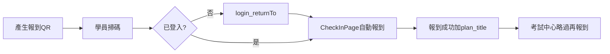

# 報到雙時機 QR、開課單位 Owner、教材庫 UX — 實作計劃 (PLAN)

**文件類型**：棕地實作計劃  
**建立日期**：2026-07-17  
**最近修訂**：2026-07-18  
**狀態**：✅ 已實作（分支 `feature/checkin-owner-scope-20260717`）；瀏覽器手動驗收項待勾選後可結案並移入 `plans/已完成/`  
**任務清單**：[../tasks/20260717_報到-訓練計畫-教材-題庫_新增需求_TASKS.md](../tasks/20260717_報到-訓練計畫-教材-題庫_新增需求_TASKS.md)  
**交付摘要**：[../交付實作文件/20260718_報到QR-開課單位Owner-教材庫UX.md](../交付實作文件/20260718_報到QR-開課單位Owner-教材庫UX.md)

> 本文件 supersede [已完成/20260703_報到補齊與開考強制與交卷印章_PLAN.md](已完成/20260703_報到補齊與開考強制與交卷印章_PLAN.md) 中「QR 報到流程不改版」之 Out of Scope；**保留**「須先報到才能開考／交卷」後端鐵律。

---

## 1. 目的

1. **報到雙時機**：上課前與考試時共用同一組報到 QRcode／同一筆 `attendance_records`；遲到、請假未報到者於考試前再掃即可補報到；已報到者考試中心不再要求報到。
2. **開課單位＝Owner**：訓練計畫、歷史題庫、教材套組／檔案、**考卷工坊內該計畫考題**僅開課單位（或超管）可**編輯／刪除／封存**（計畫另含產生報到 QR）；其餘僅能檢視／下載。
3. **教材庫 UX**：編輯中鎖定其他列操作；檔案檢視可刪單檔（Owner／超管）；報到總覽統計 Modal 內嵌 QR 並優化版面。

---

## 2. 範圍

### 2.1 涵蓋（In Scope）

| Phase | 摘要 |
|-------|------|
| **A 報到 QR** | 訓練計畫管理／報到總覽產生報到 QR；登入 `returnTo`；CheckInPage 自動報到；`plan_title` 回傳 |
| **B Owner** | `question_bank.dept_id`、`teaching_material_sets.dept_id`；**寫入**權限（編輯／刪除／封存）；列表／搜尋開課單位 |
| **C 教材 UX** | 編輯鎖、檔案檢視刪除、統計 Modal QR 區塊與卡片縮放 |
| **D 資料完整性** | `UNIQUE(emp_id, plan_id)`；checkin 冪等；去重遷移 |

### 2.2 不涵蓋（Out of Scope）

| 項目 | 說明 |
|------|------|
| `checkin_type`／雙表報到 | 不拆上課／考試報到型態 |
| 後端 QR 時窗開關 enforcement | 由管理員手動開關／重產 QR，不做 TTL 旗標 |
| 系統管理「QRcode 管理」選計畫 | 維持純登入 QR；報到 QR 僅在訓練計畫／報到總覽 |
| 後端跨使用者編輯鎖 | 僅前端 UI 互斥 |
| 硬刪教材 NAS 實體檔還原 UI | 仍為軟刪（列表不顯示、NAS 檔保留）；無「救回」產品功能 |

### 2.3 審核決策（已定案）

| # | 決策 |
|---|------|
| Q1 | 報到 QR 入口：訓練計畫操作欄＋報到總覽統計 Modal「顯示 QRcode」 |
| Q2 | Owner 例外：`is_management_role()`（超管／系統管理） |
| Q3 | `dept_id` nullable；NULL＝不套用 owner 限制 |
| Q4 | 當天請假／遲到：無報到列 → 考試前再掃同一 QR 補報到 |
| Q5 | 檔案檢視：補刪除按鈕；Owner＋超管可刪 |

---

## 3. 權責

| 角色 | 責任 |
|------|------|
| 開發 | 依 TASKS 實作、遷移、單元測試、文件同步 |
| 審核者 | 核可範圍決策；合併前完成 T4-2～T4-4 瀏覽器驗收 |
| 維運 | 部署前備份 DB → 執行 `add_owner_dept_fields.py`、`add_attendance_emp_plan_unique.py` |

---

## 4. 名詞解釋

| 名詞 | 說明 |
|------|------|
| 開課單位 / Owner | `TrainingPlan.dept_id`；題庫／套組寫入對應 `dept_id` |
| 報到雙時機 | 同一 QR、同一 `attendance_records` 列，可於上課前或考試前完成一次報到 |
| returnTo | 未登入掃 QR → `/login?returnTo=/checkin?plan_id=…`；登入後必須導回報到頁 |
| 軟刪 | 教材套組／檔案 `is_active=false`；NAS 實體檔不刪 |

---

## 5. 作業內容（實作結果摘要）

### 5.1 報到流程

| 項目 | 落點 |
|------|------|
| 產生 QR | `POST /training/plans/{id}/checkin-qrcode/generate`；`TrainingPlanManager`、`AttendanceOverviewPage` |
| returnTo | `App.tsx`：`RedirectToLoginWithReturnTo`、`LoginReturnRedirect`；`LoginPage` |
| 自動報到／冪等 | `CheckInPage`（模組級 Promise）；`exam_center.checkin` 已報到回 200 |
| 成功頁標題 | `status`／`checkin` 回傳 `plan_title`（員工無 `menu:plan` 也能顯示） |
| UNIQUE | `migrations/add_attendance_emp_plan_unique.py`；model `uq_attendance_emp_plan` |

### 5.2 Owner

| 項目 | 落點 |
|------|------|
| Migration | `add_owner_dept_fields.py` |
| 判斷 | `access_scope.can_modify_owned_resource`（`can_delete_owned_resource` 為別名）；前端 `authGuards.canModifyOwnedResource` |
| 寫入限制 | 訓練計畫：`PUT`／刪除／封存／取消封存／產生報到 QR；題庫：`PUT`／刪除；教材：`PUT`／綁定計畫／上傳檔／刪除；**考卷工坊考題**：上傳／匯入／`PUT`／刪除／刪考卷 TXT（依 `plan.dept_id`） |
| 刪除／篩選 | 同上寫入限制；列表／搜尋開課單位 |
| 寫入 | 考卷上傳寫題庫帶 `plan.dept_id`；新增套組必填 `dept_id` |

### 5.3 教材庫／統計 Modal UX

| 項目 | 落點 |
|------|------|
| 編輯鎖 | `TeachingMaterialLibrary`：`rowActionsLocked` |
| 檔案刪除 | 檔案檢視操作欄＋確認 Modal；軟刪提示 |
| Modal 版面 | QR `flex-1`／圖 `w-44`；四卡縮為 `lg:w-52`、`p-2.5` |

詳見 TASKS 勾選表與交付實作文件。

---

## 6. 參考文件

| 文件 | 路徑 |
|------|------|
| 任務清單 | `tasks/20260717_報到-訓練計畫-教材-題庫_新增需求_TASKS.md` |
| 交付實作 | `交付實作文件/20260718_報到QR-開課單位Owner-教材庫UX.md` |
| 使用說明 | `1.docs/00-專案總覽/專案使用說明.md` §3.2／§3.7／§4.2 |
| 遷移指南 | `1.docs/00-專案總覽/資料庫遷移/MIGRATION_GUIDE.md`（Owner、attendance UNIQUE） |
| 20260703 報到鐵律 | `plans/已完成/20260703_報到補齊與開考強制與交卷印章_PLAN.md` |

---

## 7. 驗收清單

| # | 情境 | 預期 | 狀態 |
|---|------|------|------|
| T1 | 未登入掃 QR → 登入 | 進 `/checkin` 自動報到，不進考試中心 | 程式已修；待人工 |
| T2 | 請假後考試前再掃 | 補報到成功；不重複列 | 程式已修；待人工 |
| T3 | 已報到進考試中心 | 不再要求報到 | 沿用既有；待人工 |
| T4 | 成功頁 | 顯示計畫名稱（如「2026年度教育訓練」） | 程式已修；待人工 |
| T5 | 非 Owner 編輯／刪除／封存 | 前端 disable／檢視模式＋後端 403 | 單元測試已過；待人工 |
| T6 | 超管編輯／刪除 | 允許 | 單元測試已過；待人工 |
| T7 | 教材編輯鎖／檔案刪 | 符合 §5.3 | 待人工 |
| T8 | 統計 Modal QR 版面 | 左 QR 大、右四卡小 | 程式已修；待人工 |
| T9 | pytest／lint／build | 通過 | ✅ |

---

## 附錄 A — 原始需求條列（2026-07-17）

（保留需求原文供追溯；實作以本文 §2～§5 定案為準。）

### 有關報到的管理
1. 教育訓練報到要分：**上課前的報到**，及**考試時**的報到，因為有時候的訓練（或政策宣導...之類的）不需要考試。
2. 續1, 如果上課前的報到來不及簽到（比如上課遲到，開始上課了，簽到 QRcode 已關掉，或當天請假...），就要等到考試時再來報到。
3. 續2, 反之，已報要的人就不用在該訓練計畫考試時還要再報到一次。
4. 所以，在上課前的報到時間進行簽到，這時候開啟本次訓練的 QRcode 開放簽到。
5. 當要正式開始考試時，在「訓練計畫管理」操作欄增加：產生 QRcode。
6. 已報到者進入考試中心不用再報到。
7. 系統管理 QRcode 管理選計畫 **或** 改在訓練計畫操作欄 → **定案：後者**（報到總覽 Modal 亦提供）。

### 擁有權／題庫教材／UX
見原文「開課單位＝Owner」、清單加欄與搜尋、編輯鎖定、檔案檢視刪除（軟刪，無救回產品流程）。
