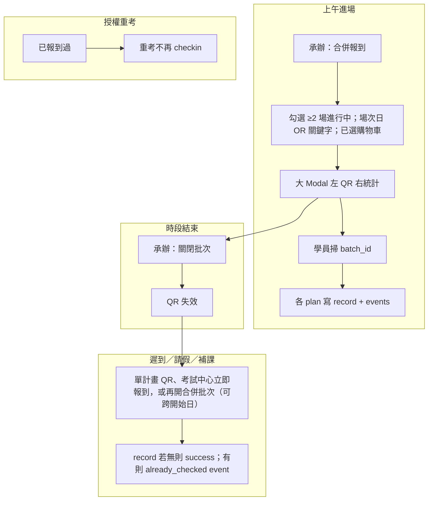

# 合併報到批次、報到歷程與報到總覽 QR 權限修正 — 實作計劃 (PLAN)

**文件類型**：棕地實作計劃  
**建立日期**：2026-07-20  
**狀態**：✅ 已合併至 `main`（`cursor/batch-merge-or-select-3b7d`，2026-07-22）；人工驗收待勾選後可移入 `plans/已完成/`。後續缺口見 [20260722_合併報到未到原因與歷程時間軸_PLAN.md](20260722_合併報到未到原因與歷程時間軸_PLAN.md)  
**任務清單**：[../tasks/20260720_合併報到批次與報到歷程_TASKS.md](../tasks/20260720_合併報到批次與報到歷程_TASKS.md)  
**前置 PLAN**：[20260717_報到-訓練計畫-教材-題庫_新增需求_PLAN.md](20260717_報到-訓練計畫-教材-題庫_新增需求_PLAN.md)（單計畫 QR、`returnTo`、冪等 UNIQUE）

> **與 20260717 之關係**：保留單計畫報到 QR（遲到／請假／補課補報）；本 PLAN **新增**依序多場之「合併批次 QR」與 append-only 報到歷程，並**修正**報到總覽「顯示 QRcode」誤綁 Owner 之落差（20260717 Q6 中「計畫含產生 QR」仍僅指**訓練計畫管理**入口，不含報到總覽）。

---

## 1. 目的

1. **多場合併、一次報到**：進行中多場訓練（可跨開始日；含補課日）勾選後，學員僅需掃描**一組合併 QR**，系統為各計畫各寫一筆有效報到（`attendance_records`），`checkin_time` 相同。
2. **報到歷程可追溯**：採 append-only `attendance_checkin_events`；`attendance_records.checkin_time` **僅存第一次成功報到時間，永不覆蓋**；支援「未到／請假 → 補報 → 再掃（already_checked）」等第 N 次事件（含使用者所述之「萬一」第三次情境）。
3. **批次 QR 可關閉／可重開**：合併報到時段結束後承辦人關閉批次，QR 失效；誤關可重開並寫 audit。
4. **權限對齊**：報到總覽之「顯示 QRcode」（含合併批次）僅需 `menu:attendance-overview`，**不套用開課單位 Owner**；訓練計畫管理之單計畫 QR 仍可依 Owner 規則（若該入口實作）。
5. **與重考分離**：授權重考表示**曾已成功報到**；重考時**不需再報到**，不新增 events。

---

## 2. 範圍

### 2.1 涵蓋（In Scope — Phase F MVP）

| Phase | 摘要 |
|-------|------|
| **F1 資料模型** | `attendance_checkin_batches`、`attendance_checkin_batch_plans`、`attendance_checkin_events`；migration |
| **F2 批次 API** | 建立批次、批次 stats、關閉／重開、學員批次 checkin |
| **F3 歷程 API** | 依 `plan_id`（＋可選 `emp_id`）查 events；與現有 stats 整合 |
| **F4 前端 — 合併報到** | 報到總覽右上「多場訓練合併報到」→ 勾選 → 大 Modal（左 QR、右多計畫統計、關閉／重開） |
| **F5 前端 — CheckIn** | `CheckInPage` 支援 `batch_id`；成功／部分成功／批次已關閉文案 |
| **F6 前端 — 歷程** | 報到統計 Modal（報到總覽／訓練計畫）人員列或詳情可展開 events |
| **F7 權限修正** | 報到總覽單計畫 QR：後端 `check_any_permission(["menu:plan","menu:attendance-overview"])` 且**不檢 Owner**；前端移除 Owner disable |

### 2.2 不涵蓋（Out of Scope — 本 PLAN）

| 項目 | 說明 |
|------|------|
| 平行教室同時上課 | 本需求為**依序多場**；非多 QR 同時投影不同教室 |
| `checkin_type` 欄位 | 仍以 events.`event_type`／`source` 區分，不新增 attendance 型態欄 |
| 重考再報到 | 授權重考後進入考試**不**觸發 checkin API |
| 自動 TTL 關批次 | 不做定時自動關閉；由承辦人手動關閉／重開 |
| 硬刪批次或 events | 批次僅 status 流轉；events 不可刪（稽核） |

### 2.3 Phase F2（選做，本 PLAN 不阻塞 MVP）

| 項目 | 說明 |
|------|------|
| 批次歷史管理獨立頁 | 列出當日／近七日 batches、一鍵重開 |
| 合併 QR 列印／海報 | MVP 以螢幕投影＋複製連結為足 |

### 2.4 審核決策（已定案）

| # | 決策 |
|---|------|
| Q1 | 勾選條件：**≥2 場**、**正在進行中**（未封存且未過期）；**不限同一開始日**。候選篩選為**場次日（落在開始～結束）OR 關鍵字**；已選清單換條件不清空。批次 `training_date`＝使用者指定之**場次／報到日**（預設今日） |
| Q2 | 受課對象：實務相同；UI 可簡化；後端仍**逐 plan 驗證**，採**部分成功**（`skipped_not_target` 寫 event） |
| Q3 | 批次關閉時掃碼：**整批失敗**（400），不部分寫入；提示改用單計畫 QR 或洽承辦 |
| Q4 | 批次關閉後可**重開**；每次重開寫 `audit_log`；events 保留 |
| Q5 | `attendance_records.checkin_time` = **第一次** `result=success` 的時間；後續掃碼只追加 `already_checked` events |
| Q6 | 未到原因（`attendance_absence_reasons`）與 events **並列顯示**於歷程 UI |
| Q7 | 報到總覽 QR（單計畫＋合併）**不綁 Owner**；未到原因／列印仍不綁 Owner（沿用 20260717） |
| Q8 | 重考免報到（沿用現行 §4.2 鐵律） |

---

## 3. 權責

| 角色 | 責任 |
|------|------|
| 產品／審核 | 確認依序多場 SOP、關閉批次時點、歷程顯示是否符合人資／稽核需求 |
| 開發 | 依 TASKS 實作 migration、API、前端、pytest；同步 MIGRATION_GUIDE／使用說明 |
| 維運 | 部署前備份 DB → 執行本波 migration；驗證報到總覽與 CheckIn 路徑 |

---

## 4. 名詞解釋

| 名詞 | 說明 |
|------|------|
| 合併報到批次 | 一次 QR 對應多個 `training_plan_id`；URL `/checkin?batch_id=<uuid>` |
| 單計畫報到 QR | 既有 `/checkin?plan_id=<id>`；用於遲到、請假、漏掃；跨開始日補課亦可改用合併批次 |
| 有效報到 | `attendance_records` 一列；`UNIQUE(emp_id, plan_id)`；`checkin_time` 不覆蓋 |
| 報到事件 | `attendance_checkin_events` 一列；每次掃碼或觸發 checkin 邏輯皆 append |
| `result=success` | 該次掃碼成功建立（或當時尚無）`attendance_records` |
| `result=already_checked` | 已有有效報到；寫 event 但不改 `checkin_time` |
| `result=skipped_not_target` | 不在該 plan 受課對象；寫 event，不建 record |
| `result=batch_closed` | 批次已關閉；整批 checkin 拒絕 |
| 批次狀態 | `open` → `closed` → `reopened`（語意同 open）→ 可再 `closed` |

---

## 5. 作業內容

### 5.1 業務流程（依序多場）



### 5.2 資料模型

#### `attendance_checkin_batches`

| 欄位 | 型別 | 說明 |
|------|------|------|
| `id` | String(UUID) PK | QR 參數 |
| `label` | String | 預設如「YYYY-MM-DD 合併報到」；可編輯 |
| `training_date` | Date | **場次／報到日**（建立時指定；可與各計畫開始日不同） |
| `status` | String | `open` / `closed` / `reopened` |
| `created_by` | FK users.emp_id | |
| `created_at` | DateTime | |
| `closed_at` | DateTime nullable | |
| `closed_by` | FK nullable | |
| `reopened_at` | DateTime nullable | 最近一次重開 |
| `reopened_by` | FK nullable | |

#### `attendance_checkin_batch_plans`

| 欄位 | 說明 |
|------|------|
| `batch_id` | FK → batches |
| `plan_id` | FK → training_plans |
| PK | (`batch_id`, `plan_id`) |

#### `attendance_checkin_events`

| 欄位 | 型別 | 說明 |
|------|------|------|
| `id` | Integer PK | |
| `emp_id` | FK | |
| `plan_id` | FK | |
| `event_time` | DateTime | UTC（與現行 `_now_utc_naive()` 一致） |
| `event_type` | String | `batch_checkin` / `single_checkin` / `exam_center` |
| `batch_id` | FK nullable | |
| `source` | String | `qr_batch` / `qr_single` / `exam_center_button` |
| `result` | String | `success` / `already_checked` / `skipped_not_target` / `batch_closed` / `plan_not_in_batch` 等 |
| `ip_address` | String nullable | 同現行 checkin |

**Migration**：`backend/migrations/add_attendance_checkin_batch_and_events.py`（名稱以實作為準）。

**既有資料**：上線前之 `attendance_records` 不補寫 events（可選 one-off backfill script 列 F2）；新 checkin 起一律雙寫。

### 5.3 API 設計

| Method | Path | 說明 | 權限 |
|--------|------|------|------|
| `POST` | `/training/attendance/batches` | body: `{ plan_ids[], label?, training_date? }`；驗證 ≥2、進行中未封存；**不要求同開始日**；`training_date` 為場次日（未傳＝今日）；回 batch + QR | `menu:attendance-overview` |
| `GET` | `/training/attendance/batches/{batch_id}` | 批次詳情 + plan 標題列表 | 同上 |
| `GET` | `/training/attendance/batches/{batch_id}/stats` | 各 plan 之 stats（複用 stats 計算） | 同上 |
| `PATCH` | `/training/attendance/batches/{batch_id}/status` | body: `{ status: "closed" \| "reopened" }` | 同上 + audit |
| `POST` | `/exam/attendance/batches/{batch_id}/checkin` | 學員批次報到 | 已登入 |
| `GET` | `/training/plans/{plan_id}/attendance/events` | query: `emp_id?`；歷程列表 | `menu:plan` 或 `menu:attendance-overview` |

**修正既有**：

| Method | Path | 變更 |
|--------|------|------|
| `POST` | `/training/plans/{plan_id}/checkin-qrcode/generate` | 改 `check_any_permission(["menu:plan","menu:attendance-overview"])`；**報到總覽呼叫時不檢 Owner**（`menu:attendance-overview` 且非 `menu:plan` 時跳過 owner；或統一：僅 `menu:plan` 路徑檢 owner — 見 TASKS T7） |
| `POST` | `/exam/plan/{plan_id}/attendance/checkin` | 成功／already_checked 皆 **append event**（`single_checkin`） |

**批次 checkin 演算法**（摘要）：

```
若 batch.status ∉ {open, reopened} → 400 batch_closed（每人寫一筆 batch_closed event 可選）
for plan in batch.plans:
  若 user 非受課對象 → event skipped_not_target；continue
  若已有 attendance_records → event already_checked；continue
  若 plan 日期／封存等不符 → event 對應失敗；continue
  否則 insert attendance_records + event success
回傳 { succeeded: PlanCheckinResult[], skipped: ... }
```

**QR URL**：

- 合併：`{base}/checkin?batch_id={uuid}`
- 單計畫：沿用 `{base}/checkin?plan_id={id}`

### 5.4 前端落點

| 元件 | 變更 |
|------|------|
| `AttendanceOverviewPage.tsx` | 右上「多場訓練合併報到」；勾選 Modal；大 QR Modal；移除單計畫 QR 之 Owner disable；右側 stats polling（建議 15s） |
| `CheckInPage.tsx` | 解析 `batch_id`；呼叫批次 checkin；多計畫成功列表 |
| `TrainingPlanManager.tsx` | 報到統計 Modal（若有）歷程區；單計畫 QR Owner 規則依 TASKS |
| `App.tsx` / `LoginPage.tsx` | `returnTo` 白名單含 `/checkin?batch_id=` |

### 5.5 歷程 UI（F6）

報到統計 Modal 內，對單一員工（或 expandable row）：

```
報到時間（有效）：2026/07/20 08:00   ← attendance_records.checkin_time
未到原因：病假（07/20 09:00 李四登記）  ← absence_reasons，若有
歷程：
  07/20 08:00  合併批次 QR     success
  07/20 14:30  單一 QR（補課）  already_checked
```

### 5.6 權限矩陣（最終）

| 功能 | 權限 | Owner |
|------|------|-------|
| 合併批次建立／關閉／重開／stats | `menu:attendance-overview` | 無 |
| 報到總覽 — 顯示單計畫 QR | `menu:attendance-overview` | **無** |
| 訓練計畫管理 — 產生單計畫 QR | `menu:plan` | **有**（開課單位） |
| 統計／未到原因／列印 | `menu:attendance-overview` 或 `menu:plan` | 無 |
| 學員 batch / single checkin | 已登入 | — |

### 5.7 測試要點

| 案例 | 預期 |
|------|------|
| 建立批次 <2 plan | 400 |
| 不同開始日之進行中計畫 | 200；批次 `training_date` 為指定場次日 |
| 關鍵字／場次日 OR 篩選後分次勾選 | 已選不清空；可建立合併 |
| 批次 open 掃碼 | 多 plan success + events |
| 批次 closed 掃碼 | 400；無新 records |
| 重開後掃碼 | 同 open |
| 第二次掃同一 batch | records 不變；events +already_checked |
| 非受課對象 | skipped event；該 plan 無 record |
| 單計畫補報 | 第一次 success；第二次 already_checked |
| 重考進入考試 | 不呼叫 checkin |

---

## 6. 參考文件

| 文件 | 路徑 |
|------|------|
| 前置 PLAN | [20260717_…PLAN.md](20260717_報到-訓練計畫-教材-題庫_新增需求_PLAN.md) |
| 任務清單 | [../tasks/20260720_合併報到批次與報到歷程_TASKS.md](../tasks/20260720_合併報到批次與報到歷程_TASKS.md) |
| 使用說明 | `1.docs/00-專案總覽/專案使用說明.md` §3.7、§4.2（待本波同步） |
| 遷移指南 | `1.docs/00-專案總覽/資料庫遷移/MIGRATION_GUIDE.md`（待增批次／events 小節） |
| 報到鐵律 | [已完成/20260703_報到補齊與開考強制與交卷印章_PLAN.md](已完成/20260703_報到補齊與開考強制與交卷印章_PLAN.md) |
| 後端現行 checkin | `backend/app/routers/exam_center.py` |
| 現行 QR generate | `backend/app/routers/training.py` `checkin-qrcode/generate` |

---

## 7. 驗收清單

| # | 情境 | 預期 | 狀態 |
|---|------|------|------|
| T1 | 勾選 ≥2 場進行中（可跨開始日；場次日 OR 關鍵字） | 可建立批次並顯示大 Modal QR | ☐ |
| T2 | 學員掃合併 QR | 3 場各有 record；checkin_time 相同；3 筆 success events | ☐ |
| T3 | 關閉批次後掃碼 | 失敗提示；無新 records | ☐ |
| T4 | 重開批次後掃碼 | 未報到者可報到；audit 有紀錄 | ☐ |
| T5 | 已報到再掃合併／單一 QR | checkin_time 不變；events 有 already_checked | ☐ |
| T6 | 遲到者單計畫 QR 補報 | 第一次 success；歷程可見 | ☐ |
| T7 | 報到總覽非 Owner | 可顯示單計畫 QR 與建立合併批次 | ☐ |
| T8 | 歷程 UI | 有效報到時間 + 未到原因 + events 列 | ☐ |
| T9 | 授權重考 | 不再觸發 checkin | ☐ |
| T10 | pytest 新增案例 | 通過 | ☐ |
| T11 | lint / build | 通過 | ☐ |

---

## 附錄 A — 典型日範例（依序三場）

| 時間 | 動作 | 張三（工安／個資／資安受課） |
|------|------|------------------------------|
| 08:00 | 掃合併 QR（batch open） | 3 筆 record @ 08:00；3 success events |
| 08:30 | 承辦關閉 batch | — |
| 14:30 | 補課再掃合併 QR（已關） | 400；或改掃工安單一 QR → already_checked event |
| — | 李四上午請假未掃 | 無 record；承辦填未到原因 |
| 14:30 | 李四掃工安單一 QR | 1 success record @ 14:30；1 success event |

---

## 附錄 B — 文件同步清單（實作完成時）

- [ ] `MIGRATION_GUIDE.md` — 新增 migration 與回滾說明  
- [ ] `專案使用說明.md` §3.7 — 合併報到 SOP；§4.2 — 與單計畫 QR 分工  
- [ ] `20260717` PLAN — Q6 加注「報到總覽 QR 見 20260720」  
- [ ] `棕地功能總覽.md`、`1.docs/README.md` — 連結本 PLAN  
- [ ] 交付實作文件（結案時新增 `20260720_…md`）
