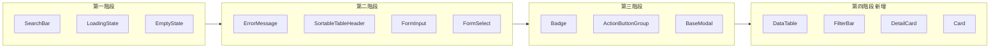

# 前端共用元件抽象化計劃（修訂版）

## 一、討論結論與設計原則

### 1.1 參考模式（react-week5 產品列表）

- **表格**：在頁面用 `const columns = [{ key, label, className?, render?(item) }]` 定義欄位與自訂渲染，傳給通用 Table 元件；Table 只負責迴圈與版面。
- **明細**：選中一筆後將資料傳給 `ProductDetailCard`，由元件負責排版。
- **分頁**：`pagination` + `onChangePage` 傳給 `Pagination` 元件。

結論：**頁面只負責「資料 + 設定」**，**元件負責「長相 + 行為」**；換頁面只需換 columns／設定，同一套元件可在不同 Page 或不同專案重用。

### 1.2 設計原則（本專案採用）

- **設定驅動**：頁面以設定（如 `columns`、`filters`、`options`）描述需求，元件依設定渲染，不寫死業務邏輯。
- **到處可用**：元件只依賴通用型別與 props（如 `data: T[]`、`columns: ColumnDef<T>[]`），不綁專案特有 API 或型別，以利搬遷至其他專案。
- **單一職責**：一個元件只做一類事（表格、搜尋、明細、分頁等），組合由頁面完成。

### 1.3 與既有計劃的對應

| 參考做法 | 本專案既有／規劃元件 |
|----------|----------------------|
| columns + 通用 Table | **DataTable**（新增規劃，見第四階段） |
| ProductDetailCard | **DetailCard / DetailPanel**（新增規劃） |
| Pagination | **Pagination**（已有） |
| 搜尋 | **SearchBar**（已有） |
| 多條件篩選 | **FilterBar**（新增規劃） |
| 列表容器／卡片 | **Card / Panel**（新增規劃） |

---

## 二、計劃範圍與階段總覽

- **既有計劃**：第一～三階段（SearchBar、LoadingState、EmptyState、ErrorMessage、SortableTableHeader、FormInput、FormSelect、Badge、ActionButtonGroup、BaseModal）維持不變；部分已實作，其餘依原規格完成。
- **修訂新增**：第四階段為「設定驅動列表與版面」元件，納入討論結論：DataTable、FilterBar、DetailCard、Card。

---

## 三、第一～三階段（維持原計劃）

- **第一階段**：SearchBar、LoadingState、EmptyState（規格與 API 見下方各節或既有實作）。
- **第二階段**：ErrorMessage、SortableTableHeader、FormInput、FormSelect。
- **第三階段**：Badge、ActionButtonGroup、BaseModal。
- **文件與匯出**：`frontend/src/components/common/README.md`、`index.ts`。

### 3.1 第一階段元件 API 摘要

**SearchBar**：`value`、`onChange`、`placeholder?`、`onSearch?`、`showClearButton?`、`icon?`、`className?`、`showContainer?`

**LoadingState**：`isLoading`、`message?`、`size?`、`fullHeight?`、`children`、`className?`

**EmptyState**：`icon?`、`title`、`description?`、`action?`、`className?`

### 3.2 第二階段元件 API 摘要

**ErrorMessage**：`message`、`type?`、`dismissible?`、`onDismiss?`、`className?`

**SortableTableHeader**：`field`、`currentSort`、`onSort`、`label`、`className?`

**FormInput**：繼承 input 屬性 + `label?`、`error?`、`required?`、`helperText?`

**FormSelect**：繼承 select 屬性 + `label?`、`error?`、`required?`、`options`、`placeholder?`、`helperText?`

### 3.3 第三階段元件 API 摘要

**Badge**：`children`、`variant?`、`size?`、`className?`

**ActionButtonGroup**：`actions`（type、onClick、disabled?、icon?、title?）、`showOnHover?`、`className?`

**BaseModal**：`isOpen`、`title?`、`children`、`onClose`、`size?`、`showCloseButton?`、`header?`、`footer?`、`className?`

---

## 四、第四階段：設定驅動列表與版面（新增）

### 4.1 DataTable 通用資料表

- **目的**：對應「columns + 通用 Table」模式；頁面只定義 `columns` 與 `data`，表格結構只寫一次。
- **檔案**：`frontend/src/components/common/DataTable.tsx`
- **Props 要點**：
  - `data: T[]`、`columns: ColumnDef<T>[]`、`keyField: keyof T`
  - `ColumnDef<T>`：`key`、`label`、`className?`、`sortable?`、`render?: (row: T) => ReactNode`
  - 可選：`isLoading`、`emptyMessage`、`onRowClick?`；內部使用既有 LoadingState、EmptyState、SortableTableHeader
- **重構對象**：UserManager、DepartmentManager、TrainingPlanManager、QuestionBankManager 等重複 `<table>` 的頁面，改為「定義 columns + 傳入 DataTable」。

### 4.2 FilterBar 篩選列

- **目的**：搜尋 + 多個篩選（年份、部門、分類等）以「一組設定」描述，傳給單一元件。
- **檔案**：`frontend/src/components/common/FilterBar.tsx`
- **Props 要點**：
  - `filters: Array<{ key: string; type: 'text'|'select'|'number'; label?: string; placeholder?: string; value; onChange; options?: { value; label }[] }>`
  - 內部可組合既有 SearchBar、FormSelect 等，或單一搜尋時僅用 SearchBar。
- **重構對象**：TrainingPlanManager、ReportDashboard、QuestionBankManager 等具多條件篩選的頁面。

### 4.3 DetailCard / DetailPanel 明細區

- **目的**：對應 ProductDetailCard；選中一筆後顯示明細，由設定或 children 決定內容。
- **檔案**：`frontend/src/components/common/DetailCard.tsx`（或 DetailPanel）
- **Props 要點**：
  - `visible: boolean`、`title: string`、`onClose: () => void`
  - 二選一：`fields?: Array<{ label: string; value: ReactNode }>` 或 `children: ReactNode`
- **重構對象**：單位成員、角色成員、單一計畫／使用者明細等「列表 + 右側/下方明細」畫面。

### 4.4 Card / Panel 容器

- **目的**：統一「白底、圓角、陰影、邊框」的區塊，不綁業務。
- **檔案**：`frontend/src/components/common/Card.tsx`
- **Props 要點**：`children`、`className?`，可選 `title`、`header?`、`footer?`（可與 BaseModal 對齊命名習慣）。

---

## 五、實作優先順序與任務

1. **先完成第一～三階段未完成項**（若尚有未實作或未重構部分）。
2. **第四階段建議順序**：Card（依賴少） → DataTable（效益大、可內用 SortableTableHeader / LoadingState / EmptyState） → DetailCard → FilterBar。
3. **文件**：於 `frontend/src/components/common/README.md` 補上第四階段元件說明與使用範例；本計劃文件維持為修訂版（含設計原則、第四階段、任務清單）。

---

## 六、技術規範與驗證（與原計劃一致）

- **樣式**：Tailwind、indigo 主色、`className` 可擴展、mobile-first。
- **TypeScript**：Props 明確型別、泛型用於 DataTable（`T`、`ColumnDef<T>`）、禁止 any、JSDoc。
- **驗證**：視覺與行為與原頁一致、程式碼審查（重複減少、可維護性、一致性、文件完整）。

---

## 七、預期效益與風險

**預期效益**：程式碼減少 30–40% 重複、UI/UX 一致、維護性提升、新頁面開發加速、元件可移植至其他專案。

**風險與注意**：重構時確保視覺一致、完整測試避免功能回歸、避免過度抽象、新元件保持向後相容。

---

## 八、任務清單（修訂版總覽）

- [ ] 第一階段：SearchBar、LoadingState、EmptyState 建立與重構
- [ ] 第二階段：ErrorMessage、SortableTableHeader、FormInput、FormSelect 建立與重構
- [ ] 第三階段：Badge、ActionButtonGroup、BaseModal 建立與重構
- [ ] 第四階段（新增）：Card、DataTable、DetailCard、FilterBar 建立與對應頁面重構
- [ ] 文件：README 與 index.ts 更新；計劃文件維持本修訂版

---

## 參考檔案

- 現有共用元件：`frontend/src/components/common/Pagination.tsx`
- 現有共用元件：`frontend/src/components/ConfirmModal.tsx`
- 需重構的頁面範例：`frontend/src/components/admin/UserManager.tsx`
- 需重構的頁面範例：`frontend/src/components/admin/DepartmentManager.tsx`
