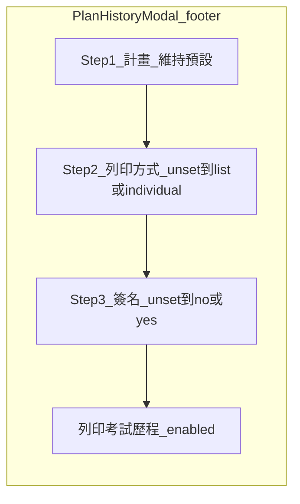

# T13 成績歷程／成績詳情列印調整實作計劃

## 規格對照（來源）

- [0.standards/2.棕地專案/T13 增修功能實作PLAN_測試問題.md](../../0.standards/2.棕地專案/T13%20增修功能實作PLAN_測試問題.md) 第 2、3 點（**2026/04/22 定案** + 步驟條／三態討論）。

## 現況與差距

| 項目 | 目前實作 | 目標 |
|------|----------|------|
| [ScoreDetailModal.tsx](../../frontend/src/components/personal/ScoreDetailModal.tsx) 從歷程進入 | `printGate` 導致「**未勾簽名則預覽鈕反灰**」、**checkbox 布林** | **預覽成績單常駐可點**；**列印員工簽名**改 **radio 三態** `unset` / `no` / `yes`；**是**才在 [ScoreCardPreview](../../frontend/src/components/personal/ScoreCardPreview.tsx) 顯示簽名／日期，**否／未選**不顯示（未選採與否相同之無簽名行為，避免曖昧） |
| [PlanHistoryModal.tsx](../../frontend/src/components/personal/PlanHistoryModal.tsx) 底部 | 標題仍為「**成績列印**」；[ScorePrintFlow](../../frontend/src/components/common/ScorePrintFlow.tsx) `variant=planHistoryFooter` 內 `printMode` **預設 `list`**、主鈕「**產生 PDF**」、PDF body **寫死** `include_employee_signature: false` | 標題「**考試歷程成績列印**」；**步驟條**；詢問2 **無預設**、詢問3 **三態無預設**；主鈕「**列印考試歷程**」且 **僅在詢問2、3 皆脫離 `unset`** 可點；`include_employee_signature` 隨三態**是／否**傳入 |
| 後端 | [POST /exam/personal/print/pdf](../../backend/app/routers/exam_center.py) 已接受 `include_employee_signature`、`include_exam_history`、`print_mode` | 前端依三態寫入 **boolean**；`include_exam_history` 是否改為 `true` 以符「**考試歷程**」PDF 內歷程明細，需與產品確認（[render_score_print_pdf_to_buffer](../../backend/app/routers/report.py) 在 `include_exam_history` 時會加歷程行） |

## 實作步驟

### 1. 共用型別（避免 `any`）

- 在適當位置新增（例如 `frontend/src/components/personal/printTriState.ts` 或 `common/printTypes.ts`）：

```ts
export type SignatureTriState = 'unset' | 'no' | 'yes';
export type PrintModeTriState = 'unset' | 'list' | 'individual';
```

- `ScorePrintFlow` 若僅在 `planHistoryFooter` 使用，可改由父層傳入 `printMode: PrintModeTriState` 與 `onPrintModeChange`，或只在 [PlanHistoryModal](../../frontend/src/components/personal/PlanHistoryModal.tsx) 管狀態、子元件用受控 props。

### 2. `ScoreDetailModal`（歷程進入時）

- **預覽鈕**：移除 `previewAllowed` 對鈕的 `disabled`／灰階邏輯；**常駐藍鈕可點**。
- **歷程入口**（`printGate === 'requireSignatureCheckbox'`，[PlanHistoryModal](../../frontend/src/components/personal/PlanHistoryModal.tsx) 已傳）：
  - 將單一 checkbox 改為 **兩顆互斥 radio「否／是」+ 狀態 `unset`**：可用 **隱藏第三狀態**的作法——以 `SignatureTriState` 管理，初始 `'unset'`，兩枚 radio 分別設成 `onChange` → `'no' | 'yes'`；**兩者皆不 checked 當 `unset`**。
  - 可選：在 `unset` 時於旁加一句淡色提示「請選擇是否列印簽名」。
- **ScoreCardPreview**：`includeEmployeeSignature={signatureTriState === 'yes'}`；非歷程入口（`printGate==='none'`）維持目前「一律顯示簽名」或維持既有行為（目前為 `true`）。
- 關閉／換 `recordId`／`historyId` 時 **重設** `SignatureTriState` 為 `unset`。

### 3. `ScorePrintFlow`（僅 `variant==='planHistoryFooter'` 段落）

- **步驟條**：在區塊頂部加橫向 **Step 1～3**（詢問1 訓練計畫、詢問2 列印方式、詢問3 列印員工簽名），用 Tailwind 與專案既有風格即可（不必抽共用 Wizard 除非重複兩次）。
- **詢問1**：維持現有下拉勾選；**不**把「已帶入單一計畫」改壞（規格：預設行為與現行一致）。
- **詢問2 文案**（僅歷程 variant）改為文件用語：  
  -「列印個人**所有考試歷程成績清單**」  
  -「列印個人**所有考試歷程的每一次考卷成績**」
- **詢問2 狀態**：`PrintModeTriState`，初始 **`unset`**；兩 radio 僅在選 `list` / `individual` 時 set；**`unset` 時兩者皆不顯示 checked**（同 ScoreDetail 做法）。
- **詢問3 區塊**（歷程 variant **新增**）：`SignatureTriState`，初始 **`unset`**；否／是 兩 radio；行為同文件與上節。
- **主按鈕**：文案「**列印考試歷程**」；`disabled` 當 `printLoading || selectedPlanIds.size===0 || printMode==='unset' || signature==='unset'`；樣式綠啟用／灰禁用。
- **匯出**：`onPrintPdf` 由父層在呼叫 API 時帶入：  
  `include_employee_signature: signature==='yes'`；  
  `print_mode: printMode`（僅在 `list` | `individual` 時傳，因鈕已鎖定）。
- **全版 `full` variant**（[ReportDashboard](../../frontend/src/components/admin/ReportDashboard.tsx) 等）：**不**改互動，避免違反「只改歷程」範圍；必要時以 props 分岔。

**Props 重構建議**：`planHistoryFooter` 目前用 `includeEmployeeSignature: boolean` + 假 handlers；改為在 **PlanHistoryModal** 持有 `printMode`／`signature` 兩個 tri-state，**ScorePrintFlow** 改為受控欄位（或把「詢問2＋3＋主鈕」整段只放在 PlanHistoryModal，僅复用「詢問1」子區塊）——以 **diff 最小** 為準；若 `ScorePrintFlow` props 變太多，可拆 **內層** `PlanHistoryPrintSection` 僅被 `PlanHistoryModal` 使用。

### 4. `PlanHistoryModal` 外層

- 區塊標題：`成績列印` → `**考試歷程成績列印**`。
- 將 tri-state 與 `exportModalPrintPdf` 更新：`body.include_employee_signature` 從**否／是**導出 boolean；`print_mode` 僅在已選 `list`/`individual` 時送出。
- **結論**：`include_exam_history`：若產品確認「考試歷程成績列印」PDF 應帶**歷程明細行**，則在 `print_mode==='list'` 時或一律設 `true`（與 [report.py](../../backend/app/routers/report.py) 中 `include_exam_history` 行為比對後再定）。若先不做，維持 `false` 並在 T13 或註解標註待確認。

### 5. 驗證

- 成績詳情：預覽鈕隨時可開；**否／未選**無簽名區、**是**有簽名區。
- 考試歷程底部：步驟條可讀；未選 2 或 3 時主鈕灰；皆選定後可下載；PDF 內簽名與參數一致。

### 6. 文件（實作完成後）

- 更新 [1.docs/個人成績總覽與學習分析說明.md](../個人成績總覽與學習分析說明.md) 若成績詳情有列印行為變更；及／或 [T13 測試問題](../../0.standards/2.棕地專案/T13%20增修功能實作PLAN_測試問題.md) 補**驗收日期**一句（依專案慣例）。

## 風險與取捨

- **向導多步**若全擠在單一長 Modal，**步驟條**以「讀寫層次」即可，不強制拆頁，除非產品要求「一次只顯示一步」。


