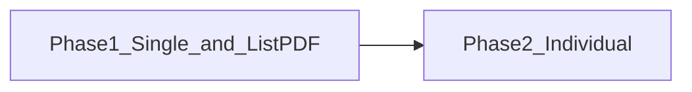

# T13「接續 2026/04/22」兩階段實作計劃

## 1. 目的

將 [T13 測試問題「接續 2026/04/22」小節](../../0.standards/2.棕地專案/T13%20增修功能實作PLAN_測試問題.md)（約行 208–231）之未竟項**分階段交付**：

- **階段一**先行：單次成績列印與畫面一致、歷程成績 **PDF** 在 `list` 下符合抬頭、無筆數、表格式歷程、隔列、簽名版式。
- **階段二**獨立排程：高複雜度之 `print_mode=individual`「每試一冊成績單」。

## 2. 範圍

| 階段 | 納入 | 不納入（延後） |
|------|------|----------------|
| 一 | 前端 `ScoreCardPreview` 列印路徑；`POST /exam/personal/print/pdf` 可選參數；`render_score_print_pdf_to_buffer` 歷程專用分岔（**list**、含 `include_exam_history` 時之表、zebra、簽名雙欄等）；`PlanHistoryModal` 串參；Admin `report_print_pdf` 預設不變 | `individual` 之「每試一冊如查看詳情」之完整產生 |
| 二 | 同上測試問題行 221–223：`individual` 行為、資料粒度、ReportLab 或 HTML 轉 PDF 等實作路徑 | 階段一已交貨項目之重構 |

## 3. 權責

- **前端**：成績單列印、歷程 Modal 列印請求欄位與產品驗收示範。
- **後端**：個人列印 API、PDF 產生器分岔、與成績中心報表列印**行為隔離**（避免破壞管理端列印）。

## 4. 名詞解釋

| 名詞 | 說明 |
|------|------|
| 單次成績 | 從歷程點某次「查看詳情」→ 成績詳情 → 預覽／列印，僅該次提交，**不**應附整表「考試歷程」於列印。 |
| 歷程成績列印 | `PlanHistoryModal` 底部精靈產生之 **PDF**（`POST /exam/personal/print/pdf`）。 |
| `list` / `individual` | Body `print_mode`；階段一以 **list** 與歷程 PDF 分岔為主；**individual** 之新行為以階段二實作。 |
| 隔列底色（zebra） | 考試歷程表**整表**奇偶列底色交替，**不**與「單列強調／框選當次」混用。 |

## 5. 作業內容

### 5.1 階段一（先交付）

**目標**：單次**列印＝畫面**；歷程 **PDF** 在 `list` 下符合測試問題（抬頭、筆數、歷程表、隔列、詢問3 簽名）；**不**實作 `individual` 之「每試一冊」新邏輯（可維持現行合併表或產品決定暫關 `individual`）。

#### A. 單次成績：瀏覽器列印（前端）

| 工作 | 說明 |
|------|------|
| 關閉單次路徑的歷程拼接 | [ScoreCardPreview.tsx](../../frontend/src/components/personal/ScoreCardPreview.tsx) 之 `handlePrint` 僅在明確需要時（例如可選 prop `printIncludeExamHistory`，**預設 `false`**）才組 `historyHtml`。 |
| 成績詳情傳參 | [ScoreDetailModal.tsx](../../frontend/src/components/personal/ScoreDetailModal.tsx) 從歷程進入時不啟用歷程表列印。 |

**驗收**：單次「預覽成績單 → 列印」與畫面一致，不出現「考試歷程」大區塊。

#### B. 歷程成績 PDF：共用渲染器擴充（後端＋參數串接）

| 工作 | 說明 |
|------|------|
| API 擴充 | [POST /exam/personal/print/pdf](../../backend/app/routers/exam_center.py) 增加選用參數（實作命名依程式為準），供「個人歷程列印」專用，**不**影響 Admin [report_print_pdf](../../backend/app/routers/report.py) 預設行為。 |
| 渲染分岔 | [render_score_print_pdf_to_buffer](../../backend/app/routers/report.py) 在歷程專用模式下：`list` 時 (1) 抬頭 `{計畫名}＋教育訓練考試歷程成績列印` (2) 不印筆數 (3) `include_exam_history` 以**表**呈現 (4) **隔列底色** (5) 不框選／不標「本次」 (6) 簽名為**雙欄**考生簽名／日期。 |
| 前端帶參 | [PlanHistoryModal.tsx](../../frontend/src/components/personal/PlanHistoryModal.tsx) `exportModalPrintPdf` 與新欄位、既有 `include_exam_history` 等對齊。 |

**刻意不含**：`print_mode=individual` 之「每試一冊成績單」（階段二）。若階段一仍開放前端的 `individual` 選項，應在文件或 API 註明**過渡行為**或產品暫關，避免誤解。

**驗收**：`list` 歷程 PDF 符合測試問題行 216–228 中與 `list`、抬頭、筆數、歷程表、隔列、詢問3 相關之條文。

### 5.2 階段二（延後、獨立排程）

**目標**：測試問題行 221–223 — `print_mode=individual` 時，同訓練下每次考試一份與「查看詳情」同層級之成績單（可分頁），而非僅多列主表。

| 工作 | 說明 |
|------|------|
| 釐清資料粒度 | 「一試」對應 `ExamRecord` 或 `ExamHistory`；與 [_personal_score_print_rows](../../backend/app/routers/exam_center.py) 一列一試定義一致。 |
| 實作路徑 | ReportLab 逐筆成績單、或 HTML 轉 PDF、或封面＋答題分頁；併用階段一已存在之**文件樣式／分岔參數**，避免重複。 |
| 啟用前端 | [PlanHistoryModal](../../frontend/src/components/personal/PlanHistoryModal.tsx) 選 `individual` 時帶明確 API 觸發階段二行為。 |

**驗收**：`individual` 產出與產品截圖「每次一冊、內容如查看詳情」一致；必要時另列 UAT。

### 5.3 文件與迴歸（各階段完成時）

- 更新測試問題行 208–231 **實作狀態**、必要時 [個人成績總覽與學習分析說明.md](../個人成績總覽與學習分析說明.md) §3.4。
- 每階段執行 **Admin 報表列印** 迴歸。

## 6. 參考文件

- [T13 增修功能實作PLAN_測試問題.md](../../0.standards/2.棕地專案/T13%20增修功能實作PLAN_測試問題.md)（行 174–232、「接續 2026/04/22」）
- [T13_成績歷程與成績詳情列印調整_實作計劃.md](T13_成績歷程與成績詳情列印調整_實作計劃.md)（既有 UI 精靈與三態，與本計劃**接續**關係）

## 7. 使用表單（欄位說明）

本文件為**實作計劃**說明，無對應紙本表單。若階段二需產品簽核「一試定義」或 UAT 清單，可另以任務單或驗收報告補欄位。

---

## 附：工作項對照（供追蹤）

| ID | 階段 | 內容 |
|----|------|------|
| p1-frontend-print | 一 | ScoreCardPreview 單次列印不附歷程＋ScoreDetailModal 傳參 |
| p1-backend-pdf | 一 | `personal_print_pdf` 參數＋`render_score_print_pdf` 歷程專用分岔 |
| p1-phm | 一 | PlanHistoryModal 串 API；`individual` 過渡策略 |
| p1-docs-qa | 一 | 文件、驗收、Admin 迴歸 |
| p2-individual | 二 | 每試一冊成績單實作 |
| p2-docs-qa | 二 | 文件＋UAT |
