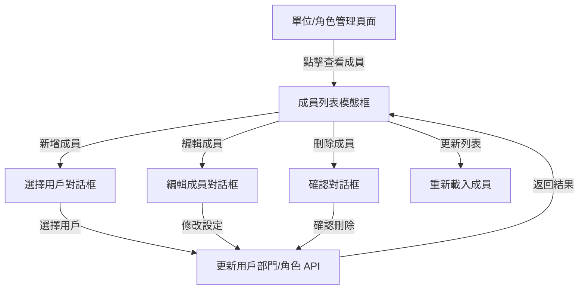

# 單位與角色成員管理功能增強實作計劃

**建立日期**: 2025-01-09  
**狀態**: 已完成

## 目標

在單位管理和角色管理頁面中，增加直接在查看成員模態框中進行成員管理（新增、編輯、刪除）的功能，提升操作便利性。

## 架構說明

### 資料流程



### 功能範圍

1. **單位管理**（DepartmentManager）
   - 在查看成員模態框中新增「新增成員」按鈕
   - 在成員列表中加入「編輯」和「刪除」按鈕
   - 新增成員：選擇現有用戶並將其部門設為當前單位
   - 編輯成員：修改成員的部門
   - 刪除成員：將成員移至其他部門（必須選擇目標部門）

2. **角色管理**（RoleManager）
   - 在查看成員模態框中新增「新增成員」按鈕
   - 在成員列表中加入「刪除」按鈕
   - 新增成員：選擇現有用戶並將其角色設為當前角色
   - 刪除成員：將成員的角色設為其他角色或移除（設為 null）

## 實作步驟

### 階段一：後端 API（可選，重用現有 API）

**目標**：確保現有 API 足夠支援需求，如需要則新增便利端點。

**檔案**：`backend/app/routers/admin.py`

**說明**：
- 現有的 `PUT /admin/users/{emp_id}` API 已可更新用戶的部門和角色
- 可重用此 API，無需新增後端端點
- 如需要，可新增便利端點（如 `POST /admin/departments/{id}/users`），但非必要

### 階段二：前端 - 單位管理增強

**檔案**：`frontend/src/components/admin/DepartmentManager.tsx`

**修改內容**：

1. **新增狀態管理**：
   - `isAddingMember`: 是否顯示新增成員對話框
   - `editingMember`: 正在編輯的成員資訊
   - `allUsers`: 所有用戶列表（用於選擇）

2. **修改查看成員模態框**：
   - 在標題區域新增「新增成員」按鈕
   - 在每個成員項目中新增「編輯」和「刪除」按鈕

3. **新增新增成員對話框**：
   - 顯示所有用戶列表（排除已在當前部門的用戶）
   - 提供搜尋功能
   - 選擇用戶後呼叫 `PUT /admin/users/{emp_id}` 更新部門

4. **新增編輯成員對話框**：
   - 顯示當前部門
   - 下拉選單選擇新部門
   - 呼叫 `PUT /admin/users/{emp_id}` 更新部門

5. **新增刪除成員確認與處理**：
   - 顯示確認對話框，要求選擇目標部門
   - 呼叫 `PUT /admin/users/{emp_id}` 將用戶移至目標部門

**API 呼叫範例**：

```typescript
// 新增成員到單位
await api.put(`/admin/users/${emp_id}`, {
  dept_id: currentDeptId
});

// 編輯成員部門
await api.put(`/admin/users/${emp_id}`, {
  dept_id: newDeptId
});

// 移除成員（移至其他部門）
await api.put(`/admin/users/${emp_id}`, {
  dept_id: targetDeptId
});
```

### 階段三：前端 - 角色管理增強

**檔案**：`frontend/src/components/admin/RoleManager.tsx`

**修改內容**：

1. **修改查看成員模態框（當 type === 'user' 時）**：
   - 在標題區域新增「新增成員」按鈕
   - 在每個成員項目中新增「刪除」按鈕
   - 改善成員列表顯示（包含員工編號、部門等資訊）

2. **新增新增成員到角色對話框**：
   - 顯示所有用戶列表（排除已有當前角色的用戶）
   - 提供搜尋功能
   - 選擇用戶後呼叫 `PUT /admin/users/{emp_id}` 更新角色

3. **新增刪除成員確認與處理**：
   - 顯示確認對話框，詢問是否移除角色（設為其他角色或 null）
   - 如果設為其他角色，提供角色選擇下拉選單
   - 呼叫 `PUT /admin/users/{emp_id}` 更新角色

**API 呼叫範例**：

```typescript
// 新增成員到角色
await api.put(`/admin/users/${emp_id}`, {
  role_id: currentRoleId
});

// 移除成員角色（設為其他角色）
await api.put(`/admin/users/${emp_id}`, {
  role_id: newRoleId  // 或 null 表示移除
});
```

### 階段四：資料載入優化

**檔案**：
- `frontend/src/components/admin/DepartmentManager.tsx`
- `frontend/src/components/admin/RoleManager.tsx`

**改進**：
- 在開啟查看成員模態框時，預載入所有用戶列表
- 快取用戶列表，避免重複請求
- 在成員操作後，自動重新載入成員列表

## 技術細節

### UI/UX 設計

1. **新增成員對話框**：
   - 使用搜尋框過濾用戶
   - 顯示用戶的姓名、員工編號、當前部門/角色
   - 點擊用戶卡片即可新增

2. **編輯成員對話框**：
   - 顯示當前成員資訊（只讀）
   - 下拉選單選擇新部門/角色
   - 確認和取消按鈕

3. **刪除確認對話框**：
   - 單位管理：必須選擇目標部門（不允許設為 null）
   - 角色管理：可選擇其他角色或移除（設為 null）

### 錯誤處理

- 處理 API 錯誤（如用戶不存在、部門不存在等）
- 顯示清晰的錯誤訊息
- 操作失敗時不關閉對話框，允許重試

### 權限檢查

- 所有操作都透過現有的權限檢查機制（`check_permission`）
- 前端也應該檢查當前用戶是否有管理權限

## 測試重點

1. **單位管理**：
   - 新增成員到單位
   - 編輯成員的部門
   - 將成員移至其他部門
   - 邊界情況：空列表、所有用戶已在部門中

2. **角色管理**：
   - 新增成員到角色
   - 移除成員的角色（設為其他角色或 null）
   - 邊界情況：空列表、所有用戶已有角色

3. **資料一致性**：
   - 操作後列表即時更新
   - 用戶在其他頁面的資訊同步更新

## 注意事項

1. **Admin 帳號保護**：
   - 現有 API 已保護 admin 帳號，前端也應該在 UI 中禁用對 admin 的操作

2. **向後相容**：
   - 不影響現有的查看成員功能
   - 現有的編輯功能（在人員管理頁面）仍然可用

3. **效能考量**：
   - 用戶列表可能很大，需要實作分頁或虛擬滾動
   - 考慮使用防抖（debounce）處理搜尋輸入

## 檔案清單

### 需要修改的檔案

1. `frontend/src/components/admin/DepartmentManager.tsx`
   - 增加成員管理功能
   - 新增對話框元件

2. `frontend/src/components/admin/RoleManager.tsx`
   - 增加成員管理功能
   - 改善成員列表顯示
   - 新增對話框元件

### 可選的新增檔案

1. `frontend/src/components/admin/AddMemberToDeptModal.tsx`（如需要獨立元件）
2. `frontend/src/components/admin/AddMemberToRoleModal.tsx`（如需要獨立元件）

## 實作順序建議

1. 先實作單位管理的成員管理功能（較簡單，只需要處理部門）
2. 再實作角色管理的成員管理功能（需要處理角色選擇和 null 值）
3. 最後進行整合測試和 UI 優化

## 實作完成記錄

**完成日期**: 2025-01-09

### 已完成項目

- ✅ 單位管理的成員管理功能（新增、編輯、刪除）
- ✅ 角色管理的成員管理功能（新增、刪除）
- ✅ 錯誤處理和狀態管理
- ✅ UI/UX 優化

### 已知問題與後續改進

1. **問題1**: 單位設定，按編輯並沒有可以看到有「新增成員」按鈕
   - **原因**: 用戶點擊的是「編輯單位名稱」按鈕，而非「查看成員」
   - **解決方案**: 需要明確區分「編輯單位」和「查看成員」兩個功能

2. **問題2**: 單位管理清單列，ID欄應改為項次，使用流水號，並按單位名稱排序
   - **狀態**: 待修復

3. **問題3**: 角色管理，當user的角色變更後，該角色卡片上的成員數也要重新計算
   - **狀態**: 待修復

4. **問題4**: 其他管理頁面缺少雙擊編輯功能
   - **狀態**: 待修復
